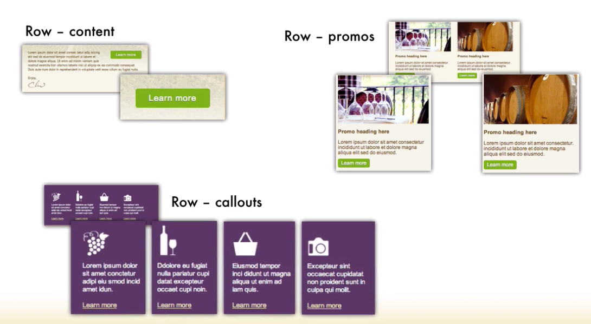
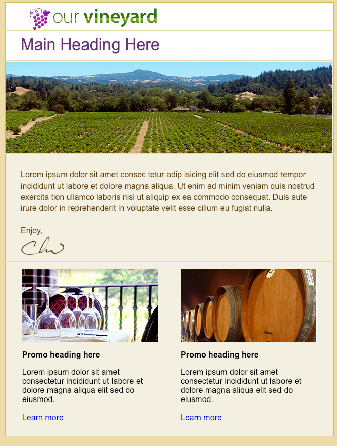

# Formatting and styling the promos row

Again first let's add some styling. What we gonna do inside of here is add an `additional table` as we talked about earlier in `responsive design` with tables we can't manipulate or move `<td>'s`. I order to have our `promos` chaned position we gonna need to put the individual `promos` to their own `table`. The `responsive nature` of using `tables` means we have to wrap each of our elements in a `single cell table` in order to manipulate them. 
So, what we gonna be doing in three different cases here is we gonna be taking an `individuall tabel`  and using that to create our `call to action button`, to create two `individual tables` for the  `promos`, and we'll aslo use the same technique to create four `individual tables` for the `callouts`. This way as our screen size changes we can manipulate and move these `tables` either to stack on top of each other or to get smaller and still aligned right and left. 



Let's start by adding a `first table`. Inside this `table` with the `class` "promo_1" we'll add an `image`, `h3` tag, some text and `<a>` tag "learn more". To create a `second promo` we can copy this table and make the needed changes. 

### HTML
```html
<!DOCTYPE HTML PUBLIC "-//W3C//DTD HTML 4.01 Transitional//EN" "http://www.w3.org/TR/html4/loose.dtd">
<html>
	<head>
		<meta http-equiv="Content-Type" content="text/html; charset=utf-8">
		<title>Our Vineyard</title>
		<style type="text/css">
			/* css goes here */
		</style>
	</head>	
	<body bgcolor="#efe1b0">    
	<table width="100%" border="0" cellsapcing="0" cellpadding="0" bgcolor="#efe1b0">
   
		 <tr>
         <td>
            <table class="container" width="640" align="center" border="0" cellpaddong="0" cellspasing="0"> <!--main email container with 7 rows inside-->
					<tr><!--logo row-->
						<td valign="top" class="logo" bgcolor="#ffffff" style="padding: 10px 20px 0px 30px; border-left: 1px solid #dbc064; border-right: 1px solid #dbc064; border-top: 1px solid #dbc064;"> 
                            <a href="#"></a> 
						</td>
					</tr>
					<tr><!--headline row-->
						<td valign="top" class="headline" bgcolor="#ffffff"  
							style="padding: 15px 20px 5px 30px; border-left: 1px solid #dbc064; border-right: 1px solid #dbc064; font-family: Arial, Helvetica, sans-serif; font-size: 16px; line-height: 22px;">
                              <h1 style="margin: 0px 0px 15px 0px; font-weigt: normal; font-size: 32px; color: #723c7f;">Main Heading Here</h1>
                        </td>
                        </tr>
                        <tr><!--banner row-->
                            <td valign="top" bgcolor="#f5f2e5" class="banner" 
                        style="border-left: 1px solid #dbc064; border-right: 1px solid #dbc064;">
                           
                            </td>
                        </tr>
					<tr><!--content row-->
                        <td valign="top" bgcolor="#f5f2e5" class="content" style="padding: 30px 30px 10px 30px;  
						border-right: 1px solid #dbc064; 
						border-left: 1px solid #dbc064; 
						font-family:Arial, Helvetica, sans-serif; font-size: 16px; 
                        line-height:22px; color: #654308;  
                        background: #f5f2e5 url(images/banner_large_ghost.jpg) no repeat 0px 0px"> 
                              Lorem ipsum dolor sit amet consec tetur adip isicing elit sed do eiusmod tempor 
							  incididunt ut labore et dolore magna aliqua. Ut enim ad minim veniam quis 
							   nostrud exercita tion ullamco laboris nisi ut aliquip ex ea commodo consequat.  
							   Duis aute irure dolor in reprehenderit in voluptate velit esse cillum eu fugiat nulla.
							 <br><br>
							 Enjoy,
							 <br>
							 
							 
                        </td>
                    </tr>
                    <tr><!--promos row-->
                        <td valign="top" bgcolor="#f5f2e5" class="promos" style="padding: 10px 30px 25px 30px;  
						border-right:1px solid #dbc064; border-left:1px solid #dbc064;  
                        background-color: #f5f2e5; font-family: Arial, Helvetica, sans-serif;">
                        <table class="promo_1" width="270" align="left"><!--create a table-->
                             <tr>
								 <td>
									 
                                      <h3 style="font-size:16px;">Promo heading here</h3>
                                      Lorem ipsum dolor sit amet consectetur incididunt ut labore et dolore magna aliqua elit sed do eiusmod.
                                       <br><br>
                                       <a href="#">Learn more</a>
     
								 </td>
							 </tr>
                           </table>
                           <table class="promo_2" width="270" align="right">
							<tr>
								<td>
								   
								   <h3 style="font-size:16px;">Promo heading here</h3>
								   Lorem ipsum dolor sit amet consectetur incididunt ut labore et dolore magna aliqua elit sed do eiusmod.
								   <br><br>
								   <a href="#">Learn more</a>
								   
								</td>
							</tr>
						  </table>

                        </td>
                    </tr>
				</table>
         </td>
         </tr>
	 </table>
	</body>	
</html>
```


