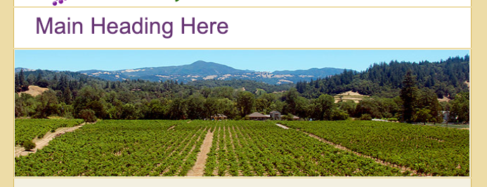

# Switching the headline and banner for smaller screen sizes

We gonna target the `banner row` and the `headline row` inside the medium screen size. We start with targeting `<td>` with the `class` "headline"; next `<td>` class "headline" `h1` element. 

### HTML head
```html
<!DOCTYPE HTML PUBLIC "-//W3C//DTD HTML 4.01 Transitional//EN" "http://www.w3.org/TR/html4/loose.dtd">
<html>
	<head>
		<meta http-equiv="Content-Type" content="text/html; charset=utf-8">
		<title>Our Vineyard</title>
		<style type="text/css">
			@media only screen and (max-width: 660px) {
              table.container {width: 480px !important; }
			  td.logo img {display: none;}
			  td.logo {background: #fff url(images/logo_medium.gif) no-repeat 10px 10px; height: 45px }
			  td.headline {padding: 5px 0px 0px 30px !important}   /* change rules for the headline*/
			  td.headline h1 {font-size: 28px !important}         /* change rules for the headline*/
			  
			}
			@media only screen and (max-width: 510px ){
				table.container{ width: 100% !important;}
				table.container td {border: none !important;}
				td.logo {background: #fff url(images/logo_small.gif) no-repeat center 10px; height: 32px}
			}
        </style>
```
Next we gonna change the rules foe the `banner`, we gonna turn off the `image` as well, so that we did it with `logo`; and then apply a medium size `banner` into the `<td>`. 

### HTML head
```html
<!DOCTYPE HTML PUBLIC "-//W3C//DTD HTML 4.01 Transitional//EN" "http://www.w3.org/TR/html4/loose.dtd">
<html>
	<head>
		<meta http-equiv="Content-Type" content="text/html; charset=utf-8">
		<title>Our Vineyard</title>
		<style type="text/css">
			@media only screen and (max-width: 660px) {
              table.container {width: 480px !important; }
			  td.logo img {display: none;}
			  td.logo {background: #fff url(images/logo_medium.gif) no-repeat 10px 10px; height: 45px }
			  td.headline {padding: 5px 0px 0px 30px !important}
			  td.headline h1 {font-size: 28px !important}

			  td.banner img {display: none}      /* change rules for the banner*/
			  td.banner {width: 480px; height: 150px; background: url(images/banner_medium.jpg) no-repeat 0px 0px;}          /* change rules for the banner*/

			}
			@media only screen and (max-width: 510px ){
				table.container{ width: 100% !important;}
				table.container td {border: none !important;}
				td.logo {background: #fff url(images/logo_small.gif) no-repeat center 10px; height: 32px}
			}
		</style>
    </head>	
```

These properties gonna be picked up for the small screen; let's add some more small screen rules. We don't need here to turn the `image` off cos we did it for the medium size already, just set an image suitable for the small screens. 

### HTML head
```html
<!DOCTYPE HTML PUBLIC "-//W3C//DTD HTML 4.01 Transitional//EN" "http://www.w3.org/TR/html4/loose.dtd">
<html>
	<head>
		<meta http-equiv="Content-Type" content="text/html; charset=utf-8">
		<title>Our Vineyard</title>
		<style type="text/css">
			@media only screen and (max-width: 660px) {
              table.container {width: 480px !important; }
			  td.logo img {display: none;}
			  td.logo {background: #fff url(images/logo_medium.gif) no-repeat 10px 10px; height: 45px }
			  td.headline {padding: 5px 0px 0px 30px !important}
			  td.headline h1 {font-size: 28px !important}

			  td.banner img {display: none}
			  td.banner {width: 480px; height: 150px; background: url(images/banner_medium.jpg) no-repeat 0px 0px;}

			}
			@media only screen and (max-width: 510px ){
				table.container{ width: 100% !important;}
				table.container td {border: none !important;}
				td.logo {background: #fff url(images/logo_small.gif) no-repeat center 10px; height: 32px}
				td.headline h1 {font-size: 24xp !important; text-align: center;}  /* change rules for the headline*/
				td.banner {height: 115px; background: url(images/banner_small.jpg) no-repeat right 0px;}  /* change rules for the banner*/
			}
		</style>
    </head>	
```

### Banner & Headline large


### Banner & Headline medium


### Banner & Headline small

