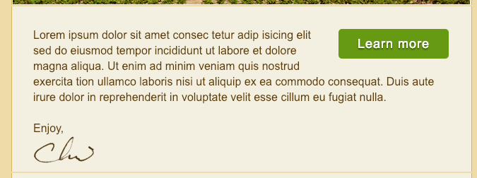
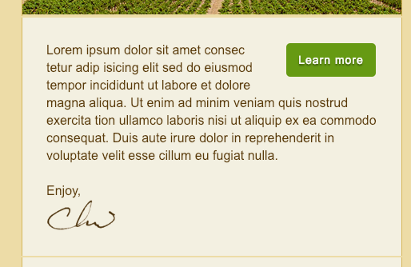
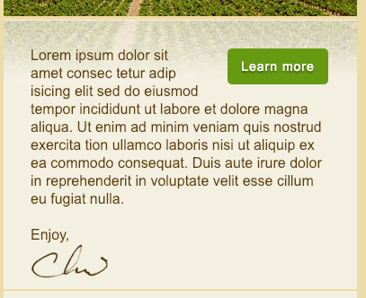
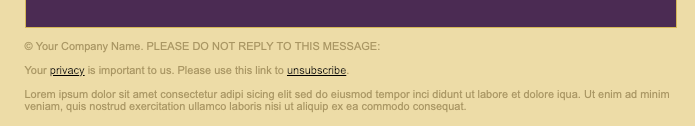
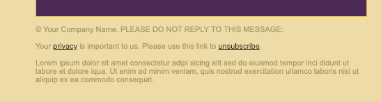
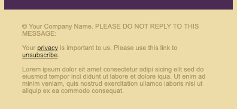

# Adjusting the layouts for the content and footer for smaller screens

First we gonna modify the `content row` for the medium screens. We gonna change the padding rules, and specify the `background image` on this element inside of the inline style, to specify the `bannar_large_ghost`, so we do need to overwrite that with an `important` flag. Next, we'll target `call-to-action button`.

### HTML head
```html
<!DOCTYPE HTML PUBLIC "-//W3C//DTD HTML 4.01 Transitional//EN" "http://www.w3.org/TR/html4/loose.dtd">
<html>
	<head>
		<meta http-equiv="Content-Type" content="text/html; charset=utf-8">
		<title>Our Vineyard</title>
		<style type="text/css">
			@media only screen and (max-width: 660px) {
              table.container {width: 480px !important; }
			  td.logo img {display: none;}
			  td.logo {background: #fff url(images/logo_medium.gif) no-repeat 10px 10px; height: 45px }
			  td.headline {padding: 5px 0px 0px 30px !important}
			  td.headline h1 {font-size: 28px !important}

			  td.banner img {display: none}
			  td.banner {width: 480px; height: 150px; background: url(images/banner_medium.jpg) no-repeat 0px 0px;}
              td.content {padding-bottom: 30px !important; background-image: url(images/banner_medium_ghost.jpg) !important;}            /* change rules for the content*/
			  td.content table.button {width: auto;}        /* change rules for the call-to-action button*/
			  td.content table.button td a {font-size: 14px !important}  /* change rules for the call-to-action button*/
			}

			@media only screen and (max-width: 510px ){
				table.container{ width: 100% !important;}
				table.container td {border: none !important;}
				td.logo {background: #fff url(images/logo_small.gif) no-repeat center 10px; height: 32px}
				td.headline h1 {font-size: 24xp !important; text-align: center;}
				td.banner {height: 115px; background: url(images/banner_small.jpg) no-repeat right 0px;}
			}
		</style>
    </head>	
```

Next, let's add some rules for the `smaller size screens`. We gonna target the `content row` and the `footer`: change padding => this way we'll switch the `design` to be fully fluid or 100% width; we wanna text in the footer touching the right or left side for the smaller screens. 

### HTML head
```html
<!DOCTYPE HTML PUBLIC "-//W3C//DTD HTML 4.01 Transitional//EN" "http://www.w3.org/TR/html4/loose.dtd">
<html>
	<head>
		<meta http-equiv="Content-Type" content="text/html; charset=utf-8">
		<title>Our Vineyard</title>
		<style type="text/css">
			@media only screen and (max-width: 660px) {
              table.container {width: 480px !important; }
			  td.logo img {display: none;}
			  td.logo {background: #fff url(images/logo_medium.gif) no-repeat 10px 10px; height: 45px }
			  td.headline {padding: 5px 0px 0px 30px !important}
			  td.headline h1 {font-size: 28px !important}

			  td.banner img {display: none}
			  td.banner {width: 480px; height: 150px; background: url(images/banner_medium.jpg) no-repeat 0px 0px;}
              td.content {padding-bottom: 30px !important; background-image: url(images/banner_medium_ghost.jpg) no-repeat !important;}
			  td.content table.button {width: auto;}
			  td.content table.button td a {font-size: 14px !important}
			}

			@media only screen and (max-width: 510px ){
				table.container{ width: 100% !important;}
				table.container td {border: none !important;}
				td.logo {background: #fff url(images/logo_small.gif) no-repeat center 10px; height: 32px}
				td.headline h1 {font-size: 24xp !important; text-align: center;}
				td.banner {height: 115px; background: url(images/banner_small.jpg) no-repeat right 0px;}
				td.content {line-height: 20px !important; padding-bottom: 10px !important; background: #f5f2e5 
				url(images/banner_small_ghost.jpg) no-repeat right 0px !important}  /* change rules for the content row*/
				td.footer {padding: 20px 30px !important} /* change rules for the footer*/
			}
		</style>
    </head>	
```

### Content large


### Content medium


### Content small


### Footer large


### Footer medium


### Footer small
