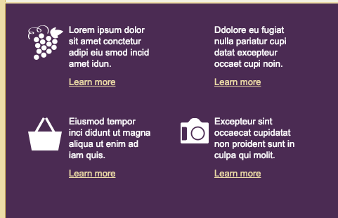

#  Adjusting the promos for callouts for medium screens

What we gonna do for `callouts` is to take four columns and arrange then as a grid. We'll start by targeting a `table` inside the `callouts`, next we gonna hide the `images` inside the `callouts`, next we gonna target the `break` to remove the space between the `paragraph` and a `link`, and we gonna target the `td` itself. Since we turned off the images we need to reassign the background graphics. 

### HTML head
```html
<!DOCTYPE HTML PUBLIC "-//W3C//DTD HTML 4.01 Transitional//EN" "http://www.w3.org/TR/html4/loose.dtd">
<html>
	<head>
		<meta http-equiv="Content-Type" content="text/html; charset=utf-8">
		<title>Our Vineyard</title>
		<style type="text/css">
			@media only screen and (max-width: 660px) {
              table.container {width: 480px !important; }
			  td.logo img {display: none;}
			  td.logo {background: #fff url(images/logo_medium.gif) no-repeat 10px 10px; height: 45px }
			  td.headline {padding: 5px 0px 0px 30px !important}
			  td.headline h1 {font-size: 28px !important}

			  td.banner img {display: none}
			  td.banner {width: 480px; height: 150px; background: url(images/banner_medium.jpg) no-repeat 0px 0px;}
              td.content {padding-bottom: 30px !important; background-image: url(images/banner_medium_ghost.jpg) no-repeat !important;}
			  td.content table.button {width: auto;}
			  td.content table.button td a {font-size: 14px !important}
			  td.promos table {width: 200px !important;}
			  td.promos table td h3 {margin-bottom: 8px;}
			  td.promos table td img {display: none;}
			  td.promos table.promo_1 td {background: url(images/promo_1_medium.jpg) no-repeat 0px 0px; padding: 100px 0px 0px 0px;}
			  td.promos table.promo_2 td {background: url(images/promo_2_medium.jpg) no-repeat 0px 0px; padding: 100px 0px 0px 0px;}
			  td.callout table {width: 50% !important; margin-bottom: 40px;}  /* start here changes for callouts*/
			  td.callout table img {display: none;}
			  td.callout table br {display: none;}
			  td.callout table a {display: block; margin-top: 10px;}
			  td.callout table td {background-size: 65px 65px;}
			  td.callout table.callout_1 td {padding: 0px 30px 0px 60px !important; background: url(images/icon_grapes.gif) no-repeat 0px -13px;}
			  td.callout table.callout_2 td {padding: 0px 20px 0px 60px !important; background: url(images/bottle_grapes.gif) no-repeat 10px -3px;}
			  td.callout table.callout_3 td {padding: 0px 30px 0px 60px !important; background: url(images/icon_basket.gif) no-repeat 0px -13px;}
			  td.callout table.callout_4 td {padding: 0px 20px 0px 60px !important; background: url(images/icon_camera.gif) no-repeat 10px -23px;}


			}

			@media only screen and (max-width: 510px ){
				table.container{ width: 100% !important;}
				table.container td {border: none !important;}
				td.logo {background: #fff url(images/logo_small.gif) no-repeat center 10px; height: 32px}
				td.headline h1 {font-size: 24xp !important; text-align: center;}
				td.banner {height: 115px; background: url(images/banner_small.jpg) no-repeat right 0px;}
				td.content {line-height: 20px !important; padding-bottom: 10px !important; background: #f5f2e5  
				url(images/banner_small_ghost.jpg) no-repeat right 0px !important}
				td.footer {padding: 20px 30px !important}
				td.promos table.promo_1 {width: 100% !important;}
				td.promos table.promo_1 td {background: url(images/promo_1_small.jpg) no-repeat 0px 40px; padding: 20px 0px 40px 110px;}
				td.promos table.promo_2 {width: 100% !important;}
				td.promos table.promo_2 td {background: url(images/promo_2_small.jpg) no-repeat 0px 20px; padding: 0px 0px 0px 110px; clear: left;}
			}
		</style>
    </head>	
```


To make callouts look like grid we add some rules: we changed the `padding` inside of a `content` so we pushed the `content` to left hand side, turned off the `graphics`, resized the background `graphics` withe the `background size` and assign individuall graphics to each one of these; we also tunres off the `break` tags so we.

There is one more `property` we gonna add to `table 3` and that's gonna be a `clear: left`. We gonna do that in case of too little content inside of `callout_2`, that will allow `table 3` to wrap up next to `table 1`.  So, let's add `clear: left` property to the `table 3`. 

 `td.callout table.callout_3 td {padding: 0px 30px 0px 60px !important; background: url(images/icon_basket.gif) no-repeat 0px -13px; clear: left}`

 


