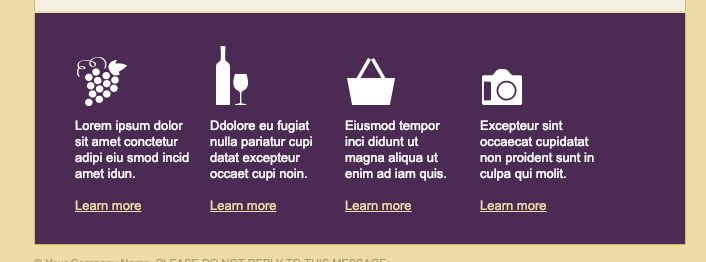
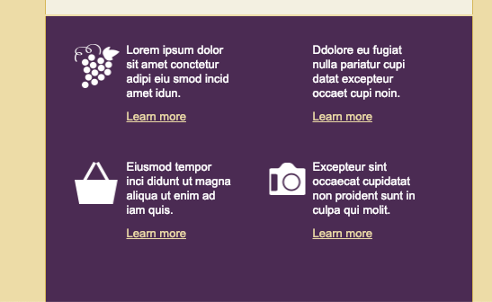
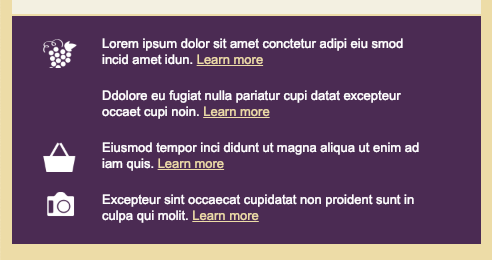
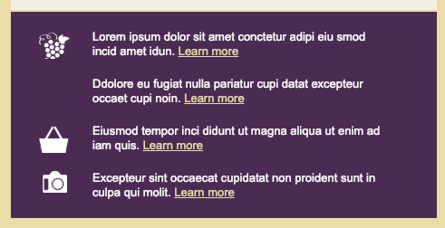
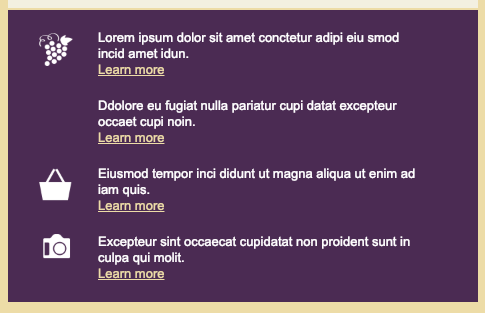

# Adjusting the promos for callouts for smaller screens

Now we gonna adjust the `layout` for the `callouts` for the small screens. 

### HTML head
```html
<!DOCTYPE HTML PUBLIC "-//W3C//DTD HTML 4.01 Transitional//EN" "http://www.w3.org/TR/html4/loose.dtd">
<html>
	<head>
		<meta http-equiv="Content-Type" content="text/html; charset=utf-8">
		<title>Our Vineyard</title>
		<style type="text/css">
			@media only screen and (max-width: 660px) {
              table.container {width: 480px !important; }
			  td.logo img {display: none;}
			  td.logo {background: #fff url(images/logo_medium.gif) no-repeat 10px 10px; height: 45px }
			  td.headline {padding: 5px 0px 0px 30px !important}
			  td.headline h1 {font-size: 28px !important}

			  td.banner img {display: none}
			  td.banner {width: 480px; height: 150px; background: url(images/banner_medium.jpg) no-repeat 0px 0px;}
              td.content {padding-bottom: 30px !important; background-image: url(images/banner_medium_ghost.jpg) no-repeat !important;}
			  td.content table.button {width: auto;}
			  td.content table.button td a {font-size: 14px !important}
			 
              td.promos table {width: 200px !important;}
			  td.promos table td h3 {margin-bottom: 8px;}
			  td.promos table td img {display: none;}
			  td.promos table.promo_1 td {background: url(images/promo_1_medium.jpg) no-repeat 0px 0px; padding: 100px 0px 0px 0px;}
			  td.promos table.promo_2 td {background: url(images/promo_2_medium.jpg) no-repeat 0px 0px; padding: 100px 0px 0px 0px;}
			  
              td.callout table {width: 50% !important; margin-bottom: 40px;}
			  td.callout table img {display: none;}
			  td.callout table br {display: none;}
			  td.callout table a {display: block; margin-top: 10px;}
			  td.callout table td {background-size: 65px 65px;}
			  td.callout table.callout_1 td {padding: 0px 30px 0px 60px !important; background: url(images/icon_grapes.gif) no-repeat 0px -13px;}
			  td.callout table.callout_2 td {padding: 0px 20px 0px 60px !important; background: url(images/bottle_grapes.gif) no-repeat 10px -3px;}
			  td.callout table.callout_3 td {padding: 0px 30px 0px 60px !important; background: url(images/icon_basket.gif) no-repeat 0px -13px; clear: left}
			  td.callout table.callout_4 td {padding: 0px 20px 0px 60px !important; background: url(images/icon_camera.gif) no-repeat 10px -23px;}


			}

			@media only screen and (max-width: 510px ){
				table.container{ width: 100% !important;}
				table.container td {border: none !important;}
				td.logo {background: #fff url(images/logo_small.gif) no-repeat center 10px; height: 32px}
				td.headline h1 {font-size: 24xp !important; text-align: center;}
				td.banner {height: 115px; background: url(images/banner_small.jpg) no-repeat right 0px;}
				td.content {line-height: 20px !important; padding-bottom: 10px !important; background: #f5f2e5  
				url(images/banner_small_ghost.jpg) no-repeat right 0px !important}
				td.footer {padding: 20px 30px !important}
				td.promos table.promo_1 {width: 100% !important;}
				td.promos table.promo_1 td {background: url(images/promo_1_small.jpg) no-repeat 0px 40px; padding: 20px 0px 40px 110px;}
				td.promos table.promo_2 {width: 100% !important;}
				td.promos table.promo_2 td {background: url(images/promo_2_small.jpg) no-repeat 0px 20px; padding: 0px 0px 0px 110px; clear: left;}

				td.callout {padding: 20px 30px 0px 30px !important}  /* start here changes for callouts for small screen*/
				td.callout table {width: 100% !important; margin-bottom: 20px;}
				td.callout table td {padding: 0px 0px 10px 50px !important; background-size: 50px 50px !important; min-height: 60px;}
				td.callout table a {display: inline}
			}
		</style>
    </head>
```

We gonna position the `icons` so they  being assigned to the `background properties` for each ine of the `callouts`. 

### HTML head
```html
<!DOCTYPE HTML PUBLIC "-//W3C//DTD HTML 4.01 Transitional//EN" "http://www.w3.org/TR/html4/loose.dtd">
<html>
	<head>
		<meta http-equiv="Content-Type" content="text/html; charset=utf-8">
		<title>Our Vineyard</title>
		<style type="text/css">
			@media only screen and (max-width: 660px) {
              table.container {width: 480px !important; }
			  td.logo img {display: none;}
			  td.logo {background: #fff url(images/logo_medium.gif) no-repeat 10px 10px; height: 45px }
			  td.headline {padding: 5px 0px 0px 30px !important}
			  td.headline h1 {font-size: 28px !important}

			  td.banner img {display: none}
			  td.banner {width: 480px; height: 150px; background: url(images/banner_medium.jpg) no-repeat 0px 0px;}
              td.content {padding-bottom: 30px !important; background-image: url(images/banner_medium_ghost.jpg) no-repeat !important;}
			  td.content table.button {width: auto;}
			  td.content table.button td a {font-size: 14px !important}
			  td.promos table {width: 200px !important;}
			  td.promos table td h3 {margin-bottom: 8px;}
			  td.promos table td img {display: none;}
			  td.promos table.promo_1 td {background: url(images/promo_1_medium.jpg) no-repeat 0px 0px; padding: 100px 0px 0px 0px;}
			  td.promos table.promo_2 td {background: url(images/promo_2_medium.jpg) no-repeat 0px 0px; padding: 100px 0px 0px 0px;}
			  td.callout table {width: 50% !important; margin-bottom: 40px;}
			  td.callout table img {display: none;}
			  td.callout table br {display: none;}
			  td.callout table a {display: block; margin-top: 10px;}
			  td.callout table td {background-size: 65px 65px;}
			  td.callout table.callout_1 td {padding: 0px 30px 0px 60px !important; background: url(images/icon_grapes.gif) no-repeat 0px -13px;}   /* start here changes for callouts icons*/
			  td.callout table.callout_2 td {padding: 0px 20px 0px 60px !important; background: url(images/bottle_grapes.gif) no-repeat 10px -3px;}
			  td.callout table.callout_3 td {padding: 0px 30px 0px 60px !important; background: url(images/icon_basket.gif) no-repeat 0px -13px; clear: left}
			  td.callout table.callout_4 td {padding: 0px 20px 0px 60px !important; background: url(images/icon_camera.gif) no-repeat 10px -23px;}


			}

			@media only screen and (max-width: 510px ){
				table.container{ width: 100% !important;}
				table.container td {border: none !important;}
				td.logo {background: #fff url(images/logo_small.gif) no-repeat center 10px; height: 32px}
				td.headline h1 {font-size: 24xp !important; text-align: center;}
				td.banner {height: 115px; background: url(images/banner_small.jpg) no-repeat right 0px;}
				td.content {line-height: 20px !important; padding-bottom: 10px !important; background: #f5f2e5  
				url(images/banner_small_ghost.jpg) no-repeat right 0px !important}
				td.footer {padding: 20px 30px !important}
				td.promos table.promo_1 {width: 100% !important;}
				td.promos table.promo_1 td {background: url(images/promo_1_small.jpg) no-repeat 0px 40px; padding: 20px 0px 40px 110px;}
				td.promos table.promo_2 {width: 100% !important;}
				td.promos table.promo_2 td {background: url(images/promo_2_small.jpg) no-repeat 0px 20px; padding: 0px 0px 0px 110px; clear: left;}

				td.callout {padding: 20px 30px 0px 30px !important}
				td.callout table {width: 100% !important; margin-bottom: 20px;}
				td.callout table td {padding: 0px 0px 10px 50px !important; background-size: 50px 50px !important; min-height: 60px;}
				td.callout table a {display: inline}
				td.callout table.callout_1 td {background-position: 0px -6px;}
				td.callout table.callout_2 td {background-position: 4px -2px;}
				td.callout table.callout_3 td {background-position: 0px -7px;}
				td.callout table.callout_4 td {background-position: 4px -17px;}
			}
		</style>
    </head>
```
### Callout large


### Callouts medium


### Callouts small


One thing more to do is the `anchor links`, they are up to the `content` now, we turned off the `break` tag display and since the `anchor tag` has a display of `inline`, it wraps up next to the `content`.  So,t to fix this we need to go to our `html body` code, find our `callouts` and  add a `class` to a second `break tag` we were using to space out our `content` inside of the `calouts`. We'll add a class of `spacer` to all of the callouts. 

### HTML
```html
<tr><!--callouts row-->
						<td valign="top" bgcolor="#55315d" class="callout" style="background-color: #55315d; 
						 padding: 30px; border-right: 1px solid #dbc064;  
						border-bottom: 1px solid #dbc064; border-left: 1px solid #dbc064;">
                           <table class="callout_1" width="135" align="left" border="0" cellspacing="0" cellpadding="0">
							<tr>
								<td valign="top" width="135" style="padding-left: 10px; padding-right: 10px; font-family:Arial, Helvetica, sans-serif; font-size:13px; line-height: 16px; color: #ffffff;">
									<br>
									Lorem ipsum dolor sit amet conctetur adipi eiu smod incid amet idun.
									<br><br class="spacer"> <!--add a spacer class here -->
									<a href="#" style="color: #efe1b0">Learn more</a>
								</td>
							</tr>
                        </table>
            <!--.......-->
```

In the `media screens` for the smaller screens let's target these `break` tags - `td.callout table br.spacer {display: inline;}`. 
Now the second `break tag` is reassigned to be displayed inline, pushing the `anchor links` to the next line. 

### Callouts without break


### Callouts with final break adjustments



As one more final detail we need let's to get rid of the `extra space` on the right and left sides. Some `email cliens` will offer the CSS applied to the `body tag`. Before our first `media query` let's create the rule to target the `body` element. This way the design on small screens will go edge to edge on the browser. 