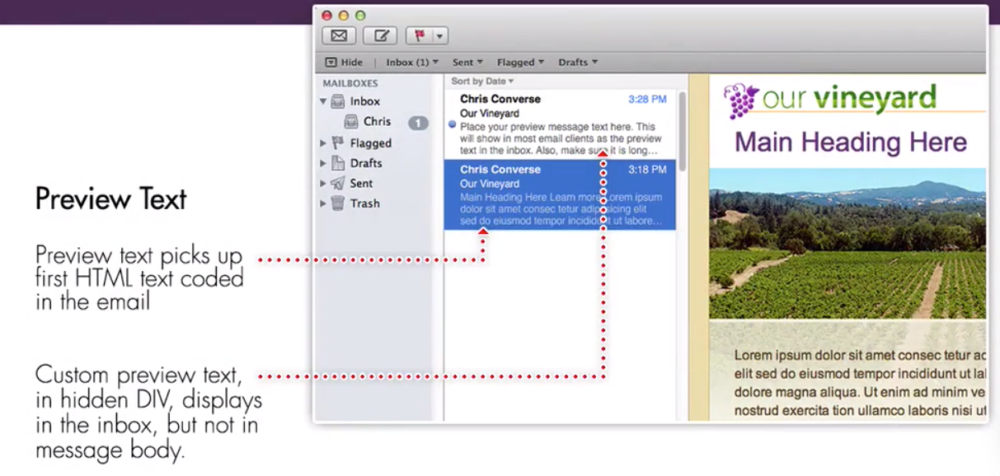

# Setting custom inbox preview text

If your `email client` support showing `preview text` in the inbox, what we gonna do is hide some text, so that the preview text sees our hidden text before it sees the text that is inside. 



In our `html body` code before the `table` that creats our background, for the browswers that don't support the `body tag`, let's start by adding a `div` tag and inline style. Inside the `dive` we'll put the `preview tags` that we wanna have shown in the preview area. There should be enough line of text, if there is room left over then the `preview area` will look for the first of the `html text`. 

### HTML

```html
<body bgcolor="#efe1b0">
        <div style="font-size: 1px; color: #efe1b0; display: none;">  <!--add div here-->
        
        Place you preview message text here. This will show in most email cliens as the preview text in the inbox.  
		   Also, make sure ot os long enough  to take up all of the space available by your chosen email clients. 
        
        
        </div> 
     <table width="100%" border="0" cellsapcing="0" cellpadding="0" bgcolor="#efe1b0">
        <tr>
			<td>
				<table class="container" width="640" align="center" border="0" cellpaddong="0" cellspasing="0"> <!--main email container-->
					<tr><!--logo row-->
						<td valign="top" class="logo" bgcolor="#ffffff" style="padding: 10px 20px 0px 30px; border-left: 1px solid #dbc064; border-right: 1px solid #dbc064; border-top: 1px solid #dbc064;"> 
						  <a href="#"></a>
						  
						</td>
					</tr>
					<tr><!--headline row-->
							<td valign="top" class="headline" bgcolor="#ffffff"  
							style="padding: 15px 20px 5px 30px; border-left: 1px solid #dbc064; border-right: 1px solid #dbc064; 
							 font-family: Arial, Helvetica, sans-serif; font-size: 16px; line-height: 22px;">
						    <h1 style="margin: 0px 0px 15px 0px; font-weight: normal; font-size: 32px; color: #723c7f;">Main Heading Here</h1>
						</td>
                    </tr>
```