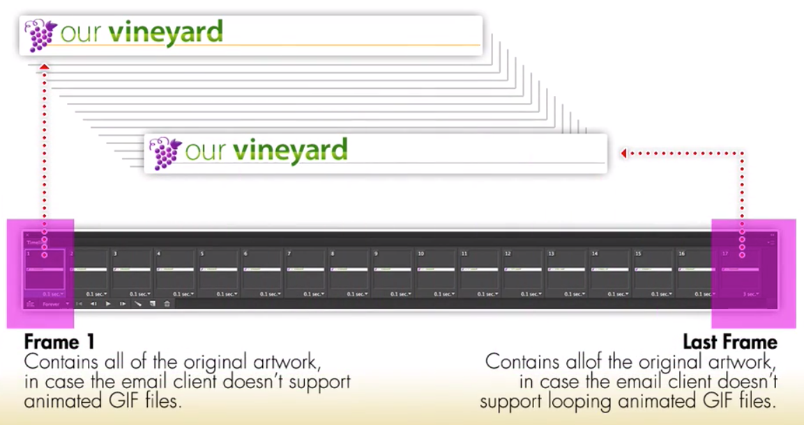

# Adding animation to the email

If you wanna add animation to the email there are `email clients` that support `animated gif`. So to explore this option let's go to the `html body`, find the `logo` and put together an ` animated gif` to the `logo`. 

### HTML
```html
	<body bgcolor="#efe1b0">
		<div style="font-size: 1px; color: #efe1b0; display: none;">
		   Place you preview message text here. This will show in most email cliens as the preview text in the inbox.  
		   Also, make sure ot os long enough  to take up all of the space available by your chosen email clients. 

		</div>
     <table width="100%" border="0" cellsapcing="0" cellpadding="0" bgcolor="#efe1b0">
        <tr>
			<td>
				<table class="container" width="640" align="center" border="0" cellpaddong="0" cellspasing="0"> <!--main email container-->
					<tr><!--logo row-->
						<td valign="top" class="logo" bgcolor="#ffffff" style="padding: 10px 20px 0px 30px; border-left: 1px solid #dbc064; border-right: 1px solid #dbc064; border-top: 1px solid #dbc064;"> 
						  <a href="#"></a>    <!--animated gif here-->
						  
						</td>
                    </tr>
```
There are a couple of things to keep in mind when we create an `animated gif` for an `email`, since not all `email clients` support this.  We need to make sure that the first frame and a last frame of the `animated gif` have the `full graphic` in place. 




So, if you using this for smth like a `banner add` you wanna make sure that all of the text in the logo, in the first and last frames. If the animation is supported then we can see all of the animated frames in between.


Instead of the `logo` we can certainly animate other graphics on the page, some of the `promo graphics` or maybe even the `icons`. The other thing is better to avoid - using animation as a background, or using `logos` and `promo graphics` as background graphics. 