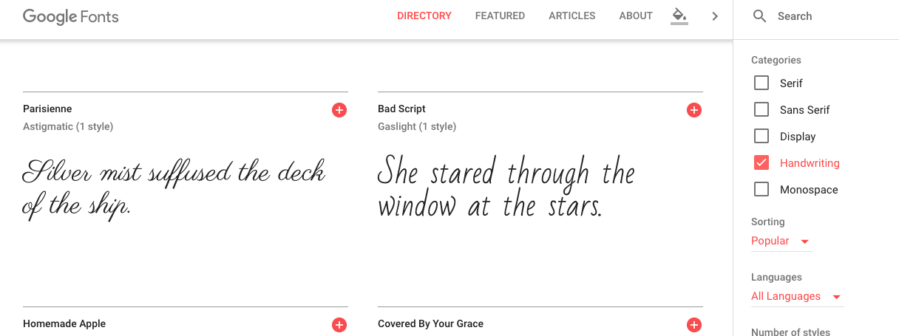
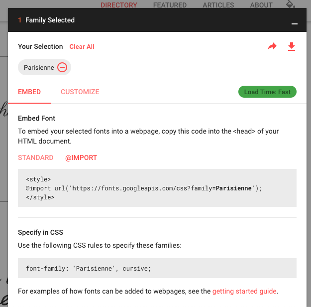

# Using web fonts in the email

You might want to use in the `email` some custom `fonts`. It's not reccomended that you use `fonts` that require `JS` to be loaded. But there are some font services tha will supply `fonts` through `CSS tags`. 

`Google fonts` the service is free and offers CSS solution for the fonts. Let's test with the `parisienne` font. 



Choose the `import` variant.



Let's copy the line of code in the `import`, go to our `html`, we need to put this into the CSS area, this has to be the first line inside of the CSS. 

### HTML head 
 ```html
 <!DOCTYPE HTML PUBLIC "-//W3C//DTD HTML 4.01 Transitional//EN" "http://www.w3.org/TR/html4/loose.dtd">
<html>
	<head>
		<meta http-equiv="Content-Type" content="text/html; charset=utf-8">
		<title>Our Vineyard</title>
		<style type="text/css">
		    @import url('https://fonts.googleapis.com/css?family=Parisienne');  /*import the font*/
			
		     body {margin: 0; padding: 0;}

			@media only screen and (max-width: 660px) {
              table.container {width: 480px !important; }
			  td.logo img {display: none;}
			  td.logo {background: #fff url(images/logo_medium.gif) no-repeat 10px 10px; height: 45px }
			  td.headline {padding: 5px 0px 0px 30px !important}
			  td.headline h1 {font-size: 28px !important}

              ........
```
Now, go back to `google fonts` to "Specify in CSS", we need to set the name of the font "Parisienne" and put it as `inline style` for our `h1` tag in the `html body`. `font-family: 'Parisienne', Arial` - we add also arial font for cases the `parisienne` won't supported. 

### HTML
```html
<tr><!--headline row-->
							<td valign="top" class="headline" bgcolor="#ffffff"  
							style="padding: 15px 20px 5px 30px; border-left: 1px solid #dbc064; border-right: 1px solid #dbc064; 
							 font-family: Arial, Helvetica, sans-serif; font-size: 16px; line-height: 22px;">
						    <h1 style="margin: 0px 0px 15px 0px; font-weight: normal; font-family: 'Parisienne', Arial; font-size: 32px; color: #723c7f;">Main Heading Here</h1>
						</td>
                    </tr>
```