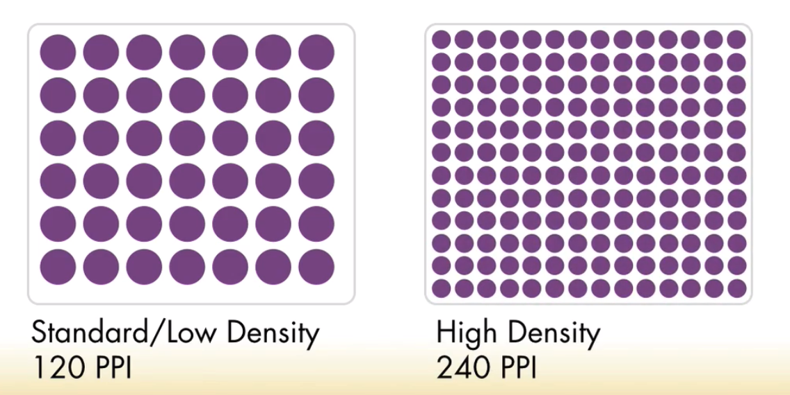

# Using high definition graphics (Retina) in html email

Let's talk about high definition screens. What we need to do to the graphic to make it high density? 



When we create graphics at the size that is going to be displayed on a standart-definition device it looks good, however the same graphic displayes on the `high-density` devices, thise devices have more pixels and images will look blury or fuzzy, cos the devise has the duplicated number of pixels. 

To transform graphics we can use photoshop. For this high-definition graphic we'll need to specify `media queries`, where we have two sets of properies: `only screen` and all series of `pixel ratios` css media queries; then we redefined the background images. 

### CSS
```css
/* high definition graphics for medium screens */
			@media
				only screen and (max-width: 660px) and (-webkit-min-device-pixel-ratio: 2),
				only screen and (max-width: 660px) and (min--moz-device-pixel-ratio: 2),
				only screen and (max-width: 660px) and (-o-min-device-pixel-ratio: 2/1),
				only screen and (max-width: 660px) and (min-device-pixel-ratio: 2),
				only screen and (max-width: 660px) and (min-resolution: 192dpi),
				only screen and (max-width: 660px) and (min-resolution: 2dppx)			
			{
				td.logo  { background-image: url(images/logo_medium_2x.gif); background-size: 510px 38px; }
				td.banner { background-image: url(images/banner_medium_2x.jpg); background-size:  478px 150px; }
				td.content { background-image: url(images/banner_medium_ghost_2x.jpg) !important; background-size: 478px 90px; }
				td.promos table.promo_1 td { background-image: url(images/promo_1_medium_2x.jpg); background-size: 185px 90px; }
				td.promos table.promo_2 td { background-image: url(images/promo_2_medium_2x.jpg); background-size: 185px 90px; }
				td.callout table.callout_1 td { background-image: url(images/icon_grapes_2x.gif); background-size: 75px 75px; }
				td.callout table.callout_2 td { background-image: url(images/icon_bottle_2x.gif); background-size: 75px 75px; }
				td.callout table.callout_3 td { background-image: url(images/icon_basket_2x.gif); background-size: 75px 75px; }
				td.callout table.callout_4 td { background-image: url(images/icon_camera_2x.gif); background-size: 75px 75px; }		
			}
			
			
			/* high definition graphics for small screens */
			@media
				only screen and (max-width: 510px) and (-webkit-min-device-pixel-ratio: 2),
				only screen and (max-width: 510px) and (min--moz-device-pixel-ratio: 2),
				only screen and (max-width: 510px) and (-o-min-device-pixel-ratio: 2/1),
				only screen and (max-width: 510px) and (min-device-pixel-ratio: 2),
				only screen and (max-width: 510px) and (min-resolution: 192dpi),
				only screen and (max-width: 510px) and (min-resolution: 2dppx)
			{
			
				td.logo { background-image: url(images/logo_small_2x.gif); background-size: 260px 25px; }
				td.banner { background-image: url(images/banner_small_2x.jpg); background-size: 510px 115px; }
				td.content { background-image: url(images/banner_small_ghost_2x.jpg) !important; background-size: 510px 70px; }
				td.promos table.promo_1 td { background-image: url(images/promo_1_small_2x.jpg); background-size: 85px 85px; }
				td.promos table.promo_2 td { background-image: url(images/promo_2_small_2x.jpg); background-size: 85px 85px; }
				td.callout table.callout_1 td { background-image: url(images/icon_grapes_2x.gif); background-size: 75px 75px; }
				td.callout table.callout_2 td { background-image: url(images/icon_bottle_2x.gif); background-size: 75px 75px; }
				td.callout table.callout_3 td { background-image: url(images/icon_basket_2x.gif); background-size: 75px 75px; }
				td.callout table.callout_4 td { background-image: url(images/icon_camera_2x.gif); background-size: 75px 75px; }
			
            }
```
