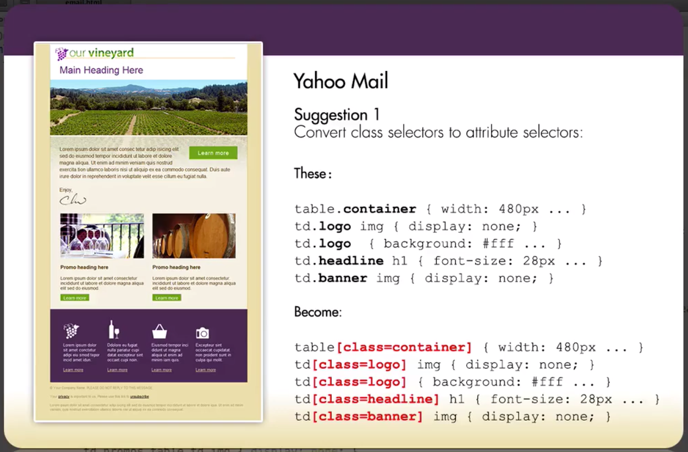
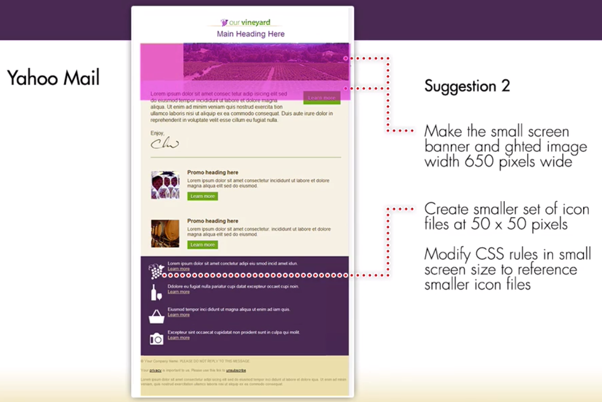

# Sudgested adjustmenst for Yahoo mails

The issue we have with Yahoo mail is that it doesn't support `media query` statements; so, the medium screen rules and the small screen rules are all being seen by Yahoo. The `media query` that specifying the individual sizes is not being supported.

What we can do is convert our `class-based selectors` (`table.container`) to `attribute-based selectors`(`table[class=container]`). Right now this is not being supported by Yahoo, but it is supported by all of the other `email clients`.  

If at some point Yahoo does begin to support the `attribute selectors` but not the `media queries`, the second suggestion would be to make `small graphics` wide enough to fill in the wide window inside the Yahoo mail. So the `small screen` bannes and the `small screen` background graphic need to be wide enough. Also we nned to create another set of `icons` for the `callouts` since the `background size` property in our CSS is not being supported by Yahoo. So we need to have two sets of `icons`: the original size and another set, set 50 * 50. We can reference this inside of the rules for `small screens`.

