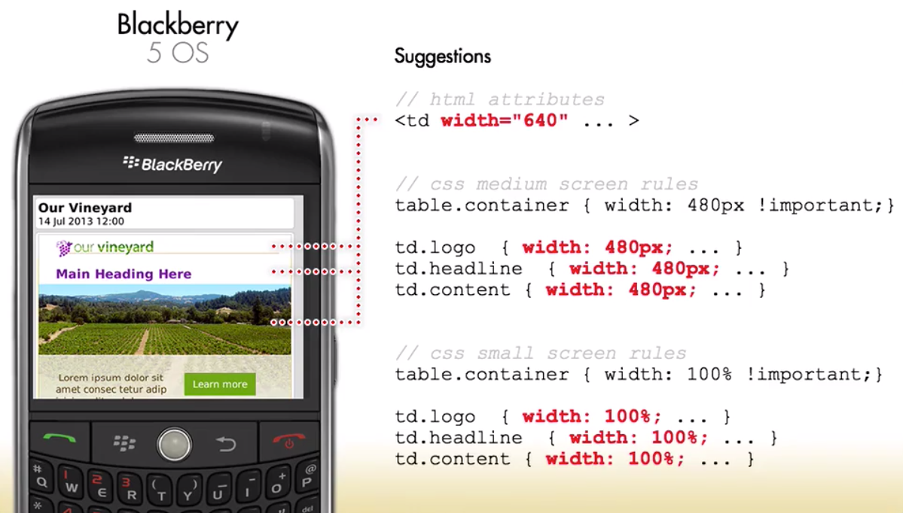

# Sudgested adjustmenst for Blackberry 5 OS mails

If we need our design to work in Blackberry 5, `Blackberry 5` is not supporting `media queries`, but the `<td>` tags inside of the `table rows` are not extending the full width. 

What Blackberry needs is setting `width` of all the individual `<td>'s`. We'll need to set this for every row. 
The implication for this on the `responsive design aspect` is this is another `property` that we gonna be to set with our `media queries`: inside of the `medium screen` we gonna need to set another `property` (additional `width`) to all of the rows; and we have to do the same for the small screen as well. 

So, this approach is gonne result in many more width properties being assigned to iur responsive rules to overwrite all of the `width` properties in the `<td>` tags. 

