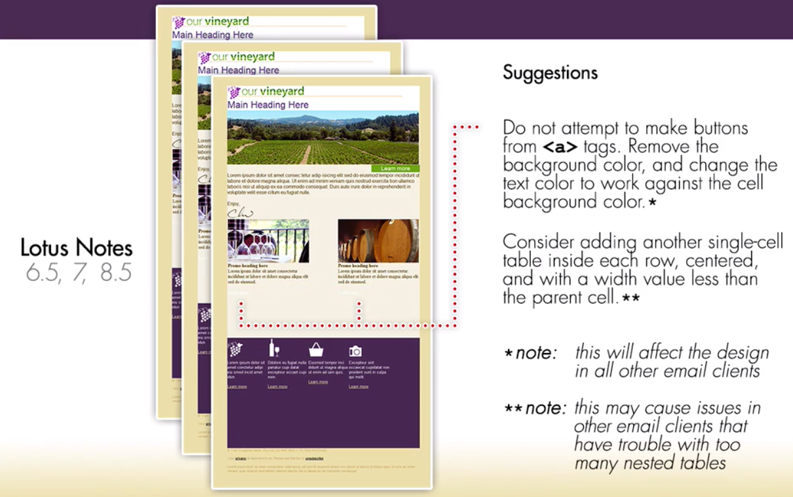

#  Sudgested adjustmenst for Lotus Notes 6.5, 7, 8.5 mails

Here the first suggestion: don't use `background properties` on the `anchor tags`. So, we can remove the `background color` and change the color of the `links`.

One more thing we need to do: put a `single-cell table` inside of the each of `table rows`. You'll notice that the `padding` is nto being supported on the `<td>'s`, so all of the content inside the `<td>'s` is touching the edges - so, if we put a `table` inside of each `table row` that contains content and set the `width` to about 650px, and set the `alignment` to center, we'll get this inside spacing we are looking for in the most `<td>'s`. 
And if we follow this approach we need to make sure to remove the `padding` to all of the other `<td>'s`, since all of the other `email cliens` are supporting it, and use the `width` of the `nested table` to control how much spacing we wanna get from left and righ hand side.

This approach will result in a `promo tables`  and `callout tables` being `three-tables deep`. We have the `outer table` which is centering our entire `content`, the `main content container` and then the `tables` for the `promos` and `callouts`. 

