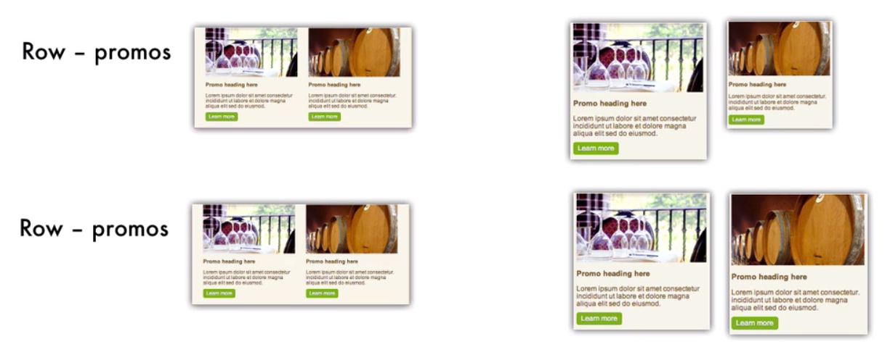
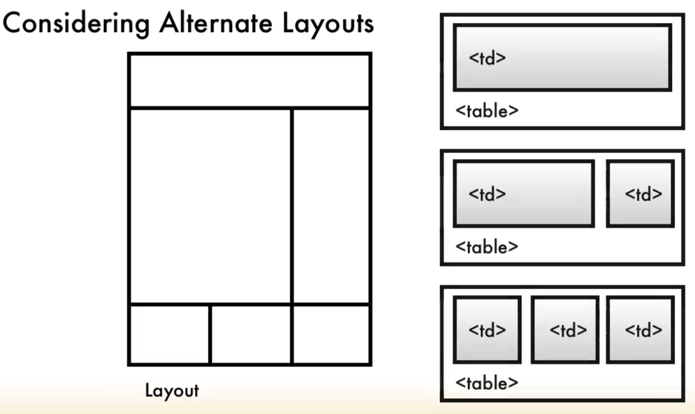
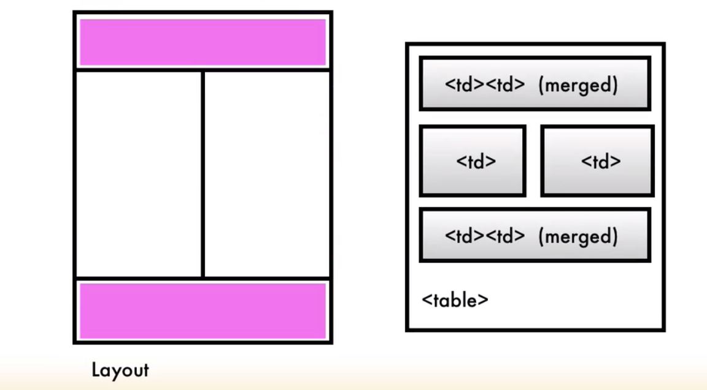
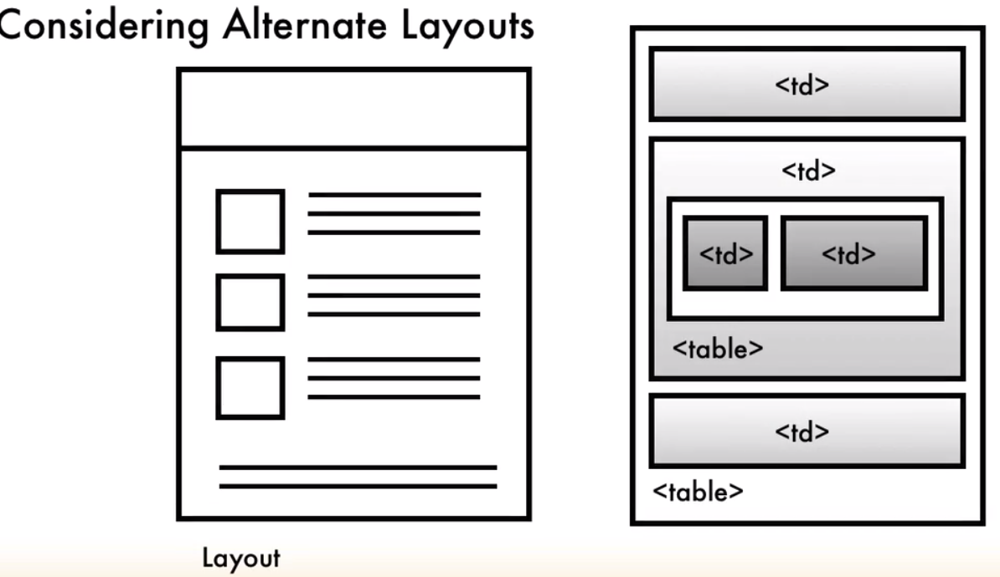

# Recommendations to alternate layouts

- we can add more `tables` inside of the `promos row`. The reason why we put two `tables` inside of each `row`  is because some older `browsers` won't support `clear tag`. So, if your two `tables` are not the `same height` (e.g smaller because of less text and smaller graphic), what that's gonne do in older email clients is allow the third table to flow up next to the first table and put in underneeth the second table, and that will allow thw fourth table to move to the left position. So, this is not the desired layout.

If we wanna more `tables` inside of that `row` it's better to add a `whole separate row` and put our additional `tables` inside of there. 

In our `callots row` we didn't have such a proplem cos we don't start rearrange the `layout` untill we go to the `media queries`. This means that only new email clients will even see those patriular rules. And those particular clients will support the `clear tags`.

## Alternate layout ideas:

1. Layout with sidebar

When we have the `sidebar` that's gonna be the entire `height` of the `content`. And the `top header` and the `footer ` broken into couple of different groups - is better to break into multiple `tables` this is because merging multiple `table cells` in a different measurements  in the same parent table can have `layout` problems. If we'd like to have the `sidebar` where the sidebar is the same height as the `content area`, we'll need a `table` with two columns inside of there. But here keep in mind for `mobile` we still have that `table data` on the side (sidebar data); so we either need to make the `content` really small or pehaps hide `content` insude of that `table data`. 

2. If we wanna have the `header` and the `footer` area have merged `table cells` but have the same measurements we can do this inside of a single `table` and this will render pretty accurately across all of the different browsers. 

3. If we wanna design smth whene the `heading` area and `content` area are the same `width` and we have a `columns structure` ibside of a `content` - we can create the `outermost table` and then put `nested` tables inside so that we can get `images` next to our `text`

Lastly, keep in mind HTML emails are not web pages. Simple, `single column email` will render properly in the most number of email clients. 