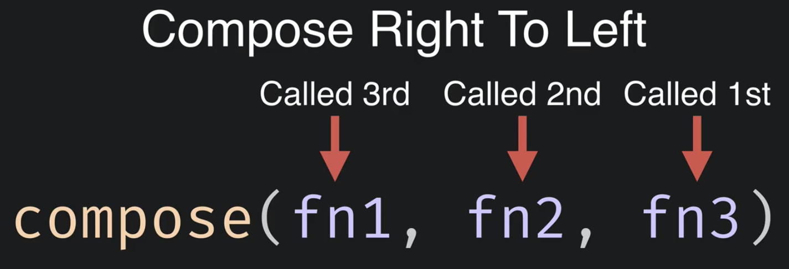
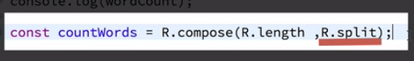
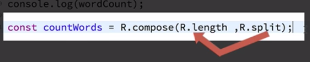
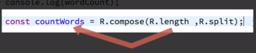

# Function Composition

`Function composition` -  is making new function out of other `functions` by combining the `logic` of other `functions`.

### Example

We got a `constant` named `"sentence"`.

```js
const sentence = "Lorem ipsum dolor sit amet, consectetur adipiscing elit, sed do eiusmod tempor incididunt ut labore et dolore magna aliqua."
```

We'd like to know how many words are in this sentence. Let's use `ramda` library to solve this. First we'll split a sentence into a list of words, which we can do by calling `ramda split() function`. 

```js
const sentence = "Lorem ipsum dolor sit amet, consectetur adipiscing elit, sed do eiusmod tempor incididunt ut labore et dolore magna aliqua."

const wordList = R.split('', sentence)     //make a list of words
console.log(wordList)

//output:
//["Lorem", "ipsum", "dolor", "sit", "amet", "consectetur", "adipiscing", "elit", "sed", "do", "eiusmod", "tempor", "incididunt", "ut", "labore", "et", "dolore", "magna", "aliqua"]
```

Ramda also has a `length() function` which takes a `single parameter` for the thing we wanna get the length of.

```js
const sentence = "Lorem ipsum dolor sit amet, consectetur adipiscing elit, sed do eiusmod tempor incididunt ut labore et dolore magna aliqua."

const wordList = R.split('', sentence)
console.log(wordList)

const wordCount = R.length(wordList)     //know the length of the word list
console.log(wordCount)

//output:
//["Lorem", "ipsum", "dolor", "sit", "amet", "consectetur", "adipiscing", "elit", "sed", "do", "eiusmod", "tempor", "incididunt", "ut", "labore", "et", "dolore", "magna", "aliqua"]
// 19
```
Well, we solved it in two steps and we had some `intermediate data`. The better way to solve the same proplem - using `functional composition`.
Ramda has a function called `compose`. This `compose function` allows you to combine two or more pure functions, and returns a new function that is a combination of those two functions.  Actually the uotput of the one function serves as the input for the another function. In our example let's put `split` function first in the `compose`, and here we won't pass any parameter to the `split funciton`. Because the `compose function` needs to be passed functions as parameters.

Now the output of the `split function` needs to be the input of the `length function`. 

```js

const countWords = R.compose(R.split)
```

The important fact about the `compose function` - it works from right to left! In other words the `last fucntion` we pass in the `compose function` is the first function called in the chain of function calles. 



Knowing this fact we need to add `length() function` before the `split() function`. That's all we need to do to compose these two function together. 

```js

const countWords = R.compose(R.length, R.split)
```

What's returned from the `compose` is a new function, that we can call. This new function will require the parameters the last function requires, in our case the `split function`.



Then the output of the `split function` is fed as the input for the `length function`. 



The `value` of calling the `length function` is the `final return value` of the newly created `composed function`. 




Well, we can call newly composed function passing the parameters the `split` function expects, namely the single space `''` character and the data we wanna act on - 'sentence'. 

```js
const sentence = "Lorem ipsum dolor sit amet, consectetur adipiscing elit, sed do eiusmod tempor incididunt ut labore et dolore magna aliqua."

const countWords = R.compose(R.length, R.split)

console.log(countWords('', sentence))
//output:
// 19 
```
The cool thing here is that we got a new reusable function we can use anywhere we needed.  

Also `currying` and partial application come here in handy. All the `functions` in the `Ramda library` are curryed, so in our newly `composed function` we can pass in some of the `parameters`, in other words we can perform `partial application`. What is returned - is another `function` that expects the remaining `parameters`. 

So, in our case we can pass the single space parameter `(" ")` in the `split function`. And we no longer need to pass in the `pattern parameter` when we call `countWords() function`. 

```js
const sentence = "Lorem ipsum dolor sit amet, consectetur adipiscing elit, sed do eiusmod tempor incididunt ut labore et dolore magna aliqua."

const countWords2 = R.compose(R.length, R.split(' ')) //pass here the first parameter

console.log(countWords2(sentence))   //here we pass just the remaining parameter 
//output:
// 19 
```

There is another way to look at `compose function`, reading it from left to right. `Ramda library` has the similar `function` called `pipe()`. `Pipe()` is almost exsactly as the `compose function` except the `functions` are composed from left to right. 

```js
const sentence = "Lorem ipsum dolor sit amet, consectetur adipiscing elit, sed do eiusmod tempor incididunt ut labore et dolore magna aliqua."

const countWords3 = R.pipe(R.split(' '), R.length,) //pass here the split() first and the length() second

console.log(countWords3(sentence))   
//output:
// 19 
```
### Exersise

```js
// Count how many digits there are in the following 
// sentence, using functional composition

const sentence = 'PechaKucha is a presentation style in which 20 slides are shown for 20 seconds each (6 minutes and 40 seconds in total).';

const numbersInString = // add function composition here

expect(numbersInString(sentence)).toBe(7); 

console.log('If you see this printed in the console, the test passed!');
```

There are 4 steps to this compostion, each of them listed below:

1. transform the string into a list of individual characters 
2. attempt to transform the individual characters into integers 
3. filter the list to only include integers 
4. find the length of the list of numbers

### Solution

```js
const sentence = 'PechaKucha is a presentation style in which 20 slides are shown for 20 seconds each (6 minutes and 40 seconds in total).';


const numbersInString = R.pipe(R.split(''), R.map(parseInt),R.filter(Number.isInteger),R.length )

expect(numbersInString(sentence)).toBe(7); 

console.log(numbersInString(sentence))

console.log('If you see this printed in the console, the test passed!');
```


