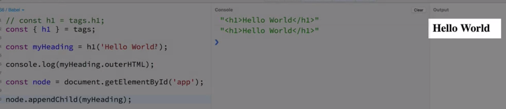

# Helper Lybraries

### Tachyons CSS Library

Find the library [here](http://tachyons.io/docs/)

To transform `raw data` to `html` we'll use opensorce `lybraries`:

### Hyperscript Lybrary
Find [here](https://github.com/hyperhype/hyperscript)

### Hyperscript-helpers Lybrary
Find [here](https://github.com/ohanhi/hyperscript-helpers)

Provides `functions` for every type of `html tag`. It provides `functions` on the `tags` variable.

```js
const myHeading = tags.h1("Hello World");

console.log(myHeading.outerHTML);
```


But the better way to write this is to use `destructuring`. 

```js
const {h1} = tags; //in curly braces add the name of the property you wanna unpack from "tags"

const myHeading = h1("Hello World");  //here we no longer need "tags"

console.log(myHeading.outerHTML);
```
To render our `heading` in the page we need to be specific about where we wanna the heading be on the page. In our `html` we have the `div` with the `id="app"`. This `tag` or `DOM node` is where we'd like the `heading` loaded into the page. 

```html
<!DOCTYPE html>
<html>
<head>
<link rel="stylesheet" href="https://unpkg.com/tachyons@4.10.0/css/tachyons.min.css"/>
</head>
<body>
<div id="app">
</div>
</body>
</html>
```

We can get the reference to this `node` in the DOM by doing the folllowing:

```js
const {h1} = tags; 

const myHeading = h1("Hello World");  
console.log(myHeading.outerHTML);

const node = document.getElementById('app'); //get the tag , we interact with the DOM programatically

node.appendChild(myHeading)  //we add heading to the node (div with the id=app)
```



### Exersise

```js
// 1. using destructuring, create a constant named
// p, which is a function that will create paragraph tags
// Remember, you'll need to use the "tags" namespace
// to destructure from

const {p} = tags;

// 2. create a constant named myParagraph by using the
// p function you coded in step 1.  The paragraph should
// contain a sentence of your choosing.

const myParagraph = p("Hello, I'm a paragraph")
      
// 3. create a constant named node, that references 
// the dom node where the id is 'app'.
const node = document.getElementById("app")

// 4. add your 'myParagraph' to the dom node you 
// coded in step 3

node.appendChild(myParagraph)

// HINTS / HELP
// If you need help, you can read the following docs:
// hyperscript-helpers: https://github.com/ohanhi/hyperscript-helpers
// destructuring: https://developer.mozilla.org/en-US/docs/Web/JavaScript/Reference/Operators/Destructuring_assignment#Object_destructuring
// reference dom node: https://developer.mozilla.org/en-US/docs/Web/API/Document/getElementById
// adding html in code: https://developer.mozilla.org/en-US/docs/Web/API/Node/appendChild
// you can find my solution at: https://jsbin.com/najisaw/1/edit?js,output
```