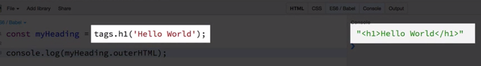

# Helper Lybraries

### Tachyons CSS Library

Find the library [here](http://tachyons.io/docs/)

To transform `raw data` to `html` we'll use opensorce `lybraries`:

### Hyperscript Lybrary

### Hyperscript-helpers Lybrary

Provides `functions` for every type of `html tag`. It provides `functions` on the `tags` variable.

```js
const myHeading = tags.h1("Hello World");

console.log(myHeading.outerHTML);
```

