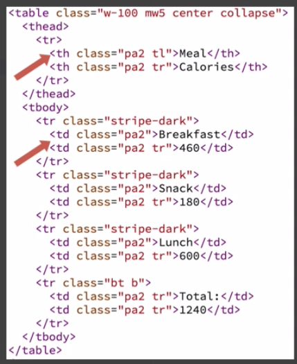

# Transforming data into HTML & CSS

In an actual `app` `HTML` will need to be `dynamically created`, based on the `current state` of the `app`.  
How do we transform `data` to `html`? 


To do this we actually need to create several smaller `functions` that are then combined together as appropriate? How can we know what `functions` to make, how many of them will be appropriate? 

The rule to follow: `"Single Responsibility Principle"`. Each `function` should do just one thing. 

Well, for our case the plan/functions to create will include: 

-- function to create a cell
-- function to create a mealRow
-- function to create a headerRow
-- function to create a totalRow
-- function to create a mealBody
-- function to create a mealHeader
-- function to create a table tag with all the contents of the table - mealsTable


We'll start from the `cell`. It is responsible for generating `html`, <td> tag in the `body` or <th> tag for cells in the `header`. Tthe cell will need some `CSS classes` to apply and the `actual data` to display in the cell. 



The only way this `function` will know which `tag` to generate is to recieve a `parameter` indicating which one to create. Also we need a parameter for CSS class and the value.  
```js
const MEALS = [
    {description: 'Breakfast', calories: 460},
    {description: 'Snack', calories: 180},
    {description: 'Lunch', calories: 600}
]
const {td, th} = tags;  //destructuring expression

function cell(tag, className, value){
      return tag({className}, value);
}

const node = document.getElementBiId('app');

const view = cell(td, 'pa2', 'Lunch')

node.appendChild(view)
```


Let's write `mealRow` function. It will take `class name` and an individual `meal record`. In the `tr` function we pass the `object literal` className and as the second `argument` the `array of cells`. Our `rows` gonna have more than one `cell`. The way we pass multiple `child values` to hyperscrypt functions like `tr function` is by passing an `array of children`. The first element of the `array` will be the `value` we get when calling a new `cell function` passing in the `tag function` we want to be used `(td)` and then css class name `pa2`, and then passing in the value` we wanna be rendered. 

The second element of the `array` will be the `value` we get by calling `cell` again. And change the `view` to mealRow with the approprieate css class and the object literal representing the cells. 

```js
const MEALS = [
    {description: 'Breakfast', calories: 460},
    {description: 'Snack', calories: 180},
    {description: 'Lunch', calories: 600}
]
const {td, th, tr} = tags;   //add tr

function cell(tag, className, value){
      return tag({className}, value);
}

function mealRow(className, meal){
      return tr({className}, [
           cell(td, 'pa2', meals.description)
           cell(td, 'pa2 tr', meals.calories)
      ])
}

const node = document.getElementBiId('app');

const view = mealRow('stripe-dark', {description: 'Lunch', calories: 500})

node.appendChild(view)
```


Let's move to `body` function. The `rows` identifyer we ude in `tbody` function doesn't exist yet and we need to create it. 

```js
const MEALS = [
    {description: 'Breakfast', calories: 460},
    {description: 'Snack', calories: 180},
    {description: 'Lunch', calories: 600}
]
const {td, th, tr, tbody } = tags;   //add body

function cell(tag, className, value){
      return tag({className}, value);
}

function mealRow(className, meal){
      return tr({className}, [
           cell(td, 'pa2', meals.description)
           cell(td, 'pa2 tr', meals.calories)
      ])
}

function mealsBody(className, meals){
    return tbody({className}, rows);   //pass css classes and rows that should be part of the body
}

const node = document.getElementBiId('app');

const view = mealRow('stripe-dark', {description: 'Lunch', calories: 500})

node.appendChild(view)
```
To tranform the meals list to the rows, we'll use `map() function`. Set it to the value returned by calling `map() function`. We'll use ramda function. 

```js
const MEALS = [
    {description: 'Breakfast', calories: 460},
    {description: 'Snack', calories: 180},
    {description: 'Lunch', calories: 600}
]
const {td, th, tr, tbody } = tags;  

function cell(tag, className, value){
      return tag({className}, value);
}

function mealRow(className, meal){
      return tr({className}, [
           cell(td, 'pa2', meals.description)
           cell(td, 'pa2 tr', meals.calories)
      ])
}

function mealsBody(className, meals){
    const rows = R.map(R.partial(mealRow, ['stripe-dark']), meals)           //create rows identifyer
    return tbody({className}, rows);   
}

const node = document.getElementBiId('app');

const view = mealsBody('', MEALS)

node.appendChild(view)
```
