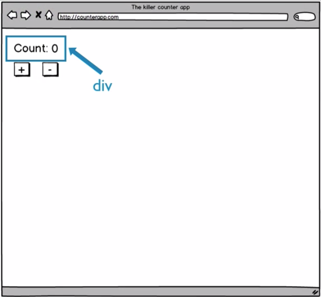

# View functions

What should be the `input parameter` for the `pure function`? Only one thing change in our view - the counter - so it makes sense hat we need to pass the `count` into the `view function`, so the `view function` knows what number to include in the `html` it creates. But let's give the parameter a more gereric name - 'model'. As the second rile for the `pure functions` - it must return the `value` based on the `input parameters`. So, we'll return an html `div` as a container for the count lable, the count itself and the two buttons. 

```js
function view(model){
  return div()
}
```


To create this `div` and any other `html` we need we'll continue to use `hyperscript` and `hyperscript-helpers` libraries. We'll use npm to install these libraries - npm install hyperscript hyperscript-helpers --save-dev. 

Now we are able to pull these libraries into `index.js` file by using the `module import syntax`. The `hyperscript-helpers` library is an actual library theat provides all the types of `html functions`, such as the `div function` to create the `div tags` and the `button functions` to create `button tags`. But the `hyperscript-helpers` library depends on some other library to know exactly how to render the `html tags`. In our case we'll use the  `hyperscript-helpers`library with the  `hyperscript` library. We do this by keying `hh` (a `referense` to `hyperscript-helper library`), which is just a `function`, and the `value` we pass into the `functions` is -`h`- our reference to `hyperscript` library. This `function` call (`hh(h)`) returns an `object` with `properties` for all the `tag-writing-functions`

```js
import h from 'hyperscript';    //import hyperscript
import hh from 'hyperscript-helpers';  // //import hyperscript-helpers

hh(h)

function view(model){
    return div()
  }
```
We'll use `destructuring` to pulll a referense to the `div function` we gonna use in a `view function`. We call the `tag functions`, like the `div function` with two `parameters`: the first: an `object` with a `className property` set to a `string` that has the `css classes` we wanna apply, then we pass some sort of `child element`. 

```js
import h from 'hyperscript';    
import hh from 'hyperscript-helpers';  

const {div} = hh(h);   //destructuring to unpack the tag functions

function view(model){
    return div({className: ''}, )
  }
```

We don't actually need to pass the `object literal` if we don't want to. Instead we can just pass in what we want to include inside the `html tag`. For now let's pass `an array`. Th efirst element of the `array` will be the `div` that contains the `count lable` and the actuall count. 

```js
import h from 'hyperscript';
import hh from 'hyperscript-helpers'; 

const { div } = hh(h); 

function view(model){
    return div([
        div(`Count: ${model}`),
        
    ])
  }
```



The next element of the `array` will be the `html button`.First we need to include the button into the `destructuring expression`. And then we'll call `the button function` passing in the `string with the "+" sign`. The last element of the `array` will be another button which shows the `"-" sign`. 

```js
import h from 'hyperscript';
import hh from 'hyperscript-helpers'; 

const { div, button } = hh(h); //include button

function view(model){
    return div([
        div(`Count: ${model}`),  //div with label and count
        button('+'), //div with plus button
        button('-')  //div with minus button
    ])
  }
```
Let's render `html` that the `view function` creates in a web page. Which we can by first creating a `constant` named `rootNode` that will referense some `DOM node` in the `index.html` file. In the `index.html` file we have the `div` with the `id='app'`, this is where we wanna load view into the page. And the last thing we need to do is to call `rootNode.appenChild()`, passing in the `markup` we'd like added, which we can get by calling our `view() function`, passing in some `value` that represents our model. 

```js
import h from 'hyperscript';
import hh from 'hyperscript-helpers'; 

const { div, button } = hh(h); 

function view(model){
    return div([
        div(`Count: ${model}`),  
        button('+'),   
        buton('-')  
    ])
  }

  const rootNode = document.getElementById('app'); //load to the div with id = app
  rootNode.appendChild(view()) 
```

Let's add a `constant` at the top of the page called `initModel` to represent our initial `model value` and set it to `0`. 

```js
import h from 'hyperscript';
import hh from 'hyperscript-helpers'; 

const { div, button } = hh(h); 

const initModel = 0

function view(model){
    return div([
        div(`Count: ${model}`),  
        button('+'),   
        buton('-')  
    ])
  }

  const rootNode = document.getElementById('app'); //load to the div with id = app
  rootNode.appendChild(view(initModel)) //call view with data
```

Here is the result: 


Let's add some `tachyons css classes` to make it look more nice. 

First we'll add an `object literal` as the first `parameter` for the `div function` that has the `count`, set the `margin vertical` to the second step. On both buttons let's add some `padding vertical` first step amd make `horisontal padding` a bit wider, by adding the class for `padding horisontal` second step. And lastly lets add `margin right` step 2 on the first button, so we have the space between two buttons.  

```js
import h from 'hyperscript';
import hh from 'hyperscript-helpers'; 

const { div, button } = hh(h); 

const initModel = 0

function view(model){
    return div([
        div({className: 'mv2'},`Count: ${model}`),
        button({className: 'pv1 ph2 mr2'},'+'),
        button({className: 'pv1 ph2'},'-')
    ])
  }

  const rootNode = document.getElementById('app');
  rootNode.appendChild(view(initModel))
  ```

  Clicking on either these buttond doesn't actually do anything yet. Let's do this. In the `buttons attribute object` where we are passing the `className` property, we'll add another attribute named `onclick`. Then for the `onclick` property's `value` we'll add a lambda function and simply console.log "+ clicked!". 

  ```js
  import h from 'hyperscript';
import hh from 'hyperscript-helpers'; 

const { div, button } = hh(h); 

const initModel = 0

function view(model){
    return div([
        div({className: 'mv2'},`Count: ${model}`),
        button({className: 'pv1 ph2 mr2', onclick: () => console.log('+ clicked!')},'+'),    //onclick property plus value 
        button({className: 'pv1 ph2', onclick: () => console.log('- clicked!')},'-')
    ])
  }

  const rootNode = document.getElementById('app');
  rootNode.appendChild(view(initModel))
  ```

  

  What's exactly is this `onclick property`? Adding this `onclick property` allows us to tell the `DOM` that we are interested in knowing when someone clicks on the button. The way we tell the `DOM` that we'd like to know when the button is clicked - is by passing the `onclick property` a `function` that can be called when it's clicked. In the `function` we provide the `DOM` we just do whatever needs to be done to properly respond to the `button click`. 