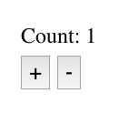
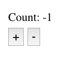
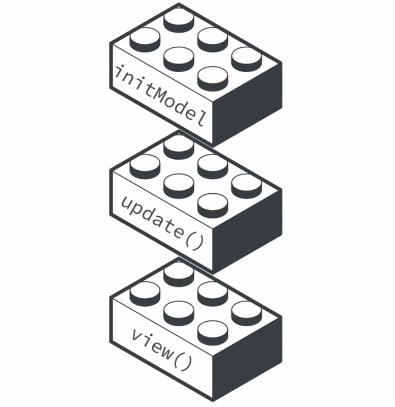

# Update function

Well, we wanna our `model` to decrease and increase when the button clicked. Obviously we need a `function` to  transform our `count`,  a pure function. So, lets' create a `function` to decrease or increase the number. We'll name this `function` "update" as it's responsible for updating our `model`. So what `input parameters` should the `update function` recieve? To answer this question let's think about when this `function` get called? Well, when we click buttons to increase or decrease the `count`. In order to this `function` work properly it need to know which button get pushed, and it's going to need what the `current number` is. So, it seems `update function` needs two parameters: some sort of message that the `button` was clicked and the `current value of the model`. 

```js
import h from 'hyperscript';
import hh from 'hyperscript-helpers'; 

const { div, button } = hh(h); 

const initModel = 0

function view(model){
    return div([
        div({className: 'mv2'},`Count: ${model}`),
        button({className: 'pv1 ph2 mr2', onclick: () => console.log('+ clicked!')},'+'),
        button({className: 'pv1 ph2', onclick: () => console.log('- clicked!')},'-')
    ])
  }

function update(msg, model){           //pass two parameters

}

  const rootNode = document.getElementById('app');
  rootNode.appendChild(view(initModel))
```

We know what `data type` the `model` will be - a number. But what `data type` should the `message` be? Keep in mind, this `message` is just an indication of what `button` was clicked. So, we need to decide what `type` and `value` the `message` will be. Let's keep it simple for now, and make a `message` to be a `string`: "Plus" or "Minus". 

Now in the body of the `update function` we just need to figure out what the `message` is and act accordingly. Let's use `switch statement()`. In parenthesis we include the `value` we want to evaluate -  the `message`. 

```js
import h from 'hyperscript';
import hh from 'hyperscript-helpers'; 

const { div, button } = hh(h); 

const initModel = 0

function view(model){
    return div([
        div({className: 'mv2'},`Count: ${model}`),
        button({className: 'pv1 ph2 mr2', onclick: () => console.log('+ clicked!')},'+'),
        button({className: 'pv1 ph2', onclick: () => console.log('- clicked!')},'-')
    ])
  }

function update(msg, model){           //pass two parameters
   switch(msg){                 //use switch statement
       case 'plus':
       return model + 1;
    
       case 'minus':
       return model - 1;

       default: 
       return model; 
   }
}

  const rootNode = document.getElementById('app');
  rootNode.appendChild(view(initModel))
```

Let's use our `update function`. Down where we are calling `view function`, let's not pass the `initModel` value, instead let's call the `update function` and as the first parameter hardcode the `"plus"` string - which is the `message` we are sending to the `update function`- and as the second paramater `initModel` value. 

```js
import h from 'hyperscript';
import hh from 'hyperscript-helpers'; 

const { div, button } = hh(h); 

const initModel = 0

function view(model){
    return div([
        div({className: 'mv2'},`Count: ${model}`),
        button({className: 'pv1 ph2 mr2', onclick: () => console.log('+ clicked!')},'+'),
        button({className: 'pv1 ph2', onclick: () => console.log('- clicked!')},'-')
    ])
  }

function update(msg, model){           
   switch(msg){                 
       case 'plus':
       return model + 1;
    
       case 'minus':
       return model - 1;

       default: 
       return model; 
   }
}

  const rootNode = document.getElementById('app');
  rootNode.appendChild(view(update('plus', initModel)))
```



  If we change the `message` to "minus", we'll get 



Well, we created the `initial model`, the `view function` and the `update function`, but they are not working together cos they are not connected, for now we just have initial blocks. 

