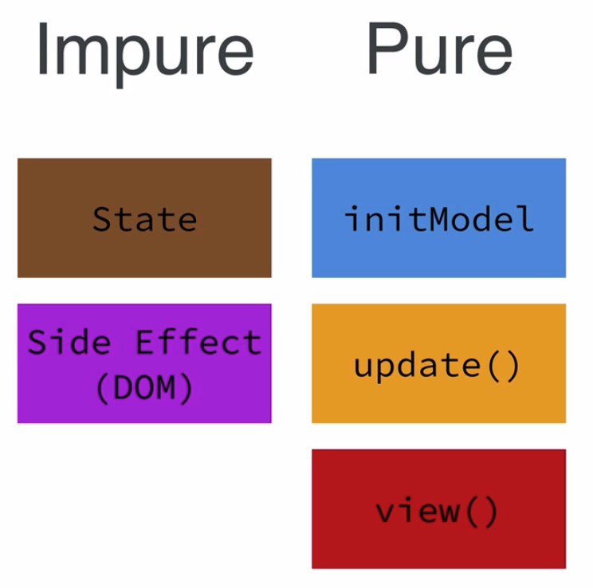
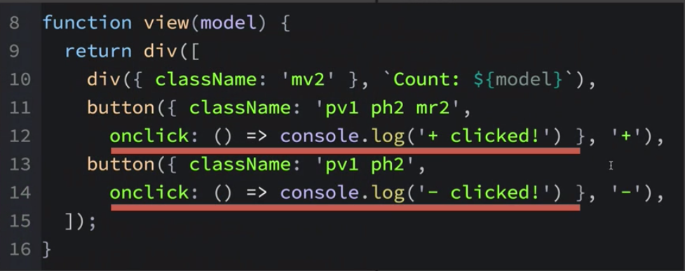
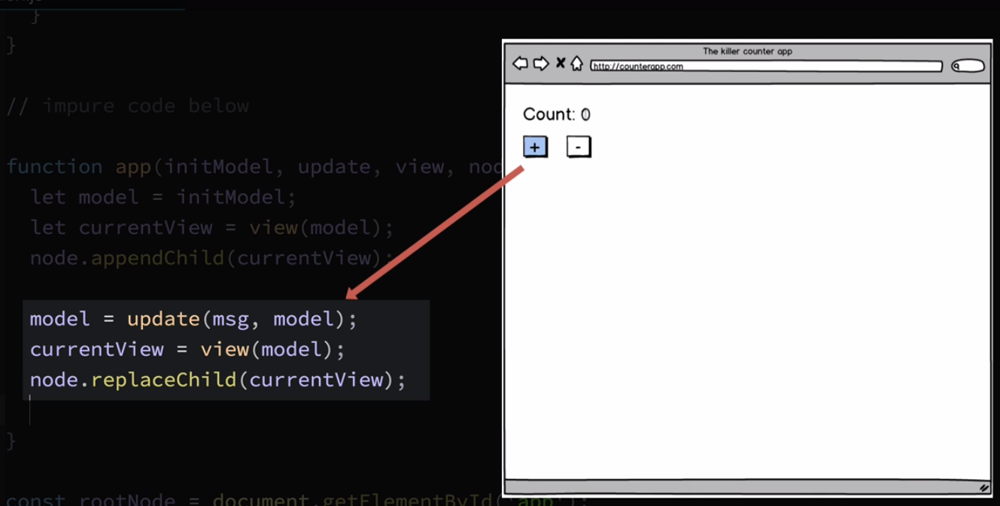

# App Function

How are we gonna maintain `state` and control `side effects`? Let's start by concidering three parts of the `app` we've made so far:

- The initial model, which represents the `starting data` in the `app`
- The `update function`, which is responsible for returning a `new model`, based on the `message` and the `current model`
- The `view function`, which return `html` and `css` that should be shown base on the `current state` of the `app`. 

There are more parts we need:

- we need somwhere to keep the `state` of our `app`
- we need a way of taking the `output` from the `view function` and rendering it on the page by interacting with the `DOM`, which is essentially a `side effect`

Our code `rootNode.appendChild(view(update('minus', initModel)))` causes a `side effect`, so we should either elimenate it or tightly control. We couldn't eliminate it cos we need snth to show on a web page. That means we should tightly control it. But what does it really mean?

Let's separate `pure` from `impure` part of our `app`. 



What is a lifecycle of our `counter app`? 

1. When we first start our `app` the app needs an `initial model`, which will be the `beginning state` - `0` (zero) in our case. 
2. After the `app` has an `initial state`, the `view function` needs to be called with the `beginning state`. 
3. Then what's returned from the `view function` - `html` and `css` is then sent to the `DOM` to be rendered on the page. 
4. When either of `'+'` or `'-'` buttons is clicked, the `DOM` calles the `onclick handler functions` we provided in a `view function`.


5. This `button click event` should somehow indirectly trigger or call `update function` providing it a `message` ('plus'/'minus'), indicating what button was clicked, and also providing the `current state` of the `app`. 
6. What's returned form the `update function` is a potentially `updated model`, which will become the `new state` of our `app`. 
7. Now, because our `app` has `new state` the `view function` should be called, so the `app` can reflect this `new state`. 

In order to support this `application lifesycle` or `flow`, we gonna write some code that'll deal with the `state`  and `side effects` in particular dealing with the `DOM`. We'll do this by writing an `impure function` which we'll call "app". 

Our `app function` is going to be passed all the `building blocks` that need to be connected together: `initial model`, `view function`, `update function` and the `DOM node` in the browser where the `app` should be loaded. 
```js
import h from 'hyperscript';
import hh from 'hyperscript-helpers'; 

const { div, button } = hh(h); 

const initModel = 0

function view(model){
    return div([
        div({className: 'mv2'},`Count: ${model}`),
        button({className: 'pv1 ph2 mr2', onclick: () => console.log('+ clicked!')},'+'),
        button({className: 'pv1 ph2', onclick: () => console.log('- clicked!')},'-')
    ])
  }

  function update(msg, model){           
    switch(msg){
        case 'plus':
        return model + 1;
     
        case 'minus':
        return model - 1;
 
        default: 
        return model; 
    }
 }

 //impure code below
 
 function app(initModel, view, update, node){            //pass all building blocks as parameters

 }
 

  const rootNode = document.getElementById('app');
  //rootNode.appendChild(view(update('minus', initModel)))
```
We need to tightly control `side effects` which will be done from within the `app function`. In the `app function` we'll create a `variable` using the `let` keyword; we'll name this `variable` "model" and we set it to the `value` passed as a `first parameter` - `initModel`. This `variable` is going to hold the `state` of our `app`. Using `let keyword` allows us to reassign `values` to the `model`, which is exactly what we need for `state changes`.  

```js
import h from 'hyperscript';
import hh from 'hyperscript-helpers'; 

const { div, button } = hh(h); 

const initModel = 0

function view(model){
    return div([
        div({className: 'mv2'},`Count: ${model}`),
        button({className: 'pv1 ph2 mr2', onclick: () => console.log('+ clicked!')},'+'),
        button({className: 'pv1 ph2', onclick: () => console.log('- clicked!')},'-')
    ])
  }

  function update(msg, model){           
    switch(msg){
        case 'plus':
        return model + 1;
     
        case 'minus':
        return model - 1;
 
        default: 
        return model; 
    }
 }

 //impure code below
 
 function app(initModel, view, update, node){            
     let model = initModel;               //create model variable

 }
 

  const rootNode = document.getElementById('app');
  //rootNode.appendChild(view(update('minus', initModel)))
```

Let's create another `variable` using the `let` keyword, and name it the `currentView`. We'll set the `currentView` to the `value` returned by `view function`, passing in a `model`. Then we'll key `node` and `appendChild()` passing in the `currentView`. 

```js
import h from 'hyperscript';
import hh from 'hyperscript-helpers'; 

const { div, button } = hh(h); 

const initModel = 0

function view(model){
    return div([
        div({className: 'mv2'},`Count: ${model}`),
        button({className: 'pv1 ph2 mr2', onclick: () => console.log('+ clicked!')},'+'),
        button({className: 'pv1 ph2', onclick: () => console.log('- clicked!')},'-')
    ])
  }

  function update(msg, model){           
    switch(msg){
        case 'plus':
        return model + 1;
     
        case 'minus':
        return model - 1;
 
        default: 
        return model; 
    }
 }

 //impure code below
 
 function app(initModel, view, update, node){            
     let model = initModel;               //create model variable
     let currentView = view(model);      //create currentView
     node.appendChild(currentView)
 }
 

  const rootNode = document.getElementById('app');
      
  //rootNode.appendChild(view(update('minus', initModel)))
```

This line `node.appendChild(currentView)` which is interacting with the `DOM` is causing a `side effect` of showing the `initial app view`. Let's check if it works. To actually bind our app's building blocks together we need to call the new `app function`, passin in the `initModel`, `view function`, `update function` and the `root node`. 

```js
import h from 'hyperscript';
import hh from 'hyperscript-helpers'; 

const { div, button } = hh(h); 

const initModel = 0

function view(model){
    return div([
        div({className: 'mv2'},`Count: ${model}`),
        button({className: 'pv1 ph2 mr2', onclick: () => console.log('+ clicked!')},'+'),
        button({className: 'pv1 ph2', onclick: () => console.log('- clicked!')},'-')
    ])
  }

  function update(msg, model){           
    switch(msg){
        case 'plus':
        return model + 1;
     
        case 'minus':
        return model - 1;
 
        default: 
        return model; 
    }
 }

 //impure code below
 
 function app(initModel, view, update, node){            
     let model = initModel;               
     let currentView = view(model);     
     node.appendChild(currentView)
 }
 

  const rootNode = document.getElementById('app');
  app(initModel, view, update, rootNode)          // call the app function
  //rootNode.appendChild(view(update('minus', initModel)))
```

But yet clicking the `buttons` doesn't change the `number`. How do we code and trigger the `update part` of the lifecycle. Somehow we need the `onclick handlers` trigger the `update sequense`? And by `update sequense` we mean the following code: reasigning the `model variable` to the `value` returned by calling `update function` passing in some `message` in and the `current model`; then reasigning the `currentView` variable by setting it equal to the `value` returned by calling the `view function`, passing in the `newly updated model` from the line above it. And then rendering in the browser by calling `node`, passing in the newly updated `view`. 

```js
import h from 'hyperscript';
import hh from 'hyperscript-helpers'; 

const { div, button } = hh(h); 

const initModel = 0

function view(model){
    return div([
        div({className: 'mv2'},`Count: ${model}`),
        button({className: 'pv1 ph2 mr2', onclick: () => console.log('+ clicked!')},'+'),
        button({className: 'pv1 ph2', onclick: () => console.log('- clicked!')},'-')
    ])
  }

  function update(msg, model){           
    switch(msg){
        case 'plus':
        return model + 1;
     
        case 'minus':
        return model - 1;
 
        default: 
        return model; 
    }
 }

 //impure code below

 function app(initModel, update, view, node){
     let model = initModel;
     let currentView = view(model);
     node.appendChild(currentView);

     model = update(msg,model);    //reassign the model
     currentView = update(model);   //reassign the currentView
     node.replceChild(currentView)   //render on the page
 }
 

  const rootNode = document.getElementById('app');
  app(initModel, update, view, rootNode)
 // rootNode.appendChild(view(update('minus', initModel)))
 ```
These three lines of code will need to execute every single time one of the buttons is clicked. 
```js
model = update(msg,model);    
currentView = update(model);   
node.replceChild(currentView)   
```


Well, if we've got some code that needs to be called repitedly, we should probably put that code in a `function`. 