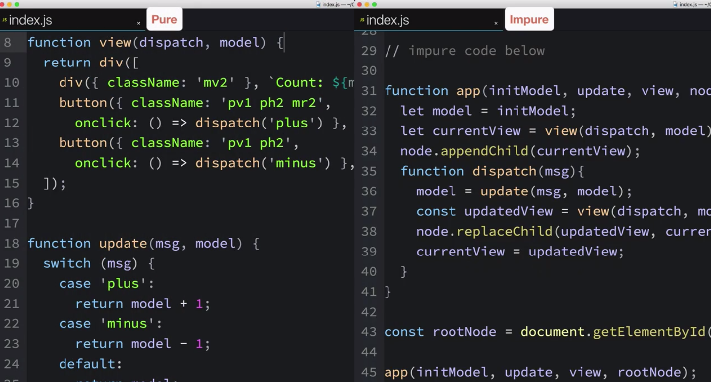
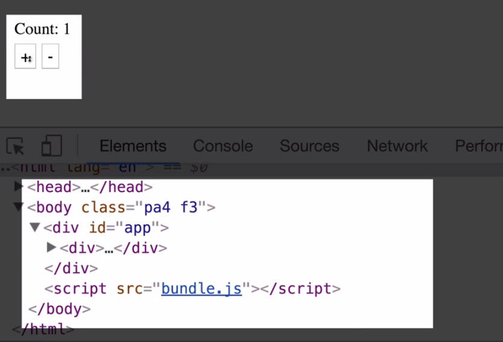
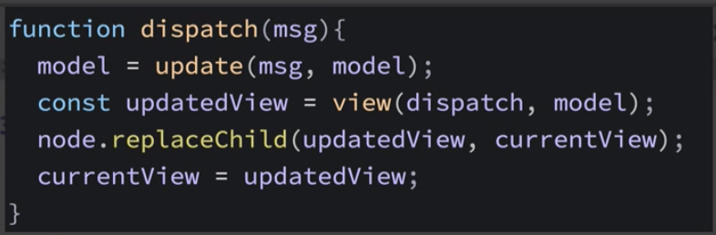
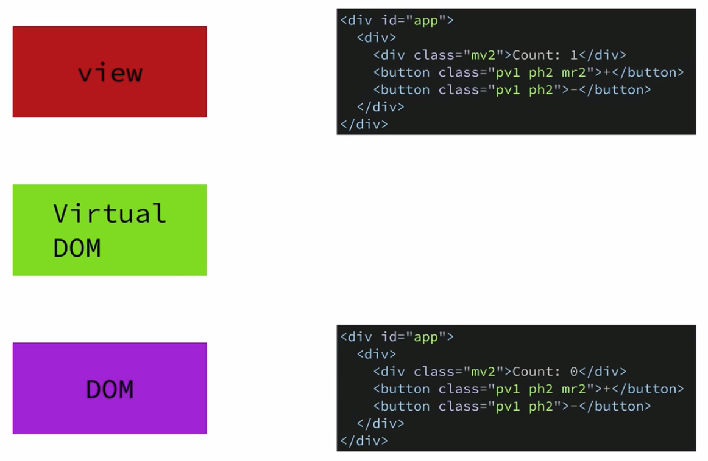

# Counter Improvements

Well, in our `app` we have both `pure` and `impure` code. And they are almost as much in size. Shouldn't it be more `pure functions`?



Well, our `app` is very trivial and small. But what if we decided to grow this simple `counter app` into the gratest `counter app` on the internet? So, we started coding a bunch of features. Where the code for the new features should be written? In `pure section` or `impure`? Well, the `impure code` in our `app` wouldn't significally change, and nearly all of new features will be implemented via `pure functions`. This way we'll get all the benefint of using `pure functions` and less chance to create hard bugs. 

Let's make one small change in our code, conserning how we are dealing with `messages`. Actually we used `strings` for `messages`, but `messages` could by of any `type` and `shape` that suits us. So, let's change what the `messages` look like. First we'll create a ` constant`, named `messages`, which we'll set using an `object literal` syntax. `Messages` will have `properties` for each type of `message` our `app` can deal with. Then we replace the `plus` string with the `MSGS.ADD`. And we'll do similar things with `minus` strings. 

```js
import h from 'hyperscript';
import hh from 'hyperscript-helpers'; 

const { div, button } = hh(h); 

const initModel = 0

function view(dispatch, model){      
    return div([
        div({className: 'mv2'},`Count: ${model}`),
        button({className: 'pv1 ph2 mr2', onclick: () => dispatch(MSGS.ADD)},'+'),  //replace plus string
        button({className: 'pv1 ph2', onclick: () => dispatch(MSGS.SUBTRACT)},'-')     //replace minus string
    ]);
  }

const MSGS = {             //create messages constant 
    ADD: 'ADD',
    SUBTRACT: 'SUBTRACT',

}

  function update(msg, model){           
    switch(msg){
        case MSGS.ADD:      //replace plus string
        return model + 1;
     
        case MSGS.SUBTRACT:        //replace minus string
        return model - 1;
 
        default: 
        return model; 
    }
 }

 //impure code below

 function app(initModel, update, view, node){
     let model = initModel;
     let currentView = view(dispatch, model);    
     node.appendChild(currentView);
     
     function dispatch(msg){                  
     model = update(msg,model);
     const updatedView = view(dispatch, model);     
     node.replaceChild(updatedView, currentView);    
     currentView = updatedView;       
     }
 }
 

  const rootNode = document.getElementById('app');
  app(initModel, update, view, rootNode)
 // rootNode.appendChild(view(update('minus', initModel)))
 ```

 There is something else in our `app` working not very efficient. Every time we interact with the `app`, the entire contents of the `div` is getting replaced. 



It's not a surprise as it's exactly how we coded the `app`. Replacing the `old view` with the `new updated view`. 



Here is the thing: tehnically the only thing that is changing in our `app` is - the `count`. So, it's a bit of overkill to replace all the `html` inside the `div`. 


Additionally, rendering things in the browser is an expensive task. All `DOM nodes` are really heavy weight and they are expensive to create and destroy. So, our initial implementation won't work for larger apps. There is an easy way to fix this, by using a `virtual DOM` library. `Virtual DOM library` is a performance lirary that will sit between the `view` our `app` generates and the `DOM`.



When we send a `new view` to the `virtual dom library` it will compare the `new view` to the `current view` and figure out the minimum amount of changes that need to be made to the browsers DOM, and it only makes those small changes.


