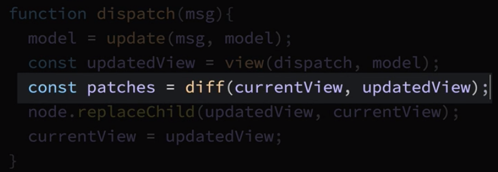

# Adding a Virtual DOM

We gonna use [Matt Esch's virtual DOM library](https://github.com/Matt-Esch/virtual-dom). 
Let's install it - `npm install virtual-dom --save-dev`. 

There are few `functions` that we need to pull into our `index.js` file. Unpack `functions` from the virtual DOM library via distructuring. 

```js
import h from 'hyperscript';    
import hh from 'hyperscript-helpers'; 
import {h, diff, patch } from 'virtual-dom'   //unpack functions here

const { div, button } = hh(h); 

const initModel = 0

function view(dispatch,model){
    return div([
        div({className: 'mv2'},`Count: ${model}`),
        button({className: 'pv1 ph2 mr2', onclick: () => dispatch(MSGS.ADD)},'+'),
        button({className: 'pv1 ph2', onclick: () => dispatch(MSGS.SUBTRACT)},'-')
    ])
  }

  const MSGS = {             
    ADD: 'ADD',
    SUBTRACT: 'SUBTRACT',
}

  function update(msg, model){           
    switch(msg){
        case MSGS.ADD:
        return model + 1;
     
        case MSGS.SUBTRACT:
        return model - 1;
 
        default: 
        return model; 
    }
 }

 //impure code below

 function app(initModel, update, view, node){
     let model = initModel;
     let currentView = view(dispatch, model);
     node.appendChild(currentView);
     
    function dispatch(msg){
        model = update(msg,model);
        const updatedView  = view(dispatch, model);
        node.replaceChild(updatedView, currentView);
        currentView = updatedView;
     }
 }
 

  const rootNode = document.getElementById('app');
  app(initModel, update, view, rootNode)
 // rootNode.appendChild(view(update('minus', initModel)))
 ```

 The new `h reference` from the virtual dom (`import {h, diff, patch } from 'virtual-dom'`) will be used in `h` we are using form the `hyperscript library`. So, we can delete the line with `h` which was imported from the `hyperscript library`, as we won't be using it anymore. 

 We've got one more thing to import - the `createElement` function from `virtual-dom/create element` package. Also let's add a `variable` inside the `app function`, called "rootNode", and set it to the value  returned by the newly created `createElement` function, passing in the `currentView` value. Then instead of passing `currentView` into a calling `appendCjild()`, we'll pass in `rootNode`.

 ```js
//import h from 'hyperscript';    //delete this line when you have `h` reference from virtual dom
import hh from 'hyperscript-helpers'; 
import {h, diff, patch } from 'virtual-dom'   
import createElement from 'virtual-dom/create-element';  //import createElement

const { div, button } = hh(h); 

const initModel = 0

function view(dispatch,model){
    return div([
        div({className: 'mv2'},`Count: ${model}`),
        button({className: 'pv1 ph2 mr2', onclick: () => dispatch(MSGS.ADD)},'+'),
        button({className: 'pv1 ph2', onclick: () => dispatch(MSGS.SUBTRACT)},'-')
    ])
  }

  const MSGS = {             
    ADD: 'ADD',
    SUBTRACT: 'SUBTRACT',
}

  function update(msg, model){           
    switch(msg){
        case MSGS.ADD:
        return model + 1;
     
        case MSGS.SUBTRACT:
        return model - 1;
 
        default: 
        return model; 
    }
 }

 //impure code below

 function app(initModel, update, view, node){
     let model = initModel;
     let currentView = view(dispatch, model);
     let rootNode = createElement(currentView)             //create rootNode here 
     node.appendChild(rootNode);     //pass in rootNode
     
    function dispatch(msg){
        model = update(msg,model);
        const updatedView  = view(dispatch, model);
        node.replaceChild(updatedView, currentView);
        currentView = updatedView;
     }
 }
 

  const rootNode = document.getElementById('app');
  app(initModel, update, view, rootNode)
 // rootNode.appendChild(view(update('minus', initModel)))
 ```

 Now, inside the `dispatch function` lets create a new `constant` named "patches", which we'll set to the `value` returned by calling the newly reported `diff fucntion`, passing in the `currentView` and the `updatedView`. 

 ```js
//import h from 'hyperscript';    //delete this line when you have `h` reference from virtual dom
import hh from 'hyperscript-helpers'; 
import {h, diff, patch } from 'virtual-dom'   
import createElement from 'virtual-dom/create-element';  //import createElement

const { div, button } = hh(h); 

const initModel = 0

function view(dispatch,model){
    return div([
        div({className: 'mv2'},`Count: ${model}`),
        button({className: 'pv1 ph2 mr2', onclick: () => dispatch(MSGS.ADD)},'+'),
        button({className: 'pv1 ph2', onclick: () => dispatch(MSGS.SUBTRACT)},'-')
    ])
  }

  const MSGS = {             
    ADD: 'ADD',
    SUBTRACT: 'SUBTRACT',
}

  function update(msg, model){           
    switch(msg){
        case MSGS.ADD:
        return model + 1;
     
        case MSGS.SUBTRACT:
        return model - 1;
 
        default: 
        return model; 
    }
 }

 //impure code below

 function app(initModel, update, view, node){
     let model = initModel;
     let currentView = view(dispatch, model);
     let rootNode = createElement(currentView)             //create rootNode here 
     node.appendChild(rootNode);     //pass in rootNode
     
    function dispatch(msg){
        model = update(msg,model);
        const updatedView  = view(dispatch, model);
        const patches = diff(currentView, updatedView)  //create patches here
        node.replaceChild(updatedView, currentView);
        currentView = updatedView;
     }
 }
 

  const rootNode = document.getElementById('app');
  app(initModel, update, view, rootNode)
 // rootNode.appendChild(view(update('minus', initModel)))
 ```

 This line is determining exactly what's changed between the last `view` that was rendered and the `new updated view` that needs to be rendered. 

 

 Next, we'll set the `rootNode `variable to the `value` returned by newly imported `patch() function`, passing in the `rootNode` and the `patches` - that minimal changes, that need to be applied to the DOM. And the last thing we need to do is to get rid of the call `replaceChild()`. 

 ```js

import hh from 'hyperscript-helpers'; 
import {h, diff, patch } from 'virtual-dom'   
import createElement from 'virtual-dom/create-element';  

const { div, button } = hh(h); 

const initModel = 0

function view(dispatch,model){
    return div([
        div({className: 'mv2'},`Count: ${model}`),
        button({className: 'pv1 ph2 mr2', onclick: () => dispatch(MSGS.ADD)},'+'),
        button({className: 'pv1 ph2', onclick: () => dispatch(MSGS.SUBTRACT)},'-')
    ])
  }

  const MSGS = {             
    ADD: 'ADD',
    SUBTRACT: 'SUBTRACT',
}

  function update(msg, model){           
    switch(msg){
        case MSGS.ADD:
        return model + 1;
     
        case MSGS.SUBTRACT:
        return model - 1;
 
        default: 
        return model; 
    }
 }

 //impure code below

 function app(initModel, update, view, node){
     let model = initModel;
     let currentView = view(dispatch, model);
     let rootNode = createElement(currentView)            
     node.appendChild(rootNode);     
     
    function dispatch(msg){
        model = update(msg,model);
        const updatedView  = view(dispatch, model);
        const patches = diff(currentView, updatedView)  
        rootNode = patch(rootNode, patches)      //reassign the rootNode here 
        //node.replaceChild(updatedView, currentView);     //delete replaceChild call
        currentView = updatedView;
     }
 }
 

  const rootNode = document.getElementById('app');
  app(initModel, update, view, rootNode)
 // rootNode.appendChild(view(update('minus', initModel)))
 ```