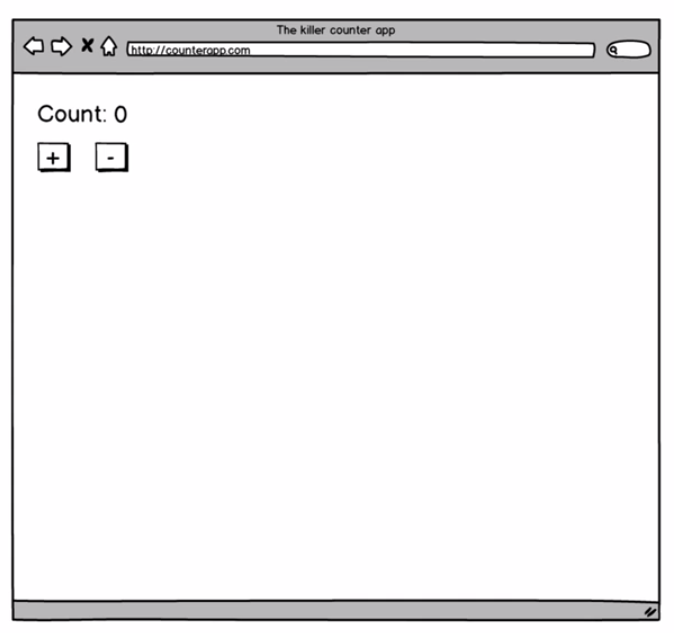

# App planning

When we are building app using `functional programming` the two fundamental blocks will be using are: 

- `immutable data`
- `pure functions`

We are going to build `counter app`. 

Questions: 

1. What kind of data we'll need for this app?  
- For our app we'll need a `number`(the count), as that's the only thing that will change
2. What `functions` will we need for our app? Or what kind of `data transformations` will we need our `app` to do?
- transform the `data model` (in our case a number) into `html` and `css` that should be shown in the browser. We call this `view functions`. 
- the other type of data transformations: update `data model` based on the interactions that happen in the app. (in our case increase and decrease the counter)
3. Where and how do we allow side effects? More specifically, where do we keep our `counter` that will change? 

