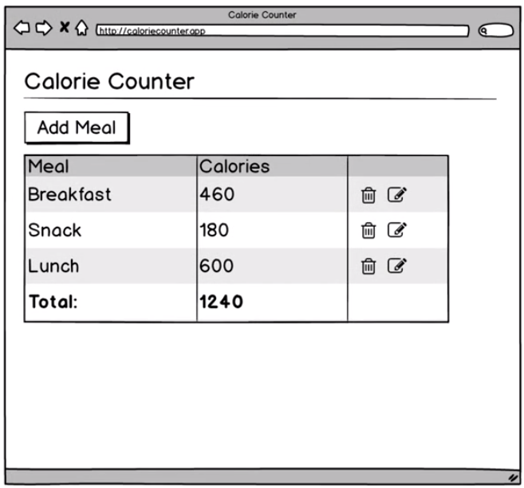
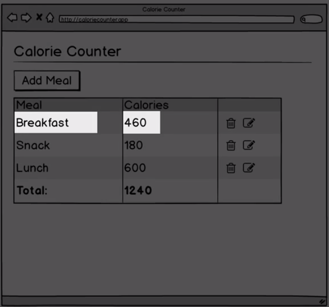

# Planning

We'll figure out what the `major components` are that we are going to build. 
What is the `functional programmer` primerely interested in? And the answer is: `data` and `functions` to transform that `data`. 

`Data` - pieces of data that should be a part of our `data model` for the `app`.
For example: the `string description` of the meal and the calories will be the small `data pieces` of the `data model`.

The next thing we are interested in is `functions` to transform the `data`. There is a couple of categories of the `data transformation` we'll need. 
- transformation of the `raw data model` into `html` and `css` to be displayed in a browser. - `View functions`
- updating our transforming `data model` when we interact with the app. - `Update functions`

Planning steps:
1. defining the `data model` 
2. defining `view functions`
3. defining `update functions` 