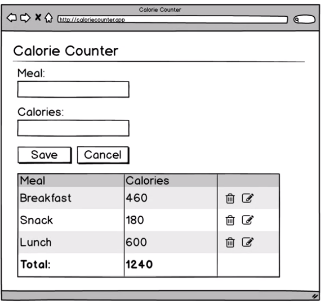

# Planning Data Model

Keep in mind! The `data model` we use in our `app` could be any type and shape we need it to be. 

For most non-trivial apps we'll have `an object`, which has potentially mane different `properties` for all the different pieces of `data` in our app.  

What pieces of `data` our `app` will need: 
- rows which displays the combination of `meal description` and the `calories`


These pieces of data come hand and hand to form the `meal record`/`meal object`. There are potentially many different `meal records`. 

```js
meal = {
    description: 'Breakfast',
    calories: 460
}
```
So, what kind of `data` will our `app` need to store rows? We should probably have an `array`, we cam call "meals", that will contain each `meal record`. 

```js
model = {
    meals: [],
}
```
Then in our `app` we have a `add meal `button. 

Clicking this button will cause a `form` to show, which allows us to add new meals to the list. 


How our `app` gonna know if it should show the `add meal` button or the `form`? Well, we could just have a `piece of data` indicating what to show. Let's add a `property` named "showForm", which can be set to a `boolean value`.