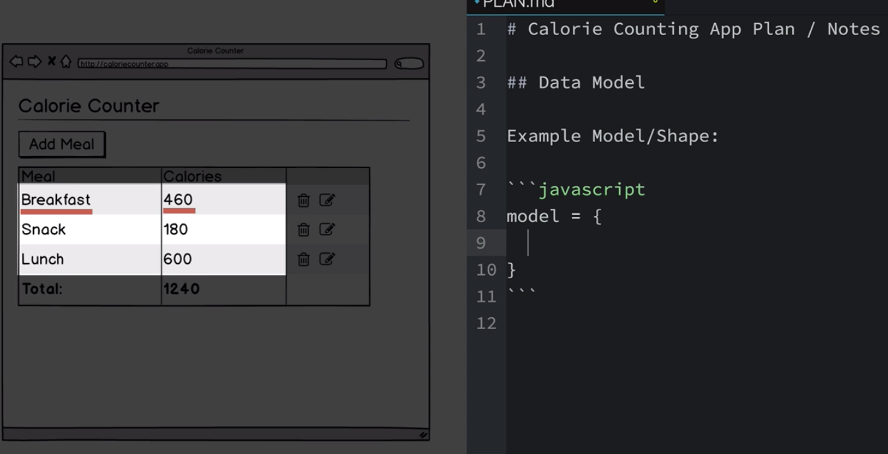
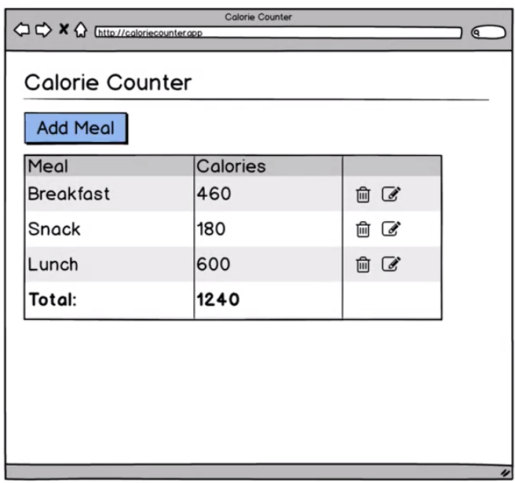
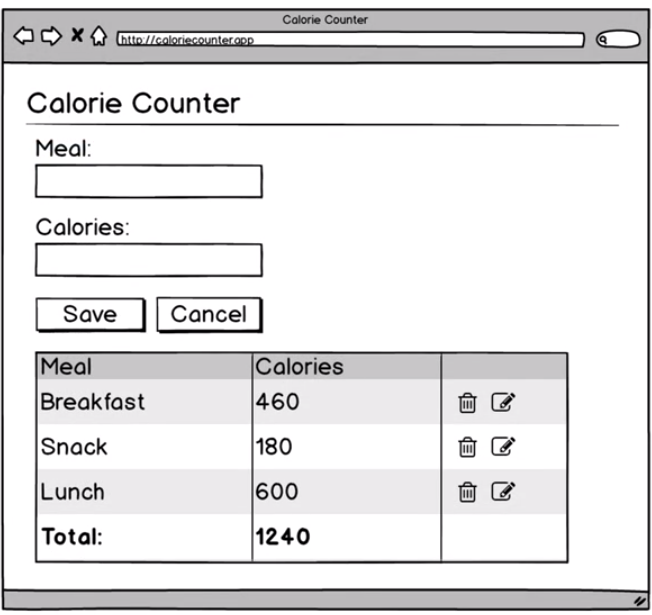
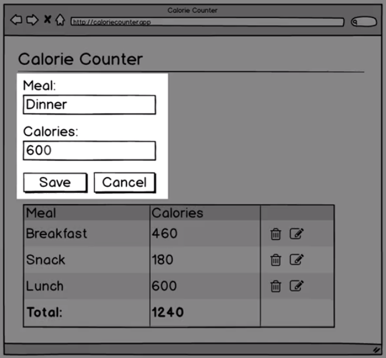
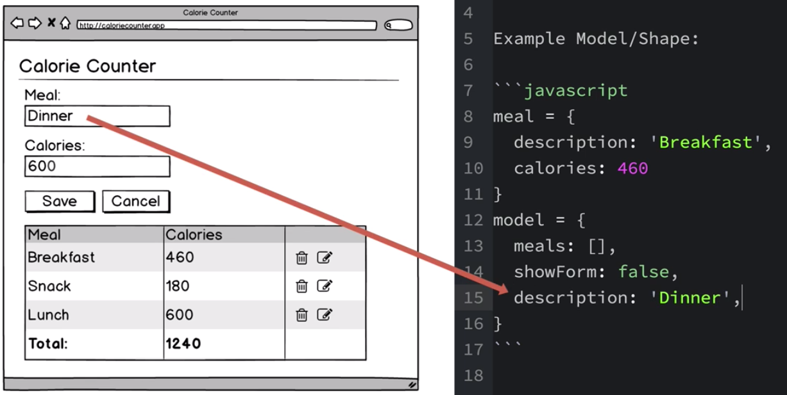
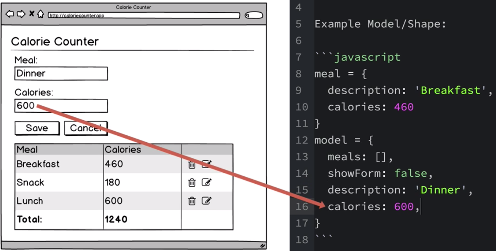

# Planning Data Model

Keep in mind! The `data model` we use in our `app` could be any type and shape we need it to be. 

For most non-trivial apps we'll have `an object`, which has potentially mane different `properties` for all the different pieces of `data` in our app.  

What pieces of `data` our `app` will need: 
- rows which displays the combination of `meal description` and the `calories`



These pieces of data come hand and hand to form the `meal record`/`meal object`. There are potentially many different `meal records`. 

```js
meal = {
    description: 'Breakfast',
    calories: 460
}
```
So, what kind of `data` will our `app` need to store rows? We should probably have an `array`, we cam call "meals", that will contain each `meal record`. 

```js
model = {
    meals: [],
}
```
Then in our `app` we have a `add meal `button. 


Clicking this button will cause a `form` to show, which allows us to add new meals to the list. 


How our `app` gonna know if it should show the `add meal` button or the `form`? Well, we could just have a `piece of data` indicating what to show. Let's add a `property` named "showForm", which can be set to a `boolean value` (false).

```js
model = {
    meals: [],
    showForm: false
}
```
What should we do with the `data` entered into the `form` description and calories `input fields`?



Well, that's temporary `data` but it's still `data`. So, let's include it in our `model`. We;ll call it "description" and it will contain a `string`, and "calories" which will be the number enteren in the input. 


```js
model = {
    meals: [],
    showForm: false,
    description: "Dinner",
    calories: 600
}
```

This `form` is used for adding `meals` as we just discussed, but it will also be used for editing `existing meal records`.  Editing `meals` is initiated by clicking the `edit icon`. So there are two `modes` this `form` can be used in. Let's call it "add mode" and "edit mode".  

When the `form` is filled, what happens when the "save" button is clicked? It depends on which mode the `form` is used for. For `add mode` the `meal` should be added to the list. In "edit mode" the existed `meal` should be updated. So, when "save" button is clicked how it gonne know if it needs to add a new `meal` or update the existing one? 

First we need to fix the `meal record` to incude a `unique id` property. 
```js
meal = {
    id: 1,       //include a unique id 
    description: 'Breakfast',
    calories: 460
}

model = {
    meals: [],
    showForm: false,
    description: "Dinner",
    calories: 600
}
```
Now, if we keep track of this `id` when we click the `edit icon`, then we'd know what to do when the "save" button is clicked. We just update the record based on its `unique id`. So, let's add the field to our `data model` to keep track of the `id` of the record that's being edited, we'll cal it "editId".

```js
meal = {
    id: 1,       //include a unique id 
    description: 'Breakfast',
    calories: 460
}

model = {
    meals: [],
    showForm: false,
    description: "Dinner",
    calories: 600,
    editId: 3,   //add editing id
}
```
When we add a new meal when this `unique id` come from? If we are storing the `meal` in a `database`, the database will sign a unique identifier; but we aren't gonna using the database for this app. So, the question remains...

Let's just do this in a real simple way. We'll add a field to a `model`, named "nextId" and we have it store a number. Then each time a `new meal` is added we'll just use the `nextId` as the new meal's `unique id` and will increment the `nextId`. 

```js
meal = {
    id: 1,       //include a unique id 
    description: 'Breakfast',
    calories: 460
}

model = {
    meals: [],
    showForm: false,
    description: "Dinner",
    calories: 600,
    editId: 3,
    nextId: 1,
}
```