# Planning View Functions

What `view functions` do we need to transform our `data model` into `html` and `css`? 

1. At a minimum we'll need the main `view function`, that will be responsible for returning everything we see in our `calorie app`. 

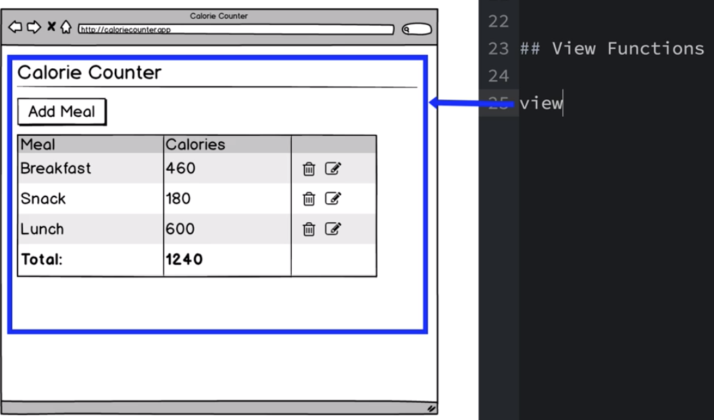

2. Next we;ll have the `formView` function that will either show the `add meal button` or the `form`. 

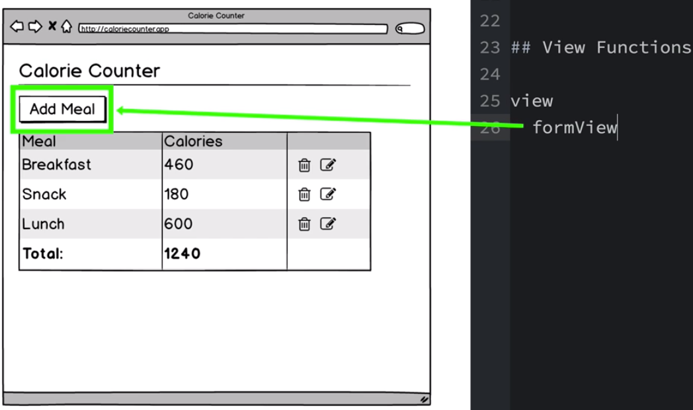
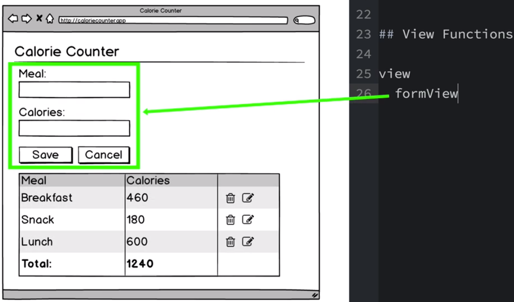

3. Within the `formView` area we'll create a function that will create the `label` and `input field` combination, we'll call this function `fieldSet`. 

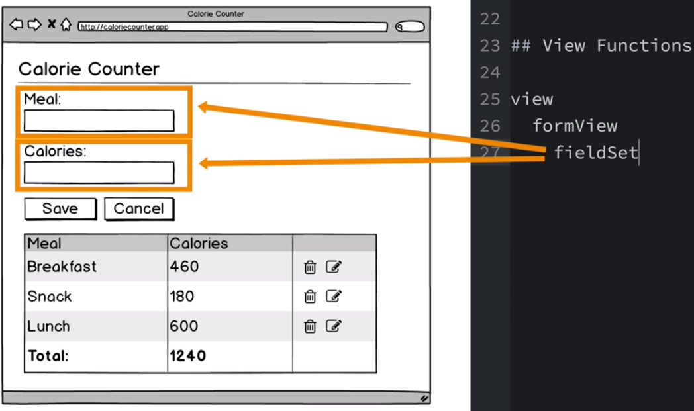

4. Next we'll create a fucntion to generate the `form buttons`, which we'll call `buttonSet`. 

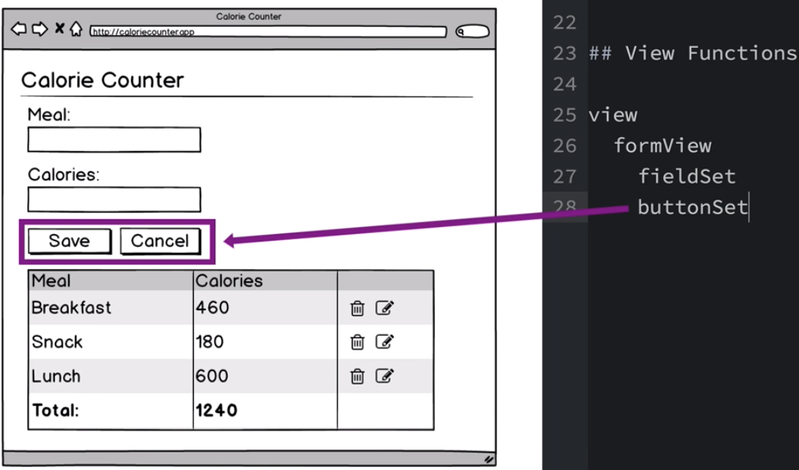

5. For the `table section` we'll need the following: 

- a `tableView function` 

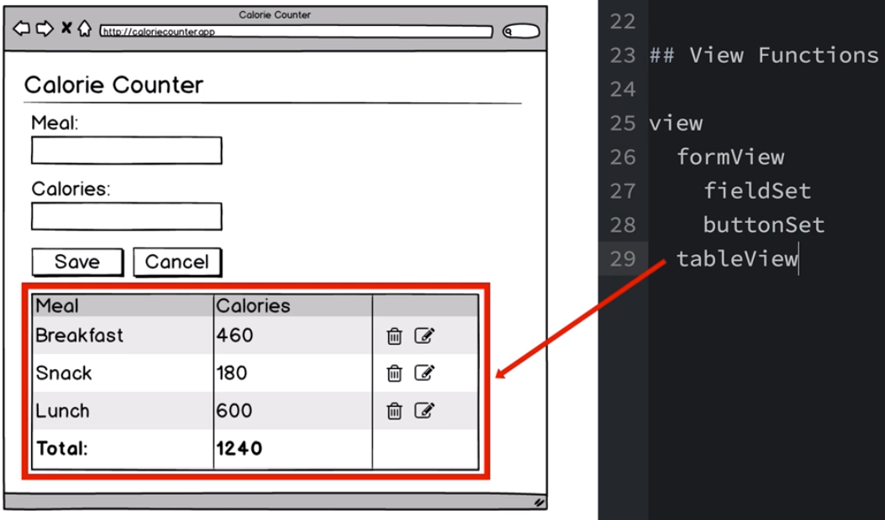

- a `tableHeader constant` for the header area

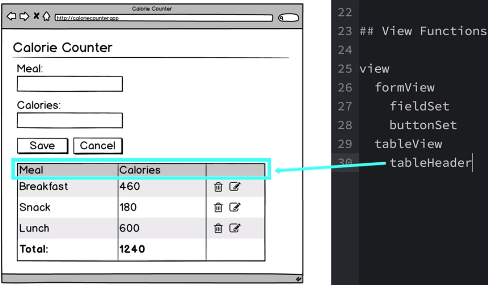

- a `mealsBody function` for the following area: 

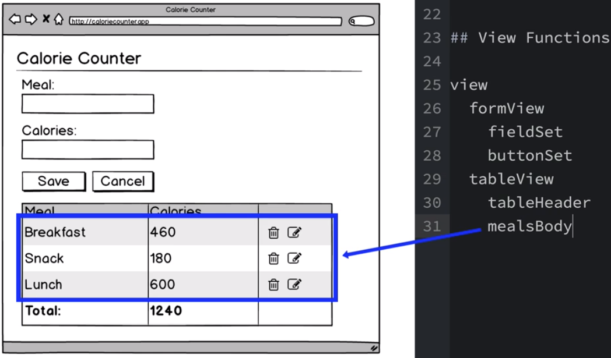

- a `mealRow function` for the rows: 

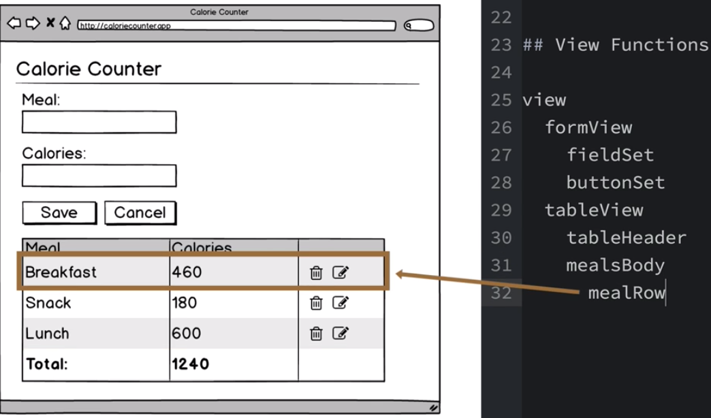

- a `cell` function for each individual cell: 

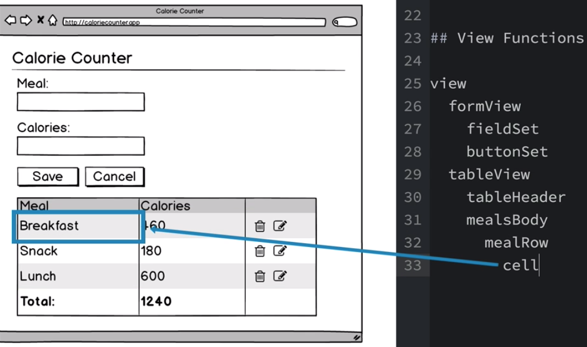

- a `totlaRow function` 

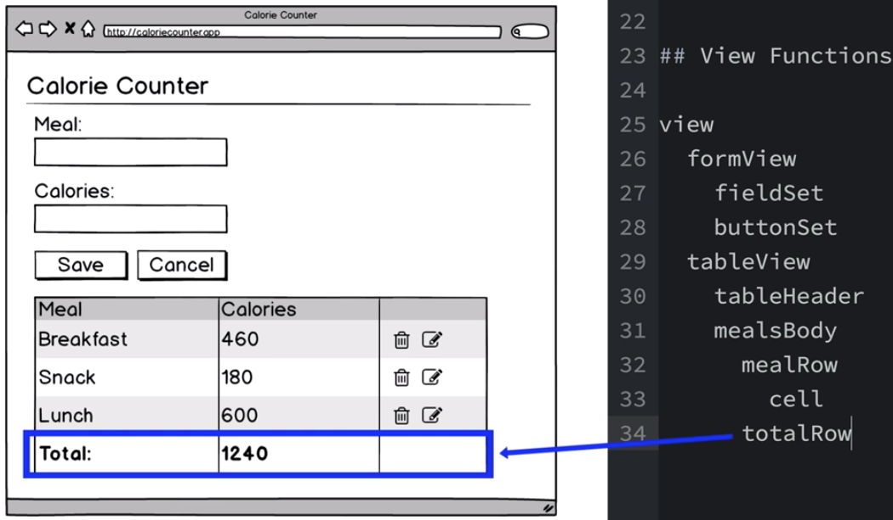

