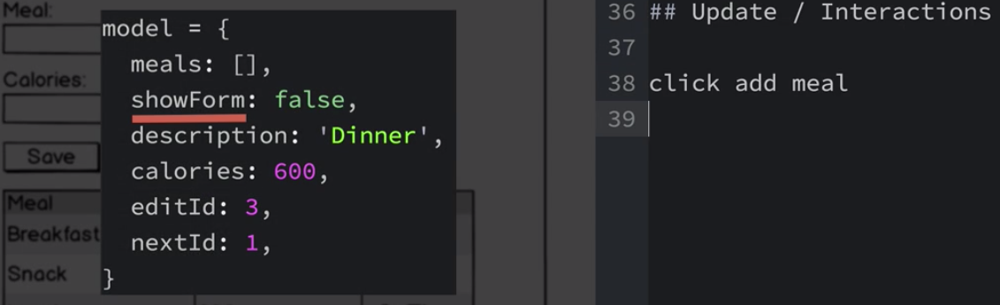
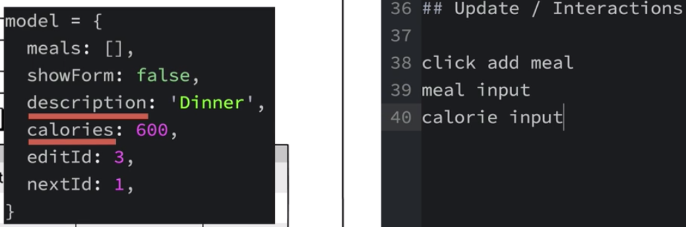

# Planning Update Functions

The last we need to plan is `update functions`, these ar eth efunctions that get called when the interaction occur within the app. 

We already know the shape of the `model`. But we haven't outlined different `message types` which our app will need to create, which again will depend on how the application will be interacted with. 

Let's make the list of all the interactions that can happen in our app:

1. clicking the `add meal` button, which should result in our `data model's` `showForm` field being set to `true`. 

2. Users can key values in the `mael description` and `calories` input fields, which should result in the model's `descrioption` and `calorie` fields being updated as appropriate. 

3. Clicking the `save button` should either add a new meal or update the existing one. 
4. Clicking the `edit icon` should put pur `app` in the `edit mode` for the meal whose `edit icon` was clikced. 
5. Clicking the `delete icon` should remove the meal fform the list. 

It seems that there should be around six different `messages` that can be created and passed in the `update function`.