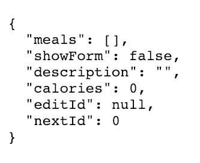

# Starter. Boiler Plate

We gonna create separate `modules/files` for the each part of the `app`.
Let's create the following files: 
- `Model.js`
- `Update.js`
- `View.js`
- `App.js` 

Let's start with the `Model.js` file. Here we'll create a `constant` named `initModel`, which will represent our initial `data model`. We'll set it to an `object` that contains all the `properties` we need: a `descripton` property which we'll set to be an empty `string`; `calories` field setting it to `0` (zero); add a `showForm` property setting it to `false`; and `nextid` property which we'll set to `0` (zero); next we'll add `editId` property - this is the field we'll use to store the `id` of the `meal` that's being edited, when we are not editing the `meal` then `editId` won't have `value`. The way we indicate the `app` since of a `value` in JavaScript is with the `null` type. Lastly, we'll add a `meals` property, which will set to be an empty array. 

### Model.js 

```js
const initModel = {
    meals: [],
    showForm: false,
    description: "",
    calories: 0,
    editId: null,
    nextId: 0,
}
```

The last thing we'll do in this file is exporting the `initial model value` which can be done by keying `export default initModel`.

### Model.js 

```js
const initModel = {
    meals: [],
    showForm: false,
    description: "",
    calories: 0,
    editId: null,
    nextId: 0,
};

export default initModel;
```

This line of code - `export default initModel` - is a part of JavaScript's `module syntax`. What this line does is - it makes the `initModel value` available to use in other files. 

Let's go work on the `App.js` file. This is the file that will contain our `impure app function`. We'll copy this function from the `counter app` we did before. Also let's copy the `import lines` for the `virtual DOM`. And the last thing we'll in this file is exporting our `app function`. 

### App.js

```js
import {h, diff, patch } from 'virtual-dom'   
import createElement from 'virtual-dom/create-element';  

function app(initModel, update, view, node){
    let model = initModel;
    let currentView = view(dispatch, model);
    let rootNode = createElement(currentView)            
    node.appendChild(rootNode);     
    
   function dispatch(msg){
       model = update(msg,model);
       const updatedView  = view(dispatch, model);
       const patches = diff(currentView, updatedView)  
       rootNode = patch(rootNode, patches)      
       currentView = updatedView;
    }
}

export default app
```

Let's work on the `Update.js` file next. Here we'll add an `updated function` which just takes a `message` and a `model`, and for now we'll just have to return the `model`. Then we'll export the `update function`. 


### Update.js

```js
function update(msg, model){
    return model;
}

export default update; 
```
We'll circle back to this file a bit later. Next, let's work on the `View.js` file. We'll create a `view function` which takes a `dispatch functios` as its first parameter and the `model` as its second parameter. 
Next, we'll import the `hyperscript-helper lybrary`, and the `h` function from the `virtual DOM library`. 

### View.js
```js
import hh from 'hypescrypt-helpers';
import {h} from 'virtual-dom';

function view(dispatch, model){

}
```

Now let's use `destructuring` and unpack the `pre function` from the `hyperscript-helper-library`. The `pre function` creates the `pre tag`, which is used for `pre-formatted text`. Then down in the `view function` we wanna show the `model` on a page. To do this we'll returt the `value` by calling the `pre function`, then as an `argumnet` to the `pre function` we'll call `JSON.stringify()` - which is a function that turns a js `value` into a readable version of that value - "stringify" will get passed the `value` we want to turn into a `string`, which in our case is the `model`. The next `parameter` to a `stringify()` is optional, we don't need it, so, we'll pass the `null value`.  But the last `parameter` indicates how many spaces we'd like to be used for indentation purposes; we'll pass number `2`. We'll ge back to this `function` in a bit. For now let's export our `view function`. 

### View.js
```js
import hh from 'hypescript-helpers';
import {h} from 'virtual-dom';

const { pre } = hh(h);      //unpack pre function

function view(dispatch, model){
     return pre(JSON.stringify(model, null, 2))
}

export default view; 
```

Let's go back to the `index.js` file. Let's get rid of the `log statement`,then we'll import the various parts of our `app` in this file. 

### index.js
```js
import initModel from './Model';
import update from './Update';
import view from './View';
import app from './App';
```
Next let's create the `cnstant` named "node" which will set to the `value` returned be calling `document.getElementById('app'), passing in a `string `app`, which is the `id` of the `div` which is in the `index.html` file.

One more thing in this file - we call the `app function` passing in the `initModel`, `update function`, `view function`, and lastly the `DOM node` we would like the `app` to be loaded. 

### index.js
```js
import initModel from './Model';
import update from './Update';
import view from './View';
import app from './App';

const node = document.getElementById('app')

app(initModel, update, view, node);
```
Now what we see in the browser is our `initial model`. 


