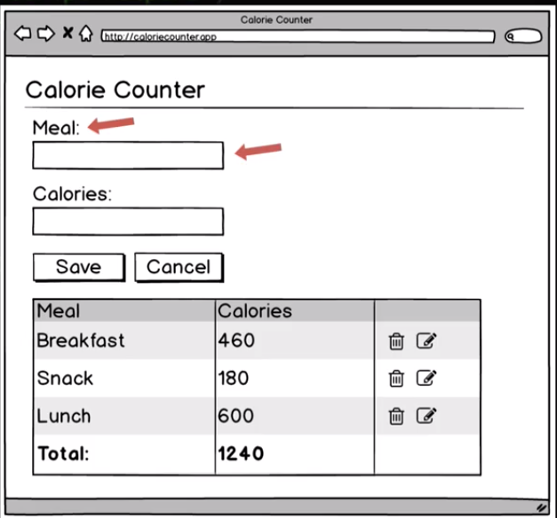
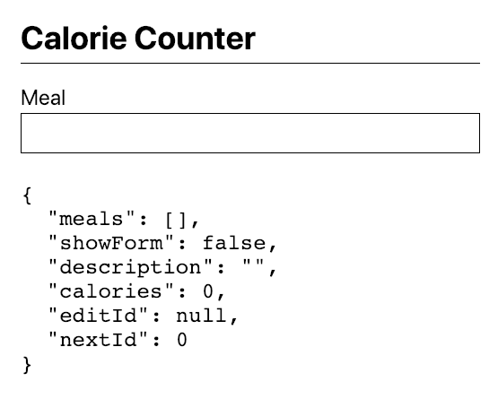
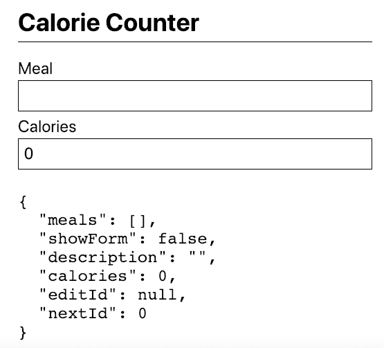
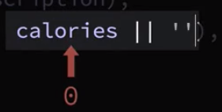
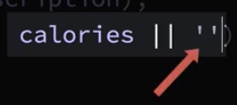
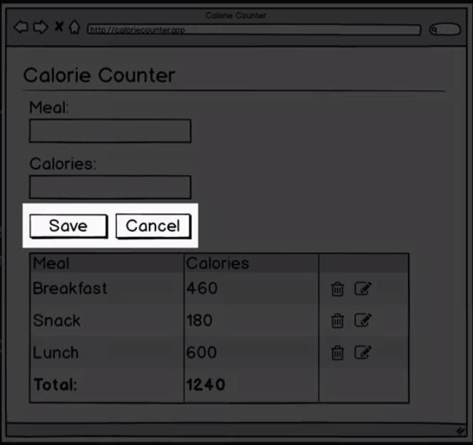
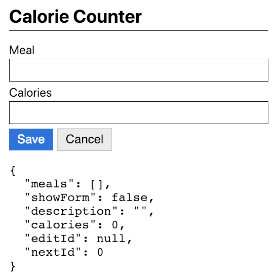
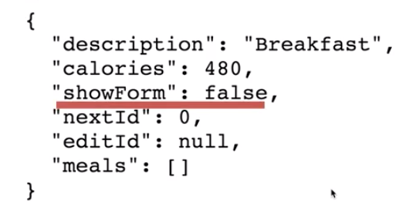
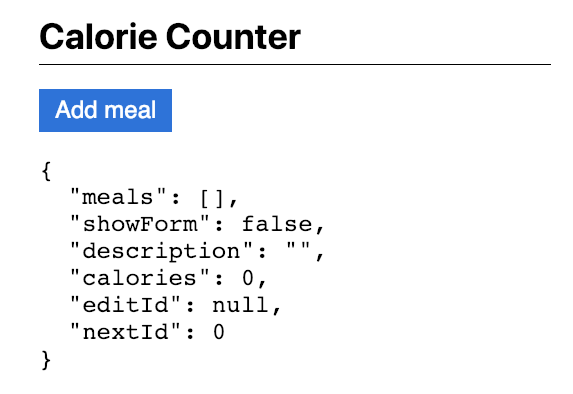

# Form View Area

Now we'll write the code to display the `form view` area, which should either display the `add meal button` or the `form`.


Let's start by making a couple of small changes to the `view function`. Instead of returning the `pre` tag by itself, let's return a `div`, which also will need to be included into the `destructuring expression`.  The `div` will need to have the following `css classes applyed: 

- max width at the sixth step 
- centered on the page 

### View.js
```js
import hh from 'hyperscript-helpers';
import {h} from 'virtual-dom';

const { pre, div  } = hh(h);  //include div

function view(dispatch, model){
   return div({className: 'mw6 center'}              //return div with css
   pre(JSON.stringify(model, null, 2))
}

export default view;
```

Then we'll pass in an `array` to contain the `div's` children. We'll have the `pre tag` be the last element of the array. We'll pass `h1` tag, which we'll need to unpack. We'll give the `heading` some `css classes`. Then we'll add the `string` "Calorie Counter". 

### View.js
```js
import hh from 'hyperscript-helpers';
import {h} from 'virtual-dom';

const { pre, div, h1  } = hh(h);  //unpack h1

function view(dispatch, model){
   return div({className: 'mw6 center'}, [   
   h1({className: 'f2 pv2 bb'}, "Calorie Counter"),  // add h1
   pre(JSON.stringify(model, null, 2))
   ]);
}

export default view;
```


Next, let's add a `formView` function which will take a `dispach function` as its first parameter and the app's model as the second parameter. Let's return the `value` by calling the `button function` which we need to unpack first. We'll give the `button` the following clases: 

- font 3
- padding vertical 2
- padding horisontal 3
- background color-blue
- foreground will be white
- remove the border with border-none

And for the button's text we'll pass the string "Add meal"

### View.js
```js
import hh from 'hyperscript-helpers';
import {h} from 'virtual-dom';

const { pre, div, h1, button  } = hh(h);  //unpack button function

function formView(dispatch, model){
    return button({className: 'f3 pv2 ph3 bg-blue white bn'}, "Add meal")
}

function view(dispatch, model){
   return div({className: 'mw6 center'}, [   
   h1({className: 'f2 pv2 bb'}, "Calorie Counter"),  
   pre(JSON.stringify(model, null, 2))
   ]);
}

export default view;
```

Let's call the `formView function` in the `view function` just below the `h1` tag. 

### View.js
```js
import hh from 'hyperscript-helpers';
import {h} from 'virtual-dom';

const { pre, div, h1, button  } = hh(h);  
function formView(dispatch, model){
    return button({className: 'f3 pv2 ph3 bg-blue white bn'}, "Add meal")
}

function view(dispatch, model){
   return div({className: 'mw6 center'}, [   
   h1({className: 'f2 pv2 bb'}, "Calorie Counter"),  
   formView(dispatch, model),    //call formView
   pre(JSON.stringify(model, null, 2))
   ]);
}

export default view;
```

Now we see the `button`,  let's work on the `form` next. 


For the moment let's comment out the `button function`; we'll back to it in a moment. Let's return the value get returned from the `form function`, which we'll need to unpack. Next we'll give the `form` some classes. Then we'll pass in an `array` for the form's children. 

### View.js
```js
import hh from 'hyperscript-helpers';
import {h} from 'virtual-dom';

const { pre, div, h1, button, form  } = hh(h);  

function formView(dispatch, model){
   return form({className: 'w-100 mv2'},[

   ] )
   // return button({className: 'f3 pv2 ph3 bg-blue white bn'}, "Add meal")
}

function view(dispatch, model){
   return div({className: 'mw6 center'}, [   
   h1({className: 'f2 pv2 bb'}, "Calorie Counter"),  
   formView(dispatch, model),    //call formView
   pre(JSON.stringify(model, null, 2))
   ]);
}

export default view;
```
What we need next is a `label` that says "Meal" and a `text input`. Then below that `text input` we'll need another `label` and another `text input` which are pretty the same. Let's create a `fucntion` that generates both a `label` and an `input`. We'll call this function "fieldSet". `fieldSet` will tke two `parameters`: the `label's text` and the `text input's value`. `fieldSet` will return a `div` with a couple of children. The first child will be a label which we need to unpack and add some classes: "display block and margin bottom 1"; the `label's text` will be the `value` stored in the `labelText` parameter. 



### View.js
```js
import hh from 'hyperscript-helpers';
import {h} from 'virtual-dom';

const { pre, div, h1, button, form, label  } = hh(h);  //unpack label

function fieldSet(labelText, inputValue){        //create fieldSet
  return div([
     label({className: 'db mb1'}, labelText)    //add classes and text
  ]);
}

function formView(dispatch, model){
   return form({className: 'w-100 mv2'},[

   ] )
   // return button({className: 'f3 pv2 ph3 bg-blue white bn'}, "Add meal")
}

function view(dispatch, model){
   return div({className: 'mw6 center'}, [   
   h1({className: 'f2 pv2 bb'}, "Calorie Counter"),  
   formView(dispatch, model),   
   pre(JSON.stringify(model, null, 2))
   ]);
}

export default view;
```

The next child of the `div` will be an `input` which we need to unpack as well. `Input` will have the classes: "padding all 2, input-reset, border all, width 100%  and margin bottom 2". The type of the `input` will be a `text input`.  The `value` of the input is the `value` of the `inputValue` parameter. 

### View.js
```js
import hh from 'hyperscript-helpers';
import {h} from 'virtual-dom';

const { pre, div, h1, button, form, label, input  } = hh(h);  //unpack input

function fieldSet(labelText, inputValue){        
  return div([
     label({className: 'db mb1'}, labelText),
     input({className: 'pa2 input-reset ba w-100 mb2', //add classes
     type: 'text',  //add type
     value: inputValue})    //add input value
  ]);
}

function formView(dispatch, model){
   return form({className: 'w-100 mv2'},[

   ] )
   // return button({className: 'f3 pv2 ph3 bg-blue white bn'}, "Add meal")
}

function view(dispatch, model){
   return div({className: 'mw6 center'}, [   
   h1({className: 'f2 pv2 bb'}, "Calorie Counter"),  
   formView(dispatch, model),    
   pre(JSON.stringify(model, null, 2))
   ]);
}

export default view;
```

Next let's go back to the `formView function`. In the form children's field we'll call a newly created `fieldSet` function, passing in the `string` "Meal" for the `label` and for the next parameter - the `value` to show in the `text input`, which is the `value` stpred in the `model's description property`. Let's use `destructuring` to unpack `description` from the `model` and then we can pass the `description` as a second parameter to the `fieldset` function. 

### View.js
```js
import hh from 'hyperscript-helpers';
import {h} from 'virtual-dom';

const { pre, div, h1, button, form, label, input  } = hh(h);  

function fieldSet(labelText, inputValue){        
  return div([
     label({className: 'db mb1'}, labelText),
     input({className: 'pa2 input-reset ba w-100 mb2', 
     type: 'text',  
     value: inputValue})    
  ]);
}

function formView(dispatch, model){
   const { description } = model;             //unpack description
   return form({className: 'w-100 mv2'},[
      fieldSet('Meal', description)       //pass label text and description
   ] )
   // return button({className: 'f3 pv2 ph3 bg-blue white bn'}, "Add meal")
}

function view(dispatch, model){
   return div({className: 'mw6 center'}, [   
   h1({className: 'f2 pv2 bb'}, "Calorie Counter"),  
   formView(dispatch, model),    
   pre(JSON.stringify(model, null, 2))
   ]);
}

export default view;
```
Now, we have the `label` and the `input`. 



Let's add the `calories` part to the `form`. We can do this by calling `fieldset` function again, passing in the `string` "Calories" and then we need to unpack the calories's `value` from the `model`, which we can pass in as the second parameter. 

### View.js
```js
import hh from 'hyperscript-helpers';
import {h} from 'virtual-dom';

const { pre, div, h1, button, form, label, input  } = hh(h);  

function fieldSet(labelText, inputValue){        
  return div([
     label({className: 'db mb1'}, labelText),
     input({className: 'pa2 input-reset ba w-100 mb2', 
     type: 'text',  
     value: inputValue})    
  ]);
}

function formView(dispatch, model){
   const { description, calories } = model;             //unpack calories
   return form({className: 'w-100 mv2'},[
      fieldSet('Meal', description),
      fieldSet('Calories', calories)      //pass calories 
   ] )
   // return button({className: 'f3 pv2 ph3 bg-blue white bn'}, "Add meal")
}

function view(dispatch, model){
   return div({className: 'mw6 center'}, [   
   h1({className: 'f2 pv2 bb'}, "Calorie Counter"),  
   formView(dispatch, model),    
   pre(JSON.stringify(model, null, 2))
   ]);
}

export default view;
```

Now we have the `form` with the two needed inputs.



The calories `text input` now contains `0`, but we'd rather prefer the `text input` to be empty when the `calories` is `0`. To do this we'll tweek the call to the second `parameter`; we'll add a logical `or` (`||`) and after that we'll ad an empty `string`.

The way JavaScript evaluates this expression (`calories || ''`) is: it looks at the first value -`calories`- and the `value` of calories is what's called the `truthy value` - it uses that value as a parameter. 

### View.js
```js
import hh from 'hyperscript-helpers';
import {h} from 'virtual-dom';

const { pre, div, h1, button, form, label, input  } = hh(h);  

function fieldSet(labelText, inputValue){        
  return div([
     label({className: 'db mb1'}, labelText),
     input({className: 'pa2 input-reset ba w-100 mb2', 
     type: 'text',  
     value: inputValue})    
  ]);
}

function formView(dispatch, model){
   const { description, calories } = model;             
   return form({className: 'w-100 mv2'},[
      fieldSet('Meal', description),
      fieldSet('Calories', calories || '' )   //add logical "or"   
   ] )
   // return button({className: 'f3 pv2 ph3 bg-blue white bn'}, "Add meal")
}

function view(dispatch, model){
   return div({className: 'mw6 center'}, [   
   h1({className: 'f2 pv2 bb'}, "Calorie Counter"),  
   formView(dispatch, model),    
   pre(JSON.stringify(model, null, 2))
   ]);
}

export default view;
```

Well, what does `truthy` mean? There is a list of `six values` that are `falsy` values: `false`, `0`, `""`, `null`, `undefined`, and `NaN`. And everything else is considered as `truthy value`. Number `0` happens to be a `falsy value`. So, `0` won't be the `value` that's resolced from this exprassion. 



Instead JS will look at the next `value` after the pipes. 



The `empty string` here is actually `falsy`, just like `0` is, but since it's the last `value` in the expression it gets used. 
For now our `input for calories` will be empty. 

Next, let's add the `form buttons`. Let's create a function called `buttonSet` which will generate both the bottons we see in the `form`: `save button` and `cancel botton`. We'll have `buttonSet` return a `div`, that will contain both buttons as `array items`. The first `button` will have various classes applied, the type of the `button` will be "submit", and the button's text will be "Save". The second `button` will also have a few classes applied to it, it will be a type "button", and will have the text "Cancel". Now we need to call a new `buttonSet` function in a `view function`. 



### View.js
```js
import hh from 'hyperscript-helpers';
import {h} from 'virtual-dom';

const { pre, div, h1, button, form, label, input  } = hh(h);  

function fieldSet(labelText, inputValue){        
  return div([
     label({className: 'db mb1'}, labelText),
     input({className: 'pa2 input-reset ba w-100 mb2', 
     type: 'text',  
     value: inputValue})    
  ]);
}

function buttonSet(dispatch){
    return div([
      button({className: 'f3 pv2 ph3 bg-blue white bn mr2 dim', type: "submit"}, "Save"), //add first button with classes and type
      button({className: 'f3 pv2 ph3 bg-light-gray dim', type: "button"}, "Cancel")  //add second button with classes and type
    ]);
}

function formView(dispatch, model){
   const { description, calories } = model;             
   return form({className: 'w-100 mv2'},[
      fieldSet('Meal', description),
      fieldSet('Calories', calories || '' ),
      buttonSet(dispatch),  
   ] )
   // return button({className: 'f3 pv2 ph3 bg-blue white bn'}, "Add meal")
}

function view(dispatch, model){
   return div({className: 'mw6 center'}, [   
   h1({className: 'f2 pv2 bb'}, "Calorie Counter"),  
   formView(dispatch, model),    
   pre(JSON.stringify(model, null, 2))
   ]);
}

export default view;
```



Well, currently we see the `form` even though the `app's model` has `"showForm"` set to `false`.



Let's fix this. First we need to unpack the `showForm` from the `model`. Then we'll say: if the `showForm` is `true` return the `form`. Then let's uncomment the `button` we created earlier; and if `showForm` is `false` then we'll return the `button`. 

### View.js
```js
import hh from 'hyperscript-helpers';
import {h} from 'virtual-dom';

const { pre, div, h1, button, form, label, input  } = hh(h);  

function fieldSet(labelText, inputValue){        
  return div([
     label({className: 'db mb1'}, labelText),
     input({className: 'pa2 input-reset ba w-100 mb2', 
     type: 'text',  
     value: inputValue})    
  ]);
}

function buttonSet(dispatch){
    return div([
      button({className: 'f3 pv2 ph3 bg-blue white bn mr2 dim', type: "submit"}, "Save"), 
      button({className: 'f3 pv2 ph3 bg-light-gray dim', type: "button"}, "Cancel")  
    ]);
}

function formView(dispatch, model){
   const { description, calories, showForm  } = model;      //unpack showForm        
   if(showForm){                             //if case
         return form({className: 'w-100 mv2'},
         [
           fieldSet('Meal', description),
          fieldSet('Calories', calories || '' ),
           buttonSet(dispatch),  
         ],
       );
   }
   return button({className: 'f3 pv2 ph3 bg-blue white bn'}, "Add meal")
   
}

function view(dispatch, model){
   return div({className: 'mw6 center'}, [   
   h1({className: 'f2 pv2 bb'}, "Calorie Counter"),  
   formView(dispatch, model),    
   pre(JSON.stringify(model, null, 2))
   ]);
}

export default view;
```
This time we see the `add meal button`. If we change the `initial model` and set the `showForm` field to `true` we'll see the `form`. 



For now we wanna the `button` work. Whwn we click it it should change the `showForm` value to `true`. 
