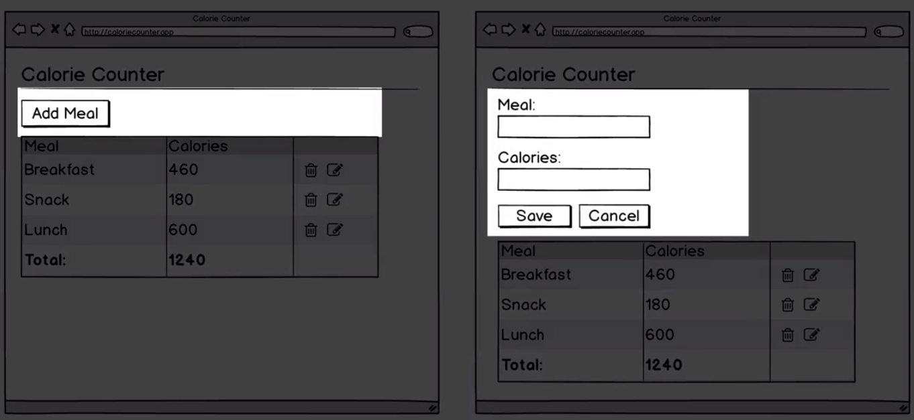
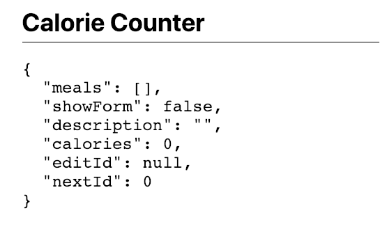
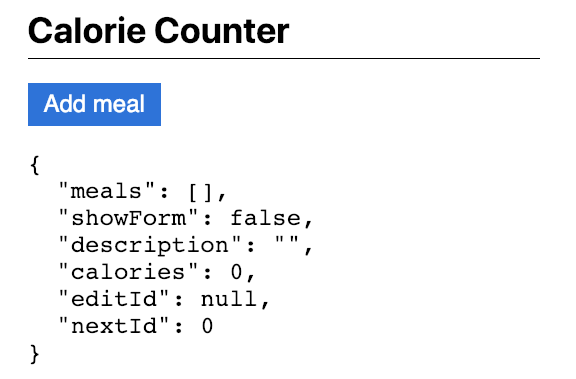

# Form View Area

Now we'll write the code to display the `form view` area, which should either display the `add meal button` or the `form`.



Let's start by making a couple of small changes to the `view function`. Instead of returning the `pre` tag by itself, let's return a `div`, which also will need to be included into the `destructuring expression`.  The `div` will need to have the following `css classes applyed: 

- max width at the sixth step 
- centered on the page 

### View.js
```js
import hh from 'hyperscript-helpers';
import {h} from 'virtual-dom';

const { pre, div  } = hh(h);  //include div

function view(dispatch, model){
   return div({className: 'mw6 center'}              //return div with css
   pre(JSON.stringify(model, null, 2))
}

export default view;
```

Then we'll pass in an `array` to contain the `div's` children. We'll have the `pre tag` be the last element of the array. We'll pass `h1` tag, which we'll need to unpack. We'll give the `heading` some `css classes`. Then we'll add the `string` "Calorie Counter". 

### View.js
```js
import hh from 'hyperscript-helpers';
import {h} from 'virtual-dom';

const { pre, div, h1  } = hh(h);  //unpack h1

function view(dispatch, model){
   return div({className: 'mw6 center'}, [   
   h1({className: 'f2 pv2 bb'}, "Calorie Counter"),  // add h1
   pre(JSON.stringify(model, null, 2))
   ]);
}

export default view;
```



Next, let's add a `formView` function which will take a `dispach function` as its first parameter and the app's model as the second parameter. Let's return the `value` by calling the `button function` which we need to unpack first. We'll give the `button` the following clases: 

- font 3
- padding vertical 2
- padding horisontal 3
- background color-blue
- foreground will be white
- remove the border with border-none

And for the button's text we'll pass the string "Add meal"

### View.js
```js
import hh from 'hyperscript-helpers';
import {h} from 'virtual-dom';

const { pre, div, h1, button  } = hh(h);  //unpack button function

fucntion formView(dispatch, model){
    return button({className: 'f3 pv2 ph3 bg-blue white bn'}, "Add meal")
}

function view(dispatch, model){
   return div({className: 'mw6 center'}, [   
   h1({className: 'f2 pv2 bb'}, "Calorie Counter"),  
   pre(JSON.stringify(model, null, 2))
   ]);
}

export default view;
```

Let's call the `formView function` in the `view function` just below the `h1` tag. 

### View.js
```js
import hh from 'hyperscript-helpers';
import {h} from 'virtual-dom';

const { pre, div, h1, button  } = hh(h);  
fucntion formView(dispatch, model){
    return button({className: 'f3 pv2 ph3 bg-blue white bn'}, "Add meal")
}

function view(dispatch, model){
   return div({className: 'mw6 center'}, [   
   h1({className: 'f2 pv2 bb'}, "Calorie Counter"),  
   formView(dispatch, model),    //call formView
   pre(JSON.stringify(model, null, 2))
   ]);
}

export default view;
```

Now we see the `button`,  let's work on the `form` next. 



For the moment let's comment out the `button function`; we'll back to it in a moment. 
