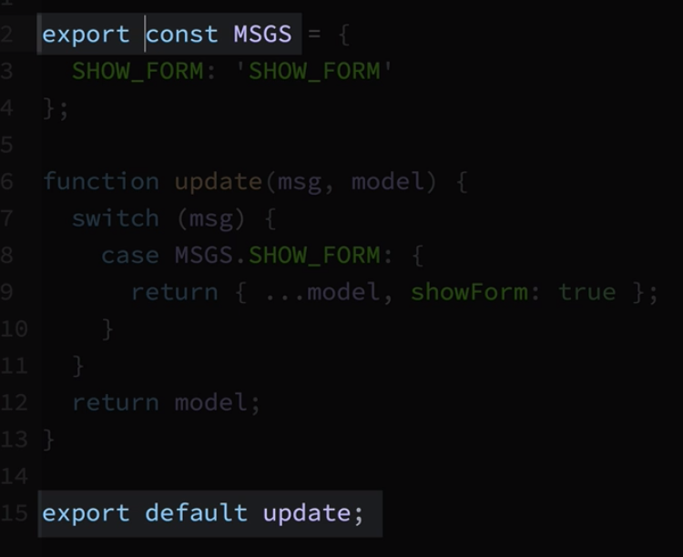
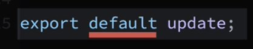
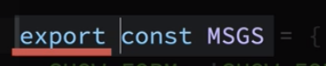
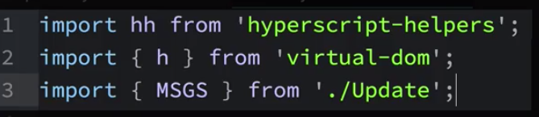
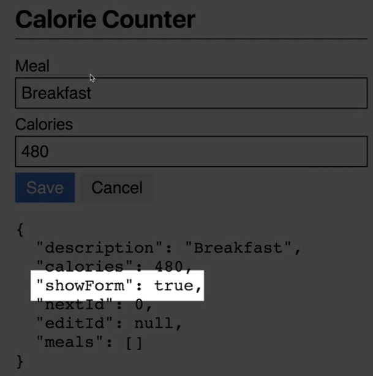
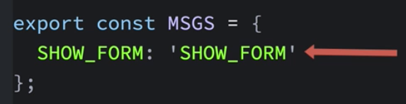
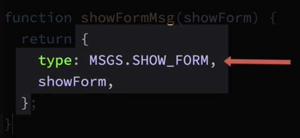
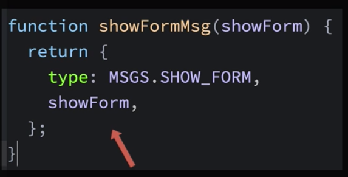
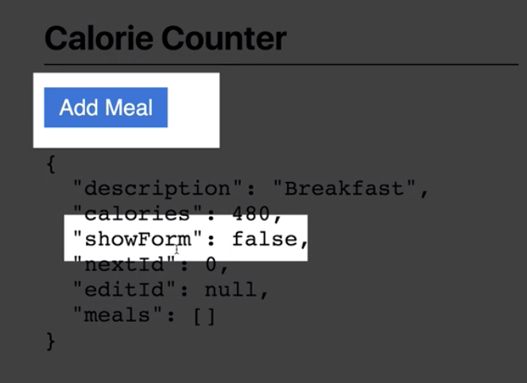

#  App Updates

So, how will we get the `add meal` button working properly? Basically, we'll do two things: 

- first we'll create and send a `message` when the `button` is clicked; this of course will happen in one of the `view functions`
- then we have the `update function` handeled theis kind of `message` returning a `new model` with the `showForm` property set to `true`. 

In the `Update.js` file lets create a `constant ` named "messages" which we'll set to be an `object` with the property `SHOW_FORM` and it's `value` to the `string` with the same name. 

### Update.js
```js
const MSGS = {                  //create message constant
    SHOW_FORM: 'SHOW_FORM'
};

function update(msg, model){
    return model
}

export default update;
```

Next, we'll add a `switch` statement in the `update function`. The `switch statement` will match against a message. In the case where the `message` is a `show-form message`, we'll return a new object using the `spread syntax` to include the `current model's properties` in that object. Then we'll overwrite the `SHOW_FORM` property, setting it to `true`.  That's all we need to do in the `update function`.

### Update.js
```js
const MSGS = {                  
    SHOW_FORM: 'SHOW_FORM'
};

function update(msg, model){
    switch(msg){
        case MSGS.SHOW_FORM:{
        return {...model, showForm: true};
        }
    }
    return model;
}

export default update;
```

Now we need to generate the `show form message` when the `add meal button` is clicked. We need to head over to the `View.js` file to generate the message, but before we do that let's use the `messages` constant from within the `View.js` file. 

The way we can access `messages` from a separate file is by exporting it. Just key "export" in front of the `const` keyword. 

### Update.js
```js
export const MSGS = {            //export messages       
    SHOW_FORM: 'SHOW_FORM'
};

function update(msg, model){
    switch(msg){
        case MSGS.SHOW_FORM:{
        return {...model, showForm: true};
        }
    }
    return model;
}

export default update;
```
Notice, that this `export` is different from the `export` we did for the `update function`.



There are two options from exporting in JS: the `default export`



And a `named export` : 



There can only be one `default export` in a file, but you can have many `named exports`. The only significant difference between these two `exporting options` is that you are using a slightly different syntax when importing them. 

now. let's open the `View.js` file and import the `messages` constant, using curly braces and naming EXACTLY what we want to import. 

### View.js

```js
import hh from 'hyperscript-helpers';
import {h} from 'virtual-dom';
import { MSGS } from './Update';    //import messages here

const { pre, div, h1, button, form, label, input  } = hh(h);

function fieldSet(labelText, inputValue){
   return div([
      label({className: 'db mb1'}, labelText),
      input({className: 'pa2 input-reset ba w-100 mb2', type: 'text', value: inputValue},)
   ]);
}

function buttonSet(dispatch){
   return div([
      button({className: 'f3 pv2 ph3 bg-blue white bn mr2 dim', type: 'submit'},
      "Save"),
      button({className: 'f3 pv2 ph3 bg-light-gray dim', type: "button"}, "Cancel")
   ])
}

function formView(dispatch, model){
   const { description, calories, showForm } = model;
   if(showForm){
   return form({className: 'w-100 mv2'},
   [
      fieldSet('Meal', description),
      fieldSet('Calories', calories || ''),
      buttonSet(dispatch),
       ],
      );
   }
   return button({className: 'f3 pv2 ph3 bg-blue white bn'}, "Add meal",);
}

function view(dispatch, model){
   return div({className: 'mw6 center'}, [
   h1({className: 'f2 pv2 bb'},  "Calorie Counter"),
   formView(dispatch, model),
   pre(JSON.stringify(model, null, 2)),
   ]);
}

export default view;
```

In our imports the following line - `import hh from 'hyperscript-helpers';`- is used for the `default export`, on lines two and three you see how to import `named exports`. 



Let's go to the `add meal` button. After the `className` property we'll add an `onclick` property, whose `value` will be a `function` that will cal our `dispatch` function and will spacify a `message` to dispatch as "MSGS.SHOW_FORM". 

### View.js

```js
import hh from 'hyperscript-helpers';
import {h} from 'virtual-dom';
import { MSGS } from './Update';    //import messages here

const { pre, div, h1, button, form, label, input  } = hh(h);

function fieldSet(labelText, inputValue){
   return div([
      label({className: 'db mb1'}, labelText),
      input({className: 'pa2 input-reset ba w-100 mb2', type: 'text', value: inputValue},)
   ]);
}

function buttonSet(dispatch){
   return div([
      button({className: 'f3 pv2 ph3 bg-blue white bn mr2 dim', type: 'submit'},
      "Save"),
      button({className: 'f3 pv2 ph3 bg-light-gray dim', type: "button"}, "Cancel")
   ])
}

function formView(dispatch, model){
   const { description, calories, showForm } = model;
   if(showForm){
   return form({className: 'w-100 mv2'},
   [
      fieldSet('Meal', description),
      fieldSet('Calories', calories || ''),
      buttonSet(dispatch),
       ],
      );
   }
   return button({className: 'f3 pv2 ph3 bg-blue white bn',
    onclick: () => dispatch(MSGS.SHOW_FORM) },         //add onclick property
    "Add meal",);
}

function view(dispatch, model){
   return div({className: 'mw6 center'}, [
   h1({className: 'f2 pv2 bb'},  "Calorie Counter"),
   formView(dispatch, model),
   pre(JSON.stringify(model, null, 2)),
   ]);
}

export default view;
```

Now, when we click the `add meal` button, the `showForm` in the `model` is set to `true`. And we see the `form` displayed in the browser. 



Currently when we click the `calcel button` nothing happens, but we wanna it to hide the `form` and clear the `meal` and `calories` `input fields`. There is a couple of ways we can do this. Let's do this: in the `Update.js` file let's create a `function` named "showFormMsg", that will be used to create and return `a new show form message`. We'll have this function take a `parameter` named "showForm", then we'll return an `object` with the `type property` set to `MSGS.SHOW_FORM value`. Then we'll use a shorthand syntax to include the `showForm` value passed into the `function`.  

### Update.js
```js
export const MSGS = {
    SHOW_FORM: 'SHOW_FORM'
}

function showFormMsg(showForm){       //create the function
    return{
        type: MSGS.SHOW_FORM,
        showForm,
    };
}

function update(msg, model){
    switch(msg){
        case MSGS.SHOW_FORM:{
        return {...model, showForm: true};
        }
    }
    return model
}

export default update;
```
Well, here we've changed the `type of message` we'll be sending to our `app` from a unique `string`



to an `object` where the `type property` is a unique string.



Now, since the message is an `object` it can have additional information in the `message`. In this case we included a `property` named "showForm", which will contain a `boolean` value. 

Now, when the `update function` recieves this type of message, it can just look at the `showForm` part of the message to figure out what to do woth the `showForm` model's property. 
Well, why to create this function? 



Technically it's not necessary, we could manually construct this same exact `message` from other parts of our `app`, but by having a `function` do it we are documenting what the expected `payload` of the `showForm` message should be. 

Let's do this. We'll remove the `export` from the `messages constant` and then instead we'll export the `showFormMsg` fucntion. 


### Update.js
```js
 const MSGS = {
    SHOW_FORM: 'SHOW_FORM'
}

export function showFormMsg(showForm){    //export the function
    return{
        type: MSGS.SHOW_FORM,
        showForm,
    };
}

function update(msg, model){
    switch(msg){
        case MSGS.SHOW_FORM:{
        return {...model, showForm: true};
        }
    }
    return model
}

export default update;
```
Now, it the `update function` let's change what's being evaluated in the `switch statement` from  `msg` to `msg.type`. Next in the case where the `message type` is `showForm` we'll use destructuring to unpack the `messages payload`, which in this case is `showForm` property that's included in the message. And now we can get rid of the hardcoded `true` value and just let the `showForm` property be set to whatever value is set to in the `message`. 

### Update.js
```js
 const MSGS = {
    SHOW_FORM: 'SHOW_FORM'
}

export function showFormMsg(showForm){    
    return{
        type: MSGS.SHOW_FORM,
        showForm,
    };
}

function update(msg, model){
    switch(msg.type){             //change to msg.type
        case MSGS.SHOW_FORM:{
        const{ showForm } = msg;      //unpack payload
        return {...model, showForm};   //delete true value 
        }
    }
    return model
}

export default update;
```

Let's go back to the `View.js` file and make all the necessary changes. We no longer need the `MSGS` constant instaed we'll import the `showFormMsg` function. Next go to the `onclick handler` to the `add meal` button, and get rid of the message we were sending, and instead call a new `showFormMsg function` passing in a `true` value, indicating we wanna `showForm` to be set to `true`. In the `cancel button` we'll ad an `onclick handler`, which will just be a function that calls `dispatch` with the message we get by calling `showFormMsg` function, but this time passing a `false` value. 

### View.js
```js
import hh from 'hyperscript-helpers';
import {h} from 'virtual-dom';
import { showFormMsg } from './Update';    //import function instead of a constant

const { pre, div, h1, button, form, label, input  } = hh(h);

function fieldSet(labelText, inputValue){
   return div([
      label({className: 'db mb1'}, labelText),
      input({className: 'pa2 input-reset ba w-100 mb2', type: 'text', value: inputValue},)
   ]);
}

function buttonSet(dispatch){
   return div([
      button({className: 'f3 pv2 ph3 bg-blue white bn mr2 dim', type: 'submit'},
      "Save"),
      button({className: 'f3 pv2 ph3 bg-light-gray dim', type: "button",
      onclick: () => dispatch(showFormMsg(false)),  //add onclick
      }, "Cancel")
   ])
}

function formView(dispatch, model){
   const { description, calories, showForm } = model;
   if(showForm){
   return form({className: 'w-100 mv2'},
   [
      fieldSet('Meal', description),
      fieldSet('Calories', calories || ''),
      buttonSet(dispatch),
       ],
      );
   }
   return button({className: 'f3 pv2 ph3 bg-blue white bn',
   onclick: () => dispatch(showFormMsg(true)),     //call function here
}, "Add meal",);
}

function view(dispatch, model){
   return div({className: 'mw6 center'}, [
   h1({className: 'f2 pv2 bb'},  "Calorie Counter"),
   formView(dispatch, model),
   pre(JSON.stringify(model, null, 2)),
   ]);
}

export default view;
```


Let's do one more thing. Let's clear the `input fields` after the `cancel button` is clicked. Let's back to the `Update.js` file, and we'll add two more properties to the `object` that's being returned: `description` which we'll set to be an empty `string` and the `calories` to be `0`. 

### Update.js
```js
 const MSGS = {
    SHOW_FORM: 'SHOW_FORM'
}

export function showFormMsg(showForm){
    return{
        type: MSGS.SHOW_FORM,
        showForm,
    };
}

function update(msg, model){
    switch(msg.type){
        case MSGS.SHOW_FORM:{
        const{ showForm } = msg; 
        return {...model, showForm, description: '', calories: 0};  //set more properties
        }
    }
    return model
}

export default update;
```