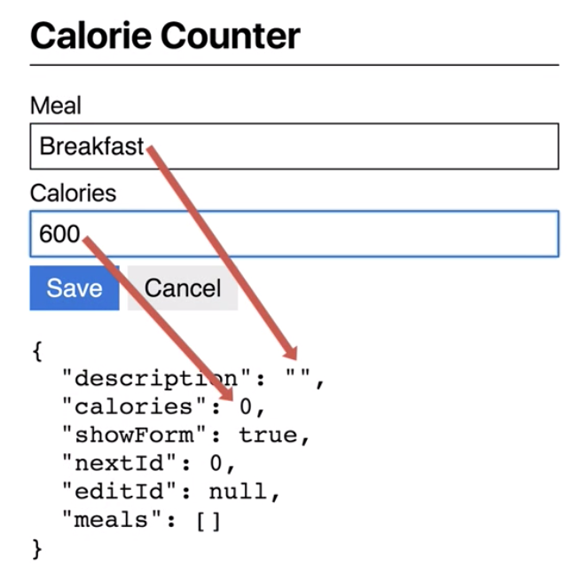
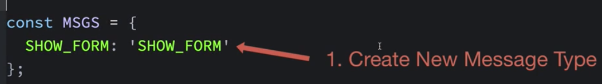
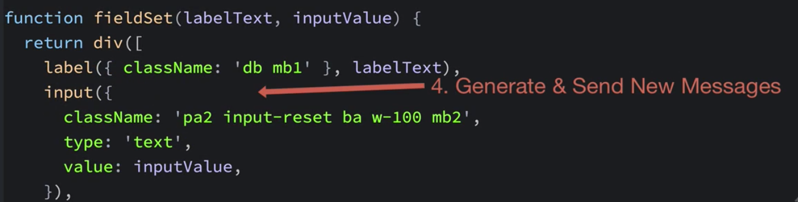

# Input Updates

When we key something to the "meal" and "calories" `inputs` we wanna the `model` to be updated reflectively. 



The steps we need to do are: 
1. create a new `message type` in the messages object similar to the `showForm` property



2. create a `function` like the `showFormmsg function` which will gwnwrate mew messages for the "meal" and "calories" `inputs` 

3. create `case statements` in the `update function` for the new message types. 

4. in `View.j` file we'll generate and send these `new messages` when values are entered into the `text input` fields. 



So, lets create two new unique `message types` as properties in the messages' object. 

### Update.js
```js
 const MSGS = {
    SHOW_FORM: 'SHOW_FORM',
    MEAL_INPUT: 'MEAL_INPUT',        // create new messages type
    CALORIES_INPUT: 'CALORIES_INPUT'
}

export function showFormMsg(showForm){
    return{
        type: MSGS.SHOW_FORM,
        showForm,
    };
}

function update(msg, model){
    switch(msg.type){
        case MSGS.SHOW_FORM:{
        const{ showForm } = msg; 
        return {...model, showForm, description: '', calories: 0};
        }
    }
    return model
}

export default update;
```

Now, let's make some `functions` to create each of these new messages. We wanna export these `functions` so it can be accessed and used from the `view function`. The first `function` we'll name "mealInputMsg" which will take a single `description` parameter. We'll have this `function` to return `object` with the `type` property set to `MSG.MEAL_INPUT`, the `payload` for this message will have the `description` that's being passed into the `function`.

The next `function` we'll name "calorieInputMsg" which will take `calories` parameter  and return a `message` where the message type is `MSG.CALORIES_INPUT`, and the message `payload` will be `calories`. 

Next, we'll modify the `update function's` `switch statement` to handle these two new message types. In the case when the message type is `MEAL_INPUT` we'll use destructuring to unpack the `description` from the `message`. Then we'll return a new `object` spreading the existing `model values`  into the new object but overwriting the new model's `description`. Next, when the message type is `CALORIES_INPUT` we'll use destructuring to unpack the `calories` from the `message` and return a new `object`  spreading the existing `model values`  into the new object but overwriting the new model's `calories`.

### Update.js
```js
 const MSGS = {
    SHOW_FORM: 'SHOW_FORM',
    MEAL_INPUT: 'MEAL_INPUT',        
    CALORIES_INPUT: 'CALORIES_INPUT'
}

export function showFormMsg(showForm){
    return{
        type: MSGS.SHOW_FORM,
        showForm,
    };
}

export function mealInputMsg(description){              //create and export function
    return{
        type: MSG.MEAL_INPUT,
        description,
    };
}

export function caloriesInputMsg(calories){            //create and export function
    return{
        type: MSG.CALORIES_INPUT,
        calories,
    };
}

function update(msg, model){
    switch(msg.type){
        case MSGS.SHOW_FORM:{
        const{ showForm } = msg; 
        return {...model, showForm, description: '', calories: 0};
        }
        case MSG.MEAL_INPUT: {                 //add new case 
            const { description } = msg;
            return{...model, description};
        }
        case MSG.CALORIES_INPUT:{            //add one more case 
            const { calories } = msg;
            return{...model, calories}
        }

    }
    return model
}

export default update;
```

Now, let's head over to the `View.js` file. First let's import two `new message generating functions`. Now the question is: "where do we generate these messages?". In this case we are interested in knowing when a `value` is entered into the "meal" and "calorie" `inputs`. we can do this by using the `oninput html attribute`.

### View.js
```js
import hh from 'hyperscript-helpers';
import {h} from 'virtual-dom';
import { showFormMsg, mealInputMsg, caloriesInputMsg } from './Update';      //import new functions

const { pre, div, h1, button, form, label, input  } = hh(h);

function fieldSet(labelText, inputValue){
   return div([
      label({className: 'db mb1'}, labelText),
      input({className: 'pa2 input-reset ba w-100 mb2', type: 'text', value: inputValue},)
   ]);
}

function buttonSet(dispatch){
   return div([
      button({className: 'f3 pv2 ph3 bg-blue white bn mr2 dim', type: 'submit'},
      "Save"),
      button({className: 'f3 pv2 ph3 bg-light-gray dim', type: "button",
      onclick: () => dispatch(showFormMsg(false)),
   }, "Cancel")
   ])
}

function formView(dispatch, model){
   const { description, calories, showForm } = model;
   if(showForm){
   return form({className: 'w-100 mv2'},
   [
      fieldSet('Meal', description),
      fieldSet('Calories', calories || ''),
      buttonSet(dispatch),
       ],
      );
   }
   return button({className: 'f3 pv2 ph3 bg-blue white bn',
   onclick: () => dispatch(showFormMsg(true)),
}, "Add meal",);
}

function view(dispatch, model){
   return div({className: 'mw6 center'}, [
   h1({className: 'f2 pv2 bb'},  "Calorie Counter"),
   formView(dispatch, model),
   pre(JSON.stringify(model, null, 2)),
   ]);
}

export default view;
```
Let's go the `fieldSet function` where the `inputs` are generated. We'll add an `oninput property` to the `input function`; then we'll give it a `function` to call when the `input` occurs. The `function` that's called will be provided with an `event object` as a parameter which will include the `value` entered into the input field. Then we need to create `dispatch` a message and pass in the new message to send. So, what message do we send here? The `fieldSet function` is used for both: "description" and "calories". So we can't really specify this type of messge within this `function`. This `function` doesn't have enough information to know what type of message to generate. What if instead of writing the `function` to handle the `oninput event` in this function`? 

### View.js
```js
import hh from 'hyperscript-helpers';
import {h} from 'virtual-dom';
import { showFormMsg, mealInputMsg, caloriesInputMsg } from './Update';     

const { pre, div, h1, button, form, label, input  } = hh(h);

function fieldSet(labelText, inputValue){
   return div([
      label({className: 'db mb1'}, labelText),
      input({className: 'pa2 input-reset ba w-100 mb2', 
      type: 'text', 
      value: inputValue,
      oninput: e => dispatch()   //add oninput 
      },)
   ]);
}

function buttonSet(dispatch){
   return div([
      button({className: 'f3 pv2 ph3 bg-blue white bn mr2 dim', type: 'submit'},
      "Save"),
      button({className: 'f3 pv2 ph3 bg-light-gray dim', type: "button",
      onclick: () => dispatch(showFormMsg(false)),
   }, "Cancel")
   ])
}

function formView(dispatch, model){
   const { description, calories, showForm } = model;
   if(showForm){
   return form({className: 'w-100 mv2'},
   [
      fieldSet('Meal', description),
      fieldSet('Calories', calories || ''),
      buttonSet(dispatch),
       ],
      );
   }
   return button({className: 'f3 pv2 ph3 bg-blue white bn',
   onclick: () => dispatch(showFormMsg(true)),
}, "Add meal",);
}

function view(dispatch, model){
   return div({className: 'mw6 center'}, [
   h1({className: 'f2 pv2 bb'},  "Calorie Counter"),
   formView(dispatch, model),
   pre(JSON.stringify(model, null, 2)),
   ]);
}

export default view;
```

Let's get rid of the code with the `dispatch` message, and add one more parameter to the `fieldset function`. 