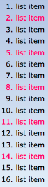

# Selector Structure

In CSS you can target anything and style it the way you  want. 
Fex. here we style every 3-rd list item, using selectors.

```css
li: nth-last-of-type(3n){
color:#E2007A
}
``` 



Here are the examples of selectors structure:

```css
 selectorB{
    property1:value1;
    property2:value2;
}
```


```css
selectorB{
    property1:value3;
    property2:value4;
 }
 ```

```css
selector: pseudo-class::pseudo-element{
    -vendor-property: value;  
}
```

```css
selector[attribute],
selector ~ relation{
    property: -vendor-value;
    -vendor-property: -vendor-value;
    -vendor-property: weirdsyntax;
}
```

Some of this will be prefixed. Generally you don’t use prefix properties. But remove the most border radius and remove a webkit, and your gradient from your code. The reason a lot of CSS properties stay prefixed used to be because of the performance. 
If you use webkit border radius or webkit border gradient the only device that needs this is an old android device. 

# Preprocessors

A CSS preprocessor is a program that lets you generate CSS from the preprocessor's own unique syntax. There are many CSS preprocessors to choose from, however most CSS preprocessors will add some features that don't exist in pure CSS, such as mixin, nesting selector, inheritance selector, and so on. These features make the CSS structure more readable and easier to maintain.

To use a CSS preprocessor, you must install a CSS compiler on your web server.

Here are a few of the most popular CSS preprocessors:

* SASS
* LESS
* Stylus
* PostCSS 

# Debuggers 
Writing CSS is so much easier when you have access to a debugger or a CSS validator. Some tools allow you to identify and fix anything that might be wrong with your code. 

* Firefox ⇾ Firebug ⇾ Firefox Developer Tools
* Opera ⇾ DragonFly
* IE and EDGE ⇾ F12
* Safary ⇾ Web Inspector
* Chrome ⇾ Developer Tools
* Mobile ⇾ Weinr
* Mobile ⇾ Remote debugging by IP
* Mobile ⇾ Tethered debugging 

