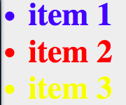

# Basic Selectors 

There are 3 basic selectors:

* id (#myid)
* class (.myclass)
* element (tag name)

Any time you have an ID you can target it with html, css and javascript. Concerning specificity, always do it as broad as possible. 

Example:

```
<ul>
<li id="myId" class="myClass">Item 1</li>
<li class="myClass>Item 2</ly>
<li>Item 3</li>
</ul>
```

```
ul{font-weight:bold;}
li{color:yellow;}
.myClass{color:red;}
#myId{color:blue;
font-size: 5em;}
```
