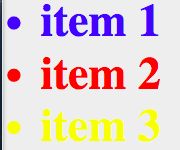

# Basic Selectors 

There are 3 basic selectors:

* id (#myid)
* class (.myclass)
* element (tag name)

Any time you have an ID you can target it with html, css and javascript. Concerning specificity, always do it as broad as possible. 

Example:

**HTML Snippet**
```html
<ul>
<li id="myId" class="myClass">Item 1</li>
<li class="myClass">Item 2</li>
<li>Item 3</li>
</ul>
```
**CSS Snippet**
```css
ul{font-weight:bold;}
li{color:yellow;}
.myClass{color:red;}
#myId{color:blue;
font-size: 5em;}
```


In CSS Level 1 they declare 6 different ways to target elements:

```css
E
E F
.class
#id
:link
:active
```

In level 2 we have two more combinators:
```css
*
E > F
E + F
E[attribute]
E[attribute=value]
E[attribute~=value]
E[attribute|=value]
:first-child
:lang(en)
:focus
:hover
:visited
:before
:after
:first-letter
:first-line
```
In CSS 3 we have more:

```css
::before
::after
::first-letter
::first-line

E[attribute^=value]
E[attribute$=value]
E[attribute*=value]

E ~ F
:root
E:last-child
E:only-child
E:nth-child(n)
E:nth-last-child(n)

E:first-of-type
E:last-of-type
E:only-of-type
E:nth-of-type(n)
E:nth-last-of-type(n)

E:empty
E:not(selector)
E:target
```
In UI specification we have:

```css
E:enabled
E:disabled
E:checked
E:default
E:valid
E:invalid
E:in-range
E:out-of-range
E:required
E:optional
E:read-only
E:read-write
```
CSS level 4:

```css
:blank
:indeterminate
:placeholder-shown
:not(s1, s2)
:matches(s1, s2)

:has(rs1, rs2)
[foo="bar" i]
:dir(ltr)
:lang(zh, *-hant)
:any-link
:scope

:current
:focus-ring
:drop
:drop(active)
:drop(valid)
:drop(invalid)

:user-error
E >> F
F || E
:nth-column(n)
:nth-last-column(n)
```
There are much more:

```css
::selection
:scope-context()
:current(s)
:past

:future
:host
:host()
:host-context()

::shadow
::content
```
<pre><code><del>:column(selector)</del>
<del>E /foo/ F</del>
<del>E! > F</del>
<del>:local-link</del>
<del>:nth-match()</del>
</pre></code>

And some of them’ve been removed. 
All selectors are [here.](https://estelle.github.io/cssmastery/selectors/selectors.html)


