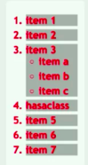

**There are four different combinators in CSS:**

* descendant selector (space)
* child selector (>)
* adjacent sibling selector (+)
* general sibling selector (~)

**Descendant selector** - matches only list items inside of unordered list (nested `<li>`s):

```css
ul li,
ol li
```


**Child selector** - only matches `<li>` items inside ordered list:

```css
ol>li
```


**Adjacent sibling** - selects all elements that are the adjacent siblings of a specified element.
Sibling elements must have the same parent element, and "adjacent" means "immediately following".

```css
li.hasaclass + li
```

