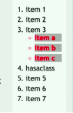
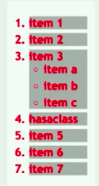
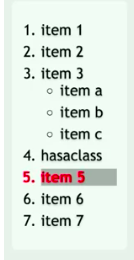
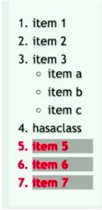

#There are four different combinators in CSS:

* descendant selector (space)
* child selector (>)
* adjacent sibling selector (+)
* general sibling selector (~)

1. **Descendant selector** - matches only list items inside of unordered list (nested `<li>`s):

```css
ul li,
ol li
```



2. **Child selector** - only matches `<li>` items inside ordered list:

```css
ol>li
```


3. **Adjacent sibling** - selects all elements that are the adjacent siblings of a specified element.
Sibling elements must have the same parent element, and "adjacent" means "immediately following".

```css
li.hasaclass + li
```


4. **General Sibling** - selects all elements that are siblings of a specified element.

```css
div ~ p 
```


##In JavaScript

Selectors API

```js
var chil = $('#bar .foo');
```
 
Natively

```js
var el   = document.querySelector('#bar');

var chil = el.querySelectorAll('.foo');
```
or

```js
chil = document.querySelectorAll('#bar .foo');
```
