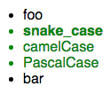

**Every `html` element can have a number of attributes. Some of them are valid, some of them are invalid.**

* The `[attribute]` selector is used to select elements with a specified attribute.
The following example selects all `<a>` elements with a target attribute:


```css
a [target] {
	background-color: yellow;
}
```

* The `[attribute="value"]` selector is used to select elements with a specified attribute and value.
The following example selects all `<a>` elements with a `target="_blank"` attribute:


```css
a[target="_blank"] { 
	background-color: yellow;
}
```

* The `E[attr|=val]` selector is uded to selects elements whose attribute has a value or begins with val- ("val" plus "-").


```css
p[lang|="en"]{
	/* <p lang="en-us">  <p lang="en-uk"> */ 
	}
```

* The `[attribute~="value"]` selector is used to select elements with an attribute value containing a specified word.
The following example selects all elements with a title attribute that contains a space-separated list of words, one of which is "flower":


```css
[title~="flower"] {
	border: 5px solid yellow;
}
```
##Level 3 Attribute Selectors

* `The E[attr^=val]` selector is used to select elements whose attribute starts with the value.


```css
a[href^=mailto] {
	background-image: url(emailicon.gif);
	}
```
```css
a[href^=http]:after {
	content: " (" attr(href) ")";
	}
```
* The `E[attr$=val]` selector is used to select elements whose attribute ends in value. 


```css
a[href$=pdf] {
	background-image: url(pdficon.gif);
	}
```
```css
a[href$=pdf]:after {
	content: " (PDF)";
	}
```

* The `E[attr*=val]` selector is used to select elements with the val that’s anywhere in the content.

* The `E:[att*=VAL i]` selector 

By default, case-sensitivity of attribute names and values in selectors depends on the document language. That's why an additional modifier (i) for CSS attribute selectors has been added to allow an author to match an attribute's value case-insensitively within the ASCII range.

**CSS Snippet**
```css
/* All list items which have an id attribute with the ending `case`. */

li[id$="case" i] {
  color: green;
}

/* All list items which have an id attribute with the exact ending `case` but
 * not the value endings `CASE` or `Case`. */

li[id$="case"] {
  font-weight: bold;
}
```


**HTML Snippet**
```html
<ul>
  <li id="foo">foo</li>
  <li id="snake_case">snake_case</li>
  <li id="camelCase">camelCase</li>
  <li id="PascalCase">PascalCase</li>
  <li id="bar">bar</li>
</ul>
```

In html5 attribute values are not case sensitive and attributes themselves are not case sensitive. But the are some that are case sensitive - those that we create ourselves are case sensitive. 


## For Styling Forms

The attribute selectors can be useful for styling forms without class or ID:

### Example:

```css
input[type="text"] {
	width: 150px;
	display: block;
	margin-bottom: 10px;
	background-color: yellow;
}
```

```css
input[type="button"] {
	width: 120px;
	margin-left: 35px;
	display: block;
}
```


