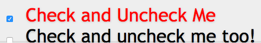
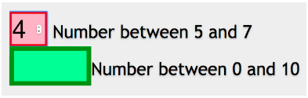

##A pseudo-class is used to define a special state of an element.

For example, it can be used to:

* Style an element when a user mouses over it
* Style visited and unvisited links differently
* Style an element when it gets focus

In `html` you can have elements that are enable or disabled, you can have elements that are checked or not checked. 

##Based on current state of UI

  `:enabled`
  `:disabled`
  `:checked`
  `:indeterminate` (Level 4)

###Example:

Any label (+  means immediately following) that comes immediately after the checked input of type checkbox should have red color. 

```css
input[type=checkbox]:checked + label {
  color: red;
}
```


And because i was thinking about accessibility and included a label i would actually have to check on a checkbox  - and i can check on a label and it will toggle on and off. That's toggling the checkbox which is activating the CSS. 

CSS updates immediately, we just update the UI feature. 

##Form related pseudoclasses:

`:default`
`:valid`
`:invalid`
`:required`
`:optional`
`:in-range`
`:out-of-range`
`:read-only`
`:read-write`
`:placeholder-shown`
`:user-error or :user-invalid`

###Examples

If it’s valid - a border is 1px solid green. If it’s invalid - a border is 1px solid red. 

If required and “true” - a border is 5px

If optional (not required) - 10px

If out-of-range (за пределами указанных в коде чисел, а именно от 5 до 7; не может быть к примеру 5.2)- background color is pink. Because in html when you have a range you have “min” and “max” - here the step attribute is not included. If the step attribute (like in example with 0-10) is not included - the default value is 1. 

If in-range - background color is lightgreen 

```css
input:valid { border: 1px solid green;}
input:invalid { border: 1px solid red;}
input:required,
input[aria-required="true"] {border-width: 5px;}
input:optional {border-width: 10px;}
input:out-of-range { background-color: pink;}
input:in-range { background-color:lightgreen;}
```

If we put 4, it’s not valid, and out of range. 



