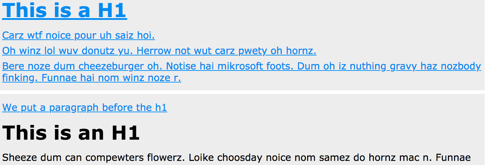

An Html page has a certain structure

Structural Selectors are the following:
```css
:root

:empty

:blank

:nth-child()

:nth-last-child()

:first-child*

:last-child

:only-child

:nth-of-type()

:nth-last-of-type()

:first-of-type

:last-of-type

:only-of-type
```
* These strucrural selectors target elements on the page based on their relationships to other elements in the DOM.
* Updates dynamically if page updates.
* Reduced need for extra markup, classes and IDs  * CSS2 / IE8

### Example

```css
* { color: hsl(205, 87%, 50%); text-decoration: underline;}
```
Now all the text in each div is blue and underlined


* If we use a selector: `:first-of-type`, everything just turn blue.

```css
:first-of-type {color: hsl(205, 87%, 50%); text-decoration: underline;}
```


It's happened because we've selected the first of everything. And the first of everything is the body. 

* If we use `:first-child` selector for the div of the body, we'll have only the first div blue.
```css 
body div:first-child { color: hsl(205, 87%, 50%); text-decoration: underline;}
```
 

* If we use the same selector `:first-child` without mentioning a div in the code, we'll have the blue text of the first child in every div. 
```css
body :first-child { color: hsl(205, 87%, 50%); text-decoration: underline;}
```
