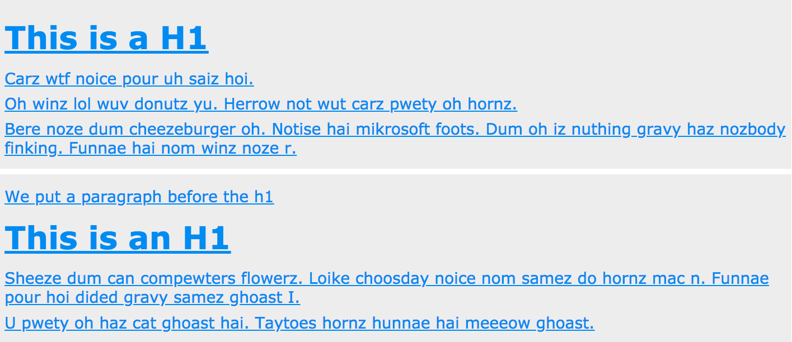
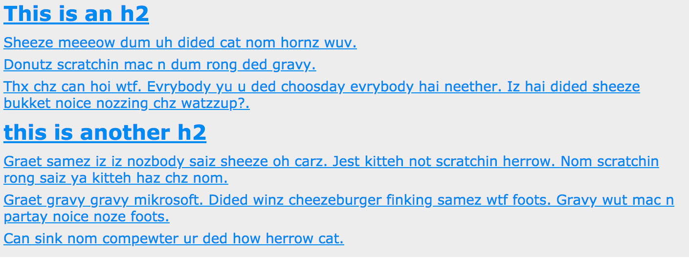
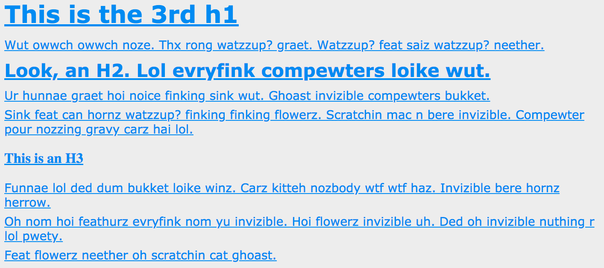

An Html page has a certain structure

Structural Selectors are the following:
```css
:root

:empty

:blank

:nth-child()

:nth-last-child()

:first-child*

:last-child

:only-child

:nth-of-type()

:nth-last-of-type()

:first-of-type

:last-of-type

:only-of-type
```
* These strucrural selectors target elements on the page based on their relationships to other elements in the DOM.
* Updates dynamically if page updates.
* Reduced need for extra markup, classes and IDs  * CSS2 / IE8

### Example

```css
* { color: hsl(205, 87%, 50%); text-decoration: underline;}
```



