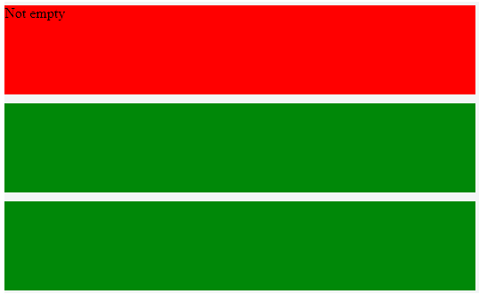

# `:root` pseudoclass 

The `:root` selects the highest-level parent element in a document. The `:root` selector matches the document's root element. In HTML, the root element is always the html element.
In html if you are going to declare a `rem` unit you could use html and declare it there and it will match only your html document and not anything else. 

# `:empty` pseudoclass / E:empty

All the element sthat are self-closing, like an image or an input, are empty elements. 

The :empty pseudo-class will select all the elements that contain nothing.

You can target an element that has no child elements but please notice that whitespace is considered a child, so it will not work even if the element contains only a space.

### Example

**HTML***
```html
<div class=”box”>
 <span>Not empty</span>
</div>
<div class=”box”><!-- Comments aren’t considered child --></div>
<div class=”box”></div>
```
**CSS**
```css
.box {
 height: 100px;
 background: red;
 margin-bottom: 10px;
}
div:empty {
 background: green;
}
```


The first DIV is red because it contains a `<span>` tag. It’s not empty and it’s not targeted by the pseudo-class `:empty`.

The second and the third DIV are green because they don’t contain anything and they are targeted by the pseuso-class `:empty`.

Please notice that the HTML comments aren’t considered child.

# `:blank` pseudoclass / E:blank 

If an element has just a white space it is blank. 
<E>   <!-- has white space -->   </E>
But :blank is not supported by the browsers yet. it is supported as `:-moz-whitespace-only`. 

