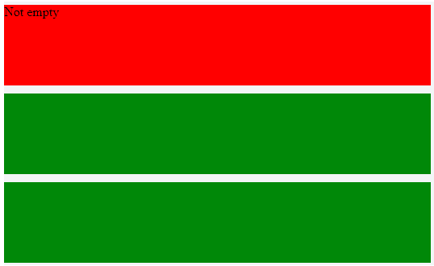

# `:root` pseudoclass 

The `:root` selects the highest-level parent element in a document. The `:root` selector matches the document's root element. In HTML, the root element is always the html element.
In html if you are going to declare a `rem` unit you could use html and declare it there and it will match only your html document and not anything else. 

# `:empty` pseudoclass / E:empty

All the element sthat are self-closing, like an image or an input, are empty elements. 

The :empty pseudo-class will select all the elements that contain nothing.

You can target an element that has no child elements but please notice that whitespace is considered a child, so it will not work even if the element contains only a space.

### Example

**HTML**
```html
<div class=”box”>
 <span>Not empty</span>
</div>
<div class=”box”><!-- Comments aren’t considered child --></div>
<div class=”box”></div>
```
**CSS**
```css
.box {
 height: 100px;
 background: red;
 margin-bottom: 10px;
}
div:empty {
 background: green;
}
```


The first DIV is red because it contains a `<span>` tag. It’s not empty and it’s not targeted by the pseudo-class `:empty`.

The second and the third DIV are green because they don’t contain anything and they are targeted by the pseuso-class `:empty`.

Please notice that the HTML comments aren’t considered child.

# `:blank` pseudoclass / E:blank 

If an element has just a white space it is blank. 
```html
<E>   <!-- has white space -->   </E>
```
But `:blank` is not supported by the browsers yet. it is supported as `:-moz-whitespace-only`. 

*We could actually use `:-moz-whitespace0only` or `:blank` when we are going to do content management, cos it often happens when there are extra spaces at the bottom  accidently and we want to remove all the paragraphs with not bracking space inside.*

 