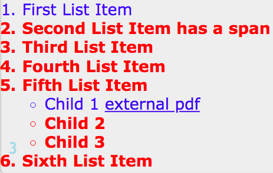

# `:not()` – The Negation Pseudo-Class

The `:not()` pseudo-class is referred to as a negation pseudo-class because it selects everything except the element we specify in the selector.

```
E:not(s1)
div:not(.excludeMe)
```
(s1) - here is a simple selector. Here should not be any combinators

For example: This selector targets all input elements that do not have a type value of button:

```css
input:not([type="button"]) {
  border-color: blue;
}
```
Supported everywhere since IE9. 
The `:not` itself doesn't have any specificity, whatever is inside there - is what givs it the weight. 
 
 **For the Safary only**

 ```css
E:not(s1, s2)
 div:not(.excludeMe, .excuseYou)
```
### Example

```css
li:first-child {
  color: blue;
  font-weight: normal;
  }
li:not(:first-child) {
  color: red;
  font-weight:bold;
  }
  ```
  

#  The `:matches()` pseudo-class for the Safary 


```css
E:matches(s1, s2)
li:matches([title], [role]) a {}

<!-- the same as -->   

css 
li[title] a, 
li[role] a {}
```

The `:matches()` pseudo-class function takes a selector list as its argument, and selects any element that can be selected by one of the selectors in that list. This is useful for writing large selectors in a more compact form.

Note that many browsers support this functionality through an older, prefixed pseudo-class — `:any()`, including older versions of Chrome, Firefox. This works in exactly the same way as `:matches()`, except that it requires vendor prefixes.

```
/* Selects any paragraph inside a header, main
   or footer element that is being hovered */
:matches(header, main, footer) p:hover {
  color: red;
  cursor: pointer;
}

/* the above is equivalent to the following */
header p:hover,
main p:hover,
footer p:hover {
  color: red;
  cursor: pointer;
}
```

# The `:any` pseudoclass for other browsers

`:-webkit-any` pseudoclass for Chrome and Android

`:-moz-any` for Firefox
```css
:-webkit-any(article, aside) :-webkit-any(article, aside) h1,
:-moz-any(article, aside) :-moz-any(article, aside) h1 {
}
 
a:matches(.foo, .bar, .bam) span,
a:-webkit-any(.foo, .bar, .bam) span,
a:-moz-any(.foo, .bar, .bam) span {
}

nav a:not(:matches(.foo, .bar, .bam)),
nav a:not(:-webkit-any(.foo, .bar, .bam)),
nav a:not(:-moz-any(.foo, .bar, .bam)),
nav a:not(.foo, .bar, .bam) {
}
nav a:not(.foo):not(.bar).not(.bam){
}
Removed
```
**Removed from the specification**

Reference combinator

<pre><code><del>
E /attr/ F</del>
<del>label /for/ input</del></pre></code>
