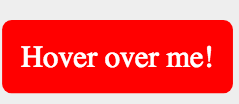
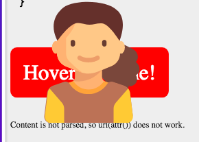

We can insert images through the url() function.

### Example 1

```css
.showMe {
	position:relative;
}
.showMe:hover::after {
	position:absolute;
	content: url(attr(data-url)); /* doesn't work */
	content: url(estelle.svg); /* does work */
	width: 200px;
	height:200px; color: blue;
	bottom: -39px;
	left: 20px;	
}
```
Content is not parsed, so url(attr()) does not work.



When we hover we see:



### Example 2

**HTML**
```html
<p><a href="#">Test</a></p>
```
**CSS**
```css
a:before {
    content: url(https://lh4.googleusercontent.com/-OnB91AW3veQ/UTt35oof1AI/AAAAAAAABNw/bNhmeqcBDec/s23/link.png);
    padding-right: 0.2em;
}
```


