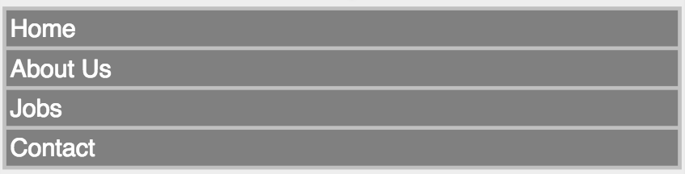
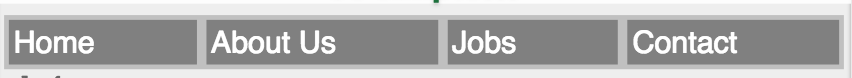

# Flex Box Specification

CSS Flexible Box Layout Module Level 1

https://drafts.csswg.org/css-flexbox/ 


[Browser support](https://caniuse.com/#feat=flexbox)

### Example
Here we have an unordered list of navigational items:



```css 
.ul {
  display: flex;
  padding: 3px;
  align-items: baseline;
  justify-content: center;
}

ul > li {
  text-align: center;
  flex: auto;
}
```
Or we can do 

```css
ul {
  display: flex;
 
}

ul > li {
  flex: auto;
}
```



