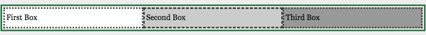
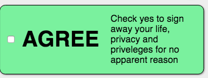

# Components of Flexbox

* Creation: display
* Direction: flex-flow (flex-direction, flex-wrap)
* Alignment: justify-content, align-items, align-self, align-content
* Ordering: order
* Flexibility: flex (flex-grow, flex-shrink, flex-basis)

## The flex box properties are:

* display - values include flex and inline flex; used on parent to create a flex container
* align-content - flex-start | flex-end | center | space-between | space-around | stretch | space-evenly
* align-items - flex-start | flex-end | center | baseline | stretch
* align-self - auto | flex-start | flex-end | center | baseline | stretch
* flex - shorthand for [flex-basis flex-grow, and flex-shrink or none]
* flex-basis - the basis by which the flex items flex; the default:auto
* flex-direction - sets the containers axis for its children with row, row-reverse, column, or columns-reverse on the parent
* flex-flow - shorthand for flex-direction and flex-wrap properties
* flex-grow - 
* flex-shrink
* flex-wrap
* justify-content
* min-height
* min-width
* order

## Steps

1. Add display: flex; to the parent of the elements to be flexed.
2. Set flex-direction to horizontal or vertical
3. Set flex-wrap to control wrap direction

## Display property values 

The display property specifies the display behavior (the type of rendering box) of an element.

In HTML, the default display property value is taken from the HTML specifications or from the browser/user default style sheet. The default value in XML is inline, including SVG elements.

inline | block | list-item | inline-list-item | inline-block | **flex** | **inline-flex** | grid | inline-grid | table | inline-table | table-row-group | table-header-group | table-footer-group | table-row | table-cell | table-column-group | table-column | table-caption | ruby | ruby-base | ruby-text | ruby-base-container | ruby-text-container | contents | none | flow | flow-root

### Example `display:flex`



```css
body > div {
  display: flex;
}
div >  div {
  flex: 20%;
}
```
### Example `display:inline-flex`



```css
label {
    display: inline-flex;
  }
small {
  width: 140px;
}
```

## What is a flex item

When you display flex to an element, that becomes flex container. And all its direct children become flex items, including text. 

Flex items

1. All non-absolutely positioned child nodes
2. Generated Content
3. anonymous flex items => non-empty text nodes

Not flex items

1. ::first-line & ::first-letter
2. white space

Kind of

1. absolutely/fixed positioned elements

## Impacted by flex CSS Properties 

Changed Properties

1. margin: adjacent flex items margins do not collapse
2. min-width & min-height: default is auto, not 0
3. visibility: collapse;

Ignored Properties

1. column-* properties
2. float
3. clear
4. vertical-align