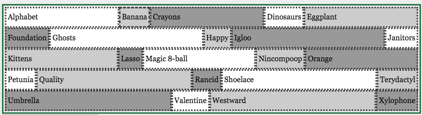
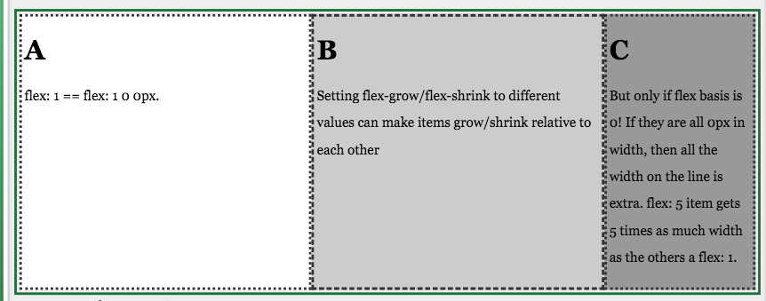
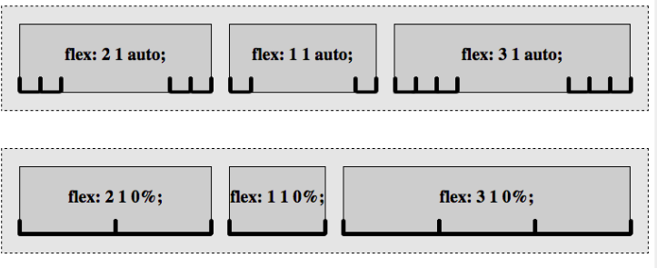

## Flex shorthand

* flex-grow: How to divide the extra space. Non-negative number. default: 1.
* flex-shrink: How to shrink if there's not enough room. Non-negative number. default: 1.
* flex-basis: the starting size before free space is distributed. length value, content or auto . If set to auto, sets to flex item’s main size property.

### Example

Here evry odd element should be allowed to grow and should have starting width of 200px. All the ones thet are not allowed to grow have the width of their content. Thier flex basis is basically their content. They are not growing, they are not shrinking. 

```css
.container {
  display: flex;
  flex-flow: row wrap;
}
.item:nth-of-type(odd) {
  flex: 1 0 220px;
}
```


## Flex relative numbers

```css
.container {
  display: flex;
}
.a, .b {
  flex: 2;
}
.c {
  flex: 1;
}
```



## Flex basis 



e.g the element is 220px wide, and then whatever else is distributed growth factor. 

Flex: 2 1 auto - here the growth factor - is 2 
If the flex basis is auto   - this element's basis width, or it's main size - is the size of it's content. 
extra space is devided into 6 parts and then give each one of the flex items 1/6 - if the growth factor is 1; 2/6 if the growth factor is 2 and 50% of the available space when the growth factor is 3. 

If the flex basis is 0 - it means by default the width of the element is 0. 
