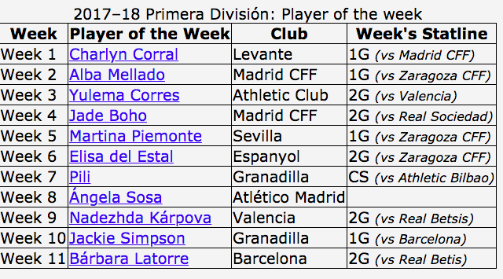
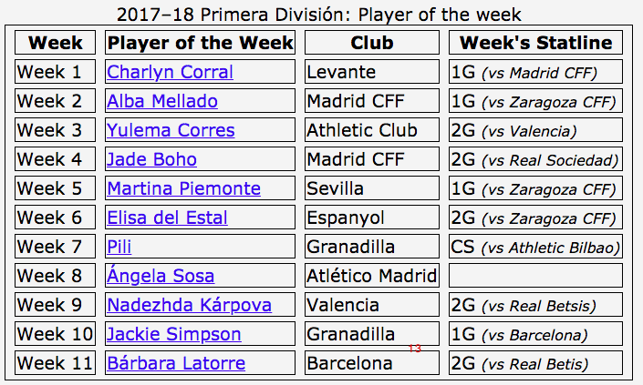

## Border collapse 

`border-collapse: separate | collapse | inherit`

When the borders are collapsed border-spacing is relevant.

## Border Spacing

`border-spacing: <length> <length>?;`

The look you want is probably:

```
table, td, th {border: none;}
table {border-spacing: 5px 10px;}
```
* one length: vertical and horizontal padding are the same.
* two lengths: first is horizontal, second is vertical
* Note: not TRouBLe
* Irrelevant if border-collapse: collapse
* Empty space is part of the table, not the column, tbody, row or cell. 

### Example

```css
table, th, td {border: 1px solid;}
table {
  border-spacing: 10px 5px;
  border-collapse: collapse; 
}
```



Here we don't have free spacing, cos we have `border-collapse: collapse`

If we don't have `border-collapse` we'll have 

```css
table, th, td {border: 1px solid;}
table {
  border-spacing: 10px 5px;
}
```


